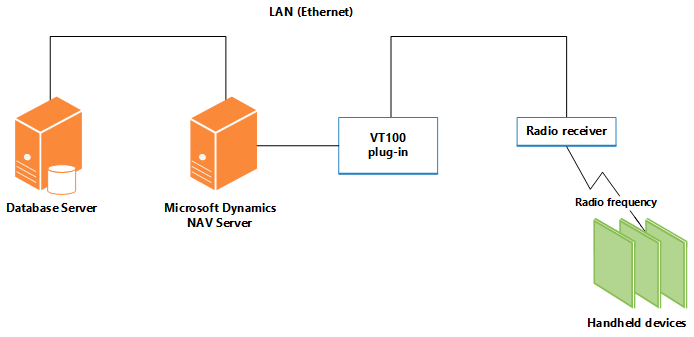
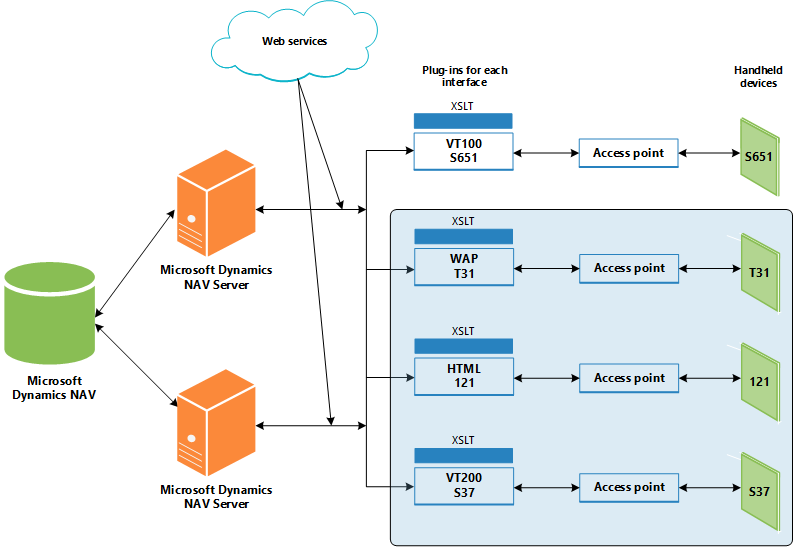

# ADCS Overview
The Automated Data Capture System \(ADCS\) solution provides a way for [!INCLUDE[navnow](includes/navnow_md.md)] to communicate with handheld devices through web services. You can test your solution by using the VT100 plug-in.  
  
> [!NOTE]  
>  We recommend that you install [!INCLUDE[nav_server](includes/nav_server_md.md)] and the VT100 plug-in on separate computers. For more information, see [How to: Create a Microsoft Dynamics NAV Server Instance](How%20to:%20Create%20a%20Microsoft%20Dynamics%20NAV%20Server%20Instance.md).  
  
## Overview and Architecture  
 ADCS enables you to accurately capture data for inbound, outbound, and internal documents, primarily for warehouse activities. For example, you can have users scan the bar codes of items in your warehouse as they perform daily tasks, and that information is recorded from these handheld device activities in [!INCLUDE[navnow](includes/navnow_md.md)].  
  
   
  
 [!INCLUDE[nav_server](includes/nav_server_md.md)] processes the data coming to in from the handheld devices via the plug-in and sends the appropriate response back to the handheld devices via the plug-in. An XML format is used to send and receive the data. The VT100 plug-in makes sure that the response from [!INCLUDE[navnow](includes/navnow_md.md)] is directed to the correct handheld device. This reduces the load on the server.  
  
 The VT100 plug-in provides the link between the server and the Access Points for the handheld devices and acts as a virtual Telnet server. All connection requests and data transmissions are handled by this service, and the incoming native protocol is transformed into standard XML that the server can interpret. After a request has been transformed, the request is forwarded by the VT100 plug-in to the server. When a reply is received, it is converted from XML into the native protocol of the handheld device. Function keys are mapped using an XSLT file that you can modify. After the data has been transformed and formatted, it is forwarded to the handheld device.  
  
### Design Overview  
 The following illustration provides a simple diagram of ADCS. The part of the illustration that is shaded, which does not include ADCS, represents what could be developed.  
  
   
  
 Consider the following when you deploy an ADCS solution:  
  
-   You can configure multiple instances of [!INCLUDE[nav_server](includes/nav_server_md.md)] on a single computer, but each instance can only access one company. Therefore, if you want to access several companies from the same computer, you must configure several [!INCLUDE[nav_server](includes/nav_server_md.md)] instances for NAS Services.  
  
-   You can only install one instance of the VT100 plug-in on a single computer. The VT100 plug-in can only serve one company but it can communicate with multiple instances of [!INCLUDE[nav_server](includes/nav_server_md.md)]. This means that all of the instances of the server that use the same VT100 plug-in can only access the same company.  
  
-   If you want to communicate with more than one company, you must install the VT100 plug-in on more than one computer, one for each company. Each of the VT100 plug-in installations must then use a separate [!INCLUDE[nav_server](includes/nav_server_md.md)] to access one of the companies.  
  
    > [!NOTE]  
    >  You can also install the VT100 plug-in multiple times on the same computer, one for each company.  
  
### Supported Devices  
 An ADCS device includes devices such as bar code readers or optical character readers that are used to mechanize the entry of information into the database.  
  
 All character-based handheld devices that have a VT100 interface will work with ADCS, although you may have to implement minor adjustments with some models. When you use a handheld device, you must be able to connect either the Access Point or the RF terminal to the IP or port address of the ADCS server.  
  
 If you want to use a graphics-based handheld device, you will have to develop your own plug-in.  
  
 You can connect multiple handheld devices to the VT100 plug-in. However, if performance becomes an issue, you can always add an additional [!INCLUDE[nav_server](includes/nav_server_md.md)] and direct the VT100 plug-in to also connect with the new server to improve performance.  
  
## See Also  
 [How to: Configure ADCS Options](How%20to:%20Configure%20ADCS%20Options.md)