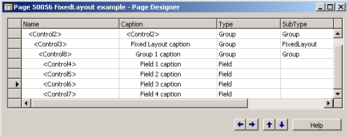
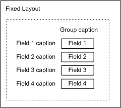
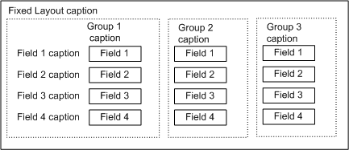

# Arranging Fields in Rows and Columns Using a FixedLayout Control
This topic describes the layout and behavior of fields in a FixedLayout control on a page. You use the FixedLayout control to arrange page fields in rows and columns, similar to a matrix, except that the FixedLayout control contains a specific number of fields, and a matrix can contain an unspecified number of fields. You typically use the FixedLayout control to display statistical data in a FastTab on a page or information in the details section of a Worksheet page. If you are using the [!INCLUDE[demolong](includes/demolong_md.md)], then you can see examples of these uses in page 151, Customer Statistics, and page 40, Item Journal.  
  
## Adding Fields  
 In Page Designer, you include a FixedLayout control under a group control. You can add fields directly under the FixedLayout control as shown in the following Page Designer example that contains four fields.  
  
   
  
 The following illustration shows the resulting field layout on a page.  
  
   
  
 It is important to notice that there are no captions for the fields.  
  
## Grouping Fields in a Fixed Layout Control  
 By placing the fields in a FixedLayout control throughout a group control, you can define separate rows and columns to create a matrix\-like arrangement. The following illustration shows a Page Designer example that adds four fields of the FixedLayout control in a group control.  
  
   
  
 The following illustration shows the resulting field layout on a page.  
  
   
  
 The group control caption appears as the column header, and the field control captions appear as the row headers. If you add two more group controls that contain fields, then the layout on the page will resemble the following illustration.  
  
   
  
 Only the field captions for the first group control appear. The field captions in other group controls are ignored.  
  
## Multiple Fixed Layouts  
 You can also set up more than one FixedLayout control in a group control. For example, the following illustration shows the page layout if you have four FixedLayout controls.  
  
   
  
 The page area is divided into two columns that contain the separate FixedLayout fields.  
  
> [!NOTE]  
>  The fields in the FixedLayout controls in the illustration are not in a group control. If they were in a group control, then they would follow the same principle as described in the previous section about how to group fields.  
  
## Editing Fields in a Fixed Layout  
 Fields in a fixed layout are not editable even if the [Editable Property\-duplicate](Editable-Property-duplicate.md) property is set to **TRUE**. However, if the field drills down to a page where the field source is defined, then you can modify the field.  
  
## See Also  
 [How to: Arrange Page Fields in Rows and Columns Using a FixedLayout Control](../Topic/How%20to:%20Arrange%20Page%20Fields%20in%20Rows%20and%20Columns%20Using%20a%20FixedLayout%20Control.md)   
 [Arranging Fields in Rows and Columns](Arranging-Fields-in-Rows-and-Columns.md)   
 [How to: Arrange Fields in Rows and Columns Using the GridLayout Control](../Topic/How%20to:%20Arrange%20Fields%20in%20Rows%20and%20Columns%20Using%20the%20GridLayout%20Control.md)