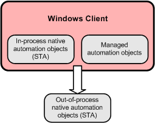

# Best Practices for Using Automation with the Microsoft Dynamics NAV Windows Client
With Automation, Windows-based applications, such as Microsoft Office products, expose Automation objects that [!INCLUDE[navnow](includes/navnow_md.md)] can access and run using an Automation controller in the development environment. Automation objects are always run on the computer running [!INCLUDE[nav_windows](includes/nav_windows_md.md)].  
  
 Because Automation objects expose a COM interface, Automation can affect the performance and security of your solution. This topic provides best practices and recommendations to follow when implementing Automation in the RoleTailored client to help limit potential performance and security issues.  
  
> [!NOTE]  
>  You specify an Automation objects to run on the [!INCLUDE[nav_windows](includes/nav_windows_md.md)] by using the [CREATE Function \(Automation\)](CREATE-Function--Automation-.md) in C/AL code of the object that runs the Automation object.  
  
## Automation Object Implementation and Support in the [!INCLUDE[nav_windows](includes/nav_windows_md.md)]  
 Use the following figure and table to help you determine whether the Automation object is supported on the [!INCLUDE[nav_windows](includes/nav_windows_md.md)] based on the Automation object's characteristics.  
  
   
  
|Automation object|Supported by [!INCLUDE[nav_windows](includes/nav_windows_md.md)]|Remarks|  
|-----------------------|--------------------------------------------|-------------|  
|Native code Automation objects that use out-of-process Automation servers|Yes|This includes Microsoft Office Automation Objects. For more information, see [Native and Managed Automation Objects](#Native_Managed_Objects).|  
|Automation objects, including OCX types, which do not add user-interface to [!INCLUDE[navnow](includes/navnow_md.md)] objects|Yes||  
|Automation objects, including OCX types, which add user-interface to [!INCLUDE[navnow](includes/navnow_md.md)] objects|No|The control can display information and interact with the user in a window of its own.|  
|Automation objects that execute as single-threaded apartments|Yes|For more information, see [Using Multithreaded Apartment Automation Objects](#STA_MTA_Objects).|  
|Automation objects that execute as multithreaded apartments|Yes|There are performance considerations with multithreaded apartments. For more information, see [Using Multithreaded Apartment Automation Objects](#STA_MTA_Objects).|  
|Managed code Automation objects|Yes|For more information, see [Native and Managed Automation Objects](#Native_Managed_Objects).|  
|Native code Automation objects that use in-process Automation servers|Yes|This includes DLLs, such as MSXML.dll. For more information, see [Native and Managed Automation Objects](#Native_Managed_Objects).|  
|Automation objects that stream parameters and are configured to receive events|No|In the [!INCLUDE[nav_dev_short](includes/nav_dev_short_md.md)], an Automation variable includes a WithEvents property, but this property does not have any impact and must be set to **No**.|  
  
##  <a name="STA_MTA_Objects"></a> Using Multithreaded Apartment Automation Objects  
 Automation objects can be designed to execute as multithreaded apartments \(MTA\). MTA Automation objects are designed for highly reentrant, stressed environments with high throughput for multiple clients and are most suitable for running an a server. However, you can use an MTA Automation object on with the [!INCLUDE[nav_windows](includes/nav_windows_md.md)] because the .NET Framework manages marshaling between MTA and STA. If you do, you may decrease performance. Some Automation objects are available in both MTA and STA versions, so you can choose STA. For example, see the DOMDocument and FreeThreadedDOMDocument Automation objects of the Microsoft XML Core Services \(MSXML2\) library. To read more about these objects and implications on performance, see the Microsoft Support Knowledge Base article [PRB: MSXML Performance Bottleneck in ShareMutex Under Stress](http://go.microsoft.com/fwlink/?LinkID=262168).  
  
##  <a name="Native_Managed_Objects"></a> Native and Managed Automation Objects  
 The [!INCLUDE[nav_windows](includes/nav_windows_md.md)] supports Automation objects that are created from either native or managed code. Automation in [!INCLUDE[navnow](includes/navnow_md.md)] uses the common language runtime \(CLR\), which allows managed code to call unmanaged and native Automation objects. The CLR generates a runtime-callable wrapper \(RCW\) proxy that implements all interfaces of the underlying Automation object. Additionally, the CLR has a built-in marshaling layer that maps the types between the native and managed domains.  
  
### Data Type Mapping Between C/AL, COM, and CLR  
 The following table lists the type mappings between C/AL, COM, and the corresponding .NET CLR types.  
  
|C/AL type|COM type|CLR type|  
|----------------|--------------|--------------|  
|Automation|VT\_DISPATCH|System.Object|  
|BigInteger|VT\_I8|System.Int64|  
|Boolean|VT\_BOOL|System.Boolean|  
|Char|VT\_BSTR|System.Byte|  
|Code|VT\_BSTR|System.String|  
|Date|VT\_DATE|System.DateTime|  
|DateTime|VT\_DATE|System.DateTime|  
|Decimal|VT\_CY|System.Decimal|  
|Decimal|VT\_R4|System.Single|  
|Decimal|VT\_R8|System.Double|  
|InStream|VT\_STREAM|System.Object|  
|Integer|VT\_I2|System.Int16|  
|Integer|VT\_I4|System.Int32|  
|OCX|VT\_DISPATCH|System.Object|  
|Option|VT\_I4|System.Int32|  
|OutStream|VT\_STREAM|System.Object|  
|Text|VT\_BSTR|System.String|  
|Time|VT\_DATE|System.DateTime|  
|Variant|VT\_VARIANT|System.Object|  
  
 Automation objects are late-bound activated, which means that they must implement the IDispatch interface. This allows the reflection API, which represents the classes, interfaces, and objects in the .NET runtime, to invoke members. The RCW recognizes managed Automation objects as being managed objects, and standard CLR reflection invocation takes place. As a result, in-process \(DLL\) and out-of-process \(EXE\) Automation behaves identically when the Automation objects are created in a managed language.  
  
## Implementing Automation Objects as VAR Parameters  
 You can implement an automation object as a VAR parameter in a function call, which means that it is called by reference. If an automation method returns [IUnknown](http://go.microsoft.com/fwlink/?LinkID=262169) or [IDispatch](http://go.microsoft.com/fwlink/?LinkID=262170) objects in the parameter list, then you must create the automation variable before it can be used; otherwise, you will get an error at runtime. For example, the following C/AL code creates an **automatioObject** variable and calls a method that will return an IDispatch object in the created variable..  
  
```  
create(automationObject, true, true);  
somereturnValue := otherObjectReturningIDispatch(automationObject);  
automationObject.CallObjectMember();  
  
```  
  
 If the **automationObject** is used without being created first, the following error will appear at runtime:  
  
 System.Runtime.InteropServices.COMException \(0x80020005\): Type mismatch. \(Exception from HRESULT: 0x80020005 \(DISP\_E\_TYPEMISMATCH\)\)  
  
## Security - User Account for In-Process Automation Objects and OCX Controls  
 In-process Automation objects and OCX controls always run under the same user account as the [!INCLUDE[nav_windows](includes/nav_windows_md.md)]. This is because in-process Automation objects are hosted by the current running process and inherit the security properties of the active user.  
  
## See Also  
 [COM Overview](COM-Overview.md)   
 [How to: Create an Automation Controller](How-to--Create%20an%20Automation%20Controller.md)   
 [Programming Best Practices](Programming-Best-Practices.md)   
 [Walkthrough: Using Automation to Write a Letter in Microsoft Office Word](Walkthrough:%20Using%20Automation%20to%20Write%20a%20Letter%20in%20Microsoft%20Office%20Word.md)   
 [Walkthrough: Using Automation to Create a Graph in Microsoft Excel](Walkthrough:%20Using%20Automation%20to%20Create%20a%20Graph%20in%20Microsoft%20Excel.md)   
 [Security and Protection](Security-and-Protection.md)