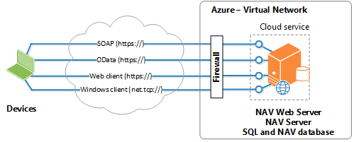
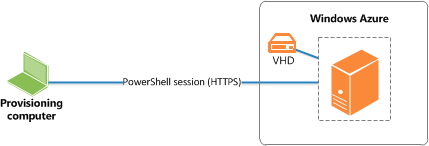

---
title:"Deploying Microsoft Dynamics NAV on One Virtual Machine Using Example-1VM Script"
ms.custom: na
ms.date: 06/05/2016
ms.reviewer: na
ms.suite: na
ms.tgt_pltfrm: na
ms.topic: article
ms-prod:"dynamics-nav-2017"
ms.assetid: 2f2923da-21e1-4b9d-a480-70c9f8f2f332
caps.latest.revision: 16
---
# Deploying Microsoft Dynamics NAV on One Virtual Machine Using Example-1VM Script
This topic describes the Example\-1VM.ps1 script of the [!INCLUDE[nav_prov_long](includes/nav_prov_long_md.md)]. The script is located in the \\WindowsPowerShellScripts\\Cloud\\HowTo folder on the [!INCLUDE[navnow](includes/navnow_md.md)] installation media \(DVD\). The Example\-1VM.ps1 script deploys [!INCLUDE[navnow](includes/navnow_md.md)] on a single Microsoft Azure virtual machine. After the script is run, you will have a fully functional environment that enables you to access [!INCLUDE[navnow](includes/navnow_md.md)] data from the [!INCLUDE[nav_windows](includes/nav_windows_md.md)] or [!INCLUDE[nav_web](includes/nav_web_md.md)].  
  
 For information about how to use the script, see [How to: Deploy Microsoft Dynamics NAV on Microsoft Azure by Using the Example Scripts](../Topic/How%20to:%20Deploy%20Microsoft%20Dynamics%20NAV%20on%20Microsoft%20Azure%20by%20Using%20the%20Example%20Scripts.md) or [Walkthrough: Deploying Microsoft Dynamics NAV on a Microsoft Azure Virtual Machine](../Topic/Walkthrough:%20Deploying%20Microsoft%20Dynamics%20NAV%20on%20a%20Microsoft%20Azure%20Virtual%20Machine.md) for a step\-by\-step example.  
  
## Deployment Overview  
 The Example\-1VM.ps1 script creates a virtual machine on Azure, which is based on an image that you specify, and then installs and configures [!INCLUDE[nav_web_server](includes/nav_web_server_md.md)], [!INCLUDE[nav_server](includes/nav_server_md.md)], and [!INCLUDE[navnow](includes/navnow_md.md)] database components for SQL Server.  
  
   
  
 The script restores a [!INCLUDE[navnow](includes/navnow_md.md)] application database of your choice, along with a [!INCLUDE[navnow](includes/navnow_md.md)] license. You can choose to install the [!INCLUDE[demolong](includes/demolong_md.md)] and license. The script also configures endpoints in Azure for [!INCLUDE[navnow](includes/navnow_md.md)] client services and management services and opens the communication ports in Windows Firewall.  
  
 When the script is finished, you will have functional [!INCLUDE[navnow](includes/navnow_md.md)] environment that has the following characteristics:  
  
-   A website on Internet Information Services \(IIS\) with a web server instance for the [!INCLUDE[nav_web](includes/nav_web_md.md)]. The website runs on TCP port 443 and uses https protocol. Users can access [!INCLUDE[navnow](includes/navnow_md.md)] data by using the [!INCLUDE[nav_web](includes/nav_web_md.md)] from a web browser.  
  
-   A [!INCLUDE[nav_server](includes/nav_server_md.md)] instance that connects to the [!INCLUDE[navnow](includes/navnow_md.md)] database.  
  
-   OData and SOAP Web services are enabled and configured to use https protocol.  
  
-   A [!INCLUDE[navnow](includes/navnow_md.md)] application database that is configured to have a [!INCLUDE[navnow](includes/navnow_md.md)] license file, company, and a single [!INCLUDE[navnow](includes/navnow_md.md)] user that has SUPER permissions.  
  
-   Uses NavUserPassword credential type as the user authentication method.  
  
-   [!INCLUDE[nav_windows](includes/nav_windows_md.md)] available by using ClickOnce website.  
  
## Deployment Process  
 The Example\-1VM.ps1 is a combination of several of the [!INCLUDE[nav_prov_short](includes/nav_prov_short_md.md)] scripts that are called at various points in the deployment process. Before running each script, a secure Windows PowerShell remote session using HTTPS is established between the provisioning computer and the Azure virtual machine.  
  
   
  
### Deployment Phases  
 The following flow chart illustrates the process that is executed by the Example\-1VM.ps1 script to deploy [!INCLUDE[navnow](includes/navnow_md.md)]. The dashed boxes illustrate the manual alternatives in the flow.  
  
   
  
 The following table provides a description of each phase in the process and the Windows PowerShell script that is executed.  
  
> [!NOTE]  
>  The scripts are located in the *Cloud\\NAVRemoteAdministrationSamples* folder of the [!INCLUDE[nav_prov_long](includes/nav_prov_long_md.md)]. For more information, see [How to: Install the Microsoft Dynamics NAV Provisioning Tools for Microsoft Azure](../Topic/How%20to:%20Install%20the%20Microsoft%20Dynamics%20NAV%20Provisioning%20Tools%20for%20Microsoft%20Azure.md).  
  
|Phase|Script|[!INCLUDE[bp_tabledescription](includes/bp_tabledescription_md.md)]|  
|-----------|------------|---------------------------------------|  
|**Import cmdlets and scripts**|Set\-PowerShellEnvironment.ps1|Imports NavAzureRemoteAdminToolsSamples.psm1 with all the HowTo\-prefixed scripts. Other PowerShell modules are automatically imported as needed.|  
|**Import the publishsettings file**|Set\-PowerShellEnvironment.ps1|Imports the PublishSettingsFile that was downloaded when Azure PowerShell was installed.   Selects the Azure storage account and imports the Azure subscription ID and certificates.   For more information about these items, see [Preparing for Deploying Microsoft Dynamics NAV on Microsoft Azure](Preparing-for-Deploying-Microsoft-Dynamics-NAV-on-Microsoft-Azure.md).|  
|**Create new VM**|HowTo\-CreateAzureVM|PowerShell session established.   Creates a new virtual machine based on a selected image from the Microsoft Azure Marketplace.   NavAdministration module is transferred to new virtual machine.|  
|**Upload files to VM**|HowTo\-UploadFilesToVM|Creates a .VHD file and uploads the [!INCLUDE[navnow](includes/navnow_md.md)] installation files to Azure storage.   Alternatively, the [!INCLUDE[navnow](includes/navnow_md.md)] installation files can be copied directly from the provisioning computer to the virtual machine through an active PowerShell session. To specify whether to use a VHD, change the $NAV\_UseAzureStorageForDvdTransfer variable in the script.|  
|**Install NAV on VM**|HowTo\-InstallNAVonVM|NAVAdministration module cmdlets are executed through a PowerShell session.   Installs [!INCLUDE[navnow](includes/navnow_md.md)] on the virtual machine. The [!INCLUDE[nav_server](includes/nav_server_md.md)] instance and [!INCLUDE[nav_web](includes/nav_web_md.md)] instance are not installed in this phase.|  
|**Add server instance**|HowTo\-AddNAVInstance|Establishes a PowerShell session, and then does the following:   -   Installs a [!INCLUDE[nav_server](includes/nav_server_md.md)] instance. -   Installs a [!INCLUDE[navnow](includes/navnow_md.md)] web server instance on IIS for [!INCLUDE[nav_web](includes/nav_web_md.md)]. -   Creates a ClickOnce website for [!INCLUDE[nav_windows](includes/nav_windows_md.md)] deployment. -   Restores the [!INCLUDE[navnow](includes/navnow_md.md)] database from the .bak file. -   Adds [!INCLUDE[navnow](includes/navnow_md.md)] user. -   Imports the [!INCLUDE[navnow](includes/navnow_md.md)] license. -   Adds Azure endpoints. -   Configures Windows Firewall.|  
  
## See Also  
 [How to: Deploy Microsoft Dynamics NAV on Microsoft Azure by Using the Example Scripts](../Topic/How%20to:%20Deploy%20Microsoft%20Dynamics%20NAV%20on%20Microsoft%20Azure%20by%20Using%20the%20Example%20Scripts.md)   
 [Deploying and Managing Microsoft Dynamics NAV on Microsoft Azure](Deploying-and-Managing-Microsoft-Dynamics-NAV-on-Microsoft-Azure.md)   
 [Planning and Preparing](Planning-and-Preparing.md)   
 [Network Topologies for Microsoft Dynamics NAV on Azure](Network-Topologies-for-Microsoft-Dynamics-NAV-on-Azure.md)   
 [Deploying Microsoft Dynamics NAV on Two Virtual Machines Using Example\-2VM Script](Deploying-Microsoft-Dynamics-NAV-on-Two-Virtual-Machines-Using-Example-2VM-Script.md)   
 [Walkthrough: Deploying Microsoft Dynamics NAV on a Microsoft Azure Virtual Machine](../Topic/Walkthrough:%20Deploying%20Microsoft%20Dynamics%20NAV%20on%20a%20Microsoft%20Azure%20Virtual%20Machine.md)