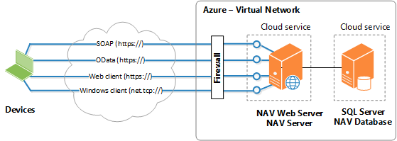
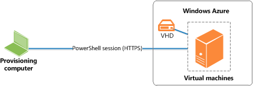
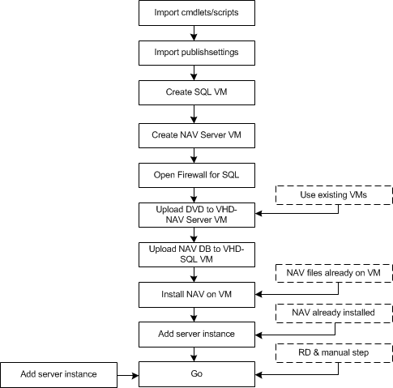

# Deploying Microsoft Dynamics NAV on Two Virtual Machines Using Example-2VM Script
This topic describes the Example\-2VM.ps1 script of the [!INCLUDE[nav_prov_long](../dynamics-nav/includes/nav_prov_long_md.md)]. The script is located in the \\WindowsPowerShellScripts\\Cloud\\HowTo folder on the [!INCLUDE[navnow](../dynamics-nav/includes/navnow_md.md)] installation media \(DVD\). The Example\-2VM.ps1 script deploys [!INCLUDE[navnow](../dynamics-nav/includes/navnow_md.md)] on two Microsoft Azure virtual machines. After the script is run, you will have a fully functional environment that enables you to access [!INCLUDE[navnow](../dynamics-nav/includes/navnow_md.md)] data from the [!INCLUDE[nav_windows](../dynamics-nav/includes/nav_windows_md.md)] or [!INCLUDE[nav_web](../dynamics-nav/includes/nav_web_md.md)].  
  
 For information about how to use the script, see [How to: Deploy Microsoft Dynamics NAV on Microsoft Azure by Using the Example Scripts](../Topic/How%20to:%20Deploy%20Microsoft%20Dynamics%20NAV%20on%20Microsoft%20Azure%20by%20Using%20the%20Example%20Scripts.md) or [Walkthrough: Deploying Microsoft Dynamics NAV on Two Microsoft Azure Virtual Machines](../Topic/Walkthrough:%20Deploying%20Microsoft%20Dynamics%20NAV%20on%20Two%20Microsoft%20Azure%20Virtual%20Machines.md) for a step\-by\-step example.  
  
## Deployment Overview  
 The Example\-2VM.ps1 script creates two virtual machines, which are created based on an Azure image that you specify, and then installs [!INCLUDE[nav_web_server](../dynamics-nav/includes/nav_web_server_md.md)] and [!INCLUDE[nav_server](../dynamics-nav/includes/nav_server_md.md)] on one machine and [!INCLUDE[navnow](../dynamics-nav/includes/navnow_md.md)] database components for SQL Server on the other machine.  
  
   
  
 The script restores a [!INCLUDE[navnow](../dynamics-nav/includes/navnow_md.md)] application database of your choice, along with a [!INCLUDE[navnow](../dynamics-nav/includes/navnow_md.md)] license. You can choose to install the [!INCLUDE[demolong](../dynamics-nav/includes/demolong_md.md)] and license. The script also configures endpoints in Azure for [!INCLUDE[navnow](../dynamics-nav/includes/navnow_md.md)] client service and management services and opens the communication ports in Windows Firewall.  
  
 When the script is finished, you will have a functional [!INCLUDE[navnow](../dynamics-nav/includes/navnow_md.md)] environment that has the following characteristics:  
  
-   Two virtual machines on Azure in a virtual network and affinity group that you specify.  
  
-   A website on Internet Information Services \(IIS\) with a web application for the [!INCLUDE[nav_web](../dynamics-nav/includes/nav_web_md.md)]. The website runs on TCP port 443 and uses https protocol. Users can access [!INCLUDE[navnow](../dynamics-nav/includes/navnow_md.md)] data by using the [!INCLUDE[nav_web](../dynamics-nav/includes/nav_web_md.md)] from a web browser.  
  
-   OData and SOAP Web services are enabled and configured to use https protocol.  
  
-   A [!INCLUDE[navnow](../dynamics-nav/includes/navnow_md.md)] application database that is configured to have a [!INCLUDE[navnow](../dynamics-nav/includes/navnow_md.md)] license file, company, and a single [!INCLUDE[navnow](../dynamics-nav/includes/navnow_md.md)] user that has SUPER permissions.  
  
-   NavUserPassword credential type is configured as the user authentication method.  
  
-   [!INCLUDE[nav_windows](../dynamics-nav/includes/nav_windows_md.md)] available by using ClickOnce.  
  
## Deployment Process  
 The Example\-2VM.ps1 script is a combination of several of the [!INCLUDE[nav_prov_short](../dynamics-nav/includes/nav_prov_short_md.md)] scripts that are called at various points in the deployment process. Before running each script, a secure Windows PowerShell remote session using HTTPS is established between the provisioning computer and the Azure virtual machine.  
  
   
  
### Deployment Phases  
 The following flow chart illustrates the process that is executed by the Example\-2VM.ps1 script to deploy [!INCLUDE[navnow](../dynamics-nav/includes/navnow_md.md)]. The dashed boxes illustrate the manual alternatives in the flow.  
  
   
  
 The following table provides a description of each phase and the Windows PowerShell script that is executed.  
  
> [!NOTE]  
>  The scripts are located in the *Cloud\\NAVRemoteAdministrationSamples* folder of the [!INCLUDE[nav_prov_long](../dynamics-nav/includes/nav_prov_long_md.md)]. For more information, see [How to: Install the Microsoft Dynamics NAV Provisioning Tools for Microsoft Azure](../Topic/How%20to:%20Install%20the%20Microsoft%20Dynamics%20NAV%20Provisioning%20Tools%20for%20Microsoft%20Azure.md).  
  
|Phase|Script|[!INCLUDE[bp_tabledescription](../dynamics-nav/includes/bp_tabledescription_md.md)]|  
|-----------|------------|---------------------------------------|  
|**Import cmdlets and scripts**||Imports NavAzureRemoteAdminToolsSamples.psm1 with all the HowTo\-prefixed scripts. Other PowerShell modules are automatically imported as needed.|  
|**Import the publishsettings file**||Imports the PublishSettingsFile that was downloaded when Azure PowerShell was installed.   Selects the Azure storage account and imports the Azure subscription ID and certificates.   For more information about these items, see [Preparing for Deploying Microsoft Dynamics NAV on Microsoft Azure](../dynamics-nav/Preparing-for-Deploying-Microsoft-Dynamics-NAV-on-Microsoft-Azure.md).|  
|**Create SQL VM**|HowTo\-CreateAzureVM|PowerShell session established.   Creates a new virtual machine to host SQL Server and the [!INCLUDE[navnow](../dynamics-nav/includes/navnow_md.md)] database. The virtual machine is created based on a selected image from the Microsoft Azure Marketplace that you specify.   NavAdministration module transferred to new virtual machine.|  
|**Create NAV Server VM**|HowTo\-CreateAzureVM|PowerShell session established.   Creates a new virtual machine to host [!INCLUDE[nav_server](../dynamics-nav/includes/nav_server_md.md)] and [!INCLUDE[nav_web_server](../dynamics-nav/includes/nav_web_server_md.md)]. The virtual machine is created based on a selected image from the Azure Marketplace that you specify.   NavAdministration module is transferred to new virtual machine.|  
|**Open Firewall for SQL**|HowTo\-OpenFirewallPort|Modifies the Windows Firewall settings on the virtual machine that is running SQL Server to enable communication on TCP port 1443 from the virtual machine that is running [!INCLUDE[nav_server](../dynamics-nav/includes/nav_server_md.md)].|  
|**Upload DVD to NAV Server VM**|HowTo\-UploadFilesToVM|Creates .VHD in Azure storage, uploads the [!INCLUDE[navnow](../dynamics-nav/includes/navnow_md.md)] installation files to the VHD, and then copies the files from the VHD to the virtual machine running [!INCLUDE[nav_server](../dynamics-nav/includes/nav_server_md.md)].   Creates a .VHD file on the provisioning computer.   Alternatively, the [!INCLUDE[navnow](../dynamics-nav/includes/navnow_md.md)] installation files can be copied directly from the provisioning computer to the virtual machine through an active PowerShell session. To specify whether to use a VHD, change the $NAV\_UseAzureStorageForDvdTransfer variable in the script.   Transfer of files by using either Azure Storage Account or through active PowerShell session.|  
|**Upload DVD to SQL VM**|HowTo\-UploadFilesToVM|Creates a .VHD in Azure storage, uploads the [!INCLUDE[navnow](../dynamics-nav/includes/navnow_md.md)] database backup \(.bak\) file to the VHD, and then copies the .bak file from the VHD to the virtual machine running SQL Server.   Alternatively, the .bak file can be copied directly from the provisioning computer to the virtual machine through an active PowerShell session. To specify whether to use a VHD, change the $NAV\_UseAzureStorageForDvdTransfer variable in the script.|  
|**Install NAV on VM**|HowTo\-InstallNAVonVM|NAVAdministration module cmdlets are executed through a PowerShell session.   Installs [!INCLUDE[navnow](../dynamics-nav/includes/navnow_md.md)] on the virtual machine. The [!INCLUDE[nav_server](../dynamics-nav/includes/nav_server_md.md)] instance and [!INCLUDE[nav_web](../dynamics-nav/includes/nav_web_md.md)] instance are not installed in this phase.|  
|**Add server instance**|HowTo\-AddNAVInstance|Establishes a PowerShell session, and then does the following:   -   Installs a [!INCLUDE[nav_server](../dynamics-nav/includes/nav_server_md.md)] instance. -   Installs a [!INCLUDE[navnow](../dynamics-nav/includes/navnow_md.md)] web server instance on IIS for [!INCLUDE[nav_web](../dynamics-nav/includes/nav_web_md.md)]. -   Creates a ClickOnce website for [!INCLUDE[nav_windows](../dynamics-nav/includes/nav_windows_md.md)] deployment. -   Restores the [!INCLUDE[navnow](../dynamics-nav/includes/navnow_md.md)] database from the .bak file. -   Adds [!INCLUDE[navnow](../dynamics-nav/includes/navnow_md.md)] user. -   Imports the [!INCLUDE[navnow](../dynamics-nav/includes/navnow_md.md)] license. -   Adds Azure endpoints. -   Configures Windows Firewall.|  
  
## See Also  
 [How to: Deploy Microsoft Dynamics NAV on Microsoft Azure by Using the Example Scripts](../Topic/How%20to:%20Deploy%20Microsoft%20Dynamics%20NAV%20on%20Microsoft%20Azure%20by%20Using%20the%20Example%20Scripts.md)   
 [Deploying Microsoft Dynamics NAV on Two Virtual Machines Using Example\-2VM Script](../dynamics-nav/Deploying-Microsoft-Dynamics-NAV-on-Two-Virtual-Machines-Using-Example-2VM-Script.md)   
 [Deploying and Managing Microsoft Dynamics NAV on Microsoft Azure](../dynamics-nav/Deploying-and-Managing-Microsoft-Dynamics-NAV-on-Microsoft-Azure.md)   
 [Preparing for Deploying Microsoft Dynamics NAV on Microsoft Azure](../dynamics-nav/Preparing-for-Deploying-Microsoft-Dynamics-NAV-on-Microsoft-Azure.md)   
 [Network Topologies for Microsoft Dynamics NAV on Azure](../dynamics-nav/Network-Topologies-for-Microsoft-Dynamics-NAV-on-Azure.md)   
 [Deploying Microsoft Dynamics NAV on One Virtual Machine Using Example\-1VM Script](../dynamics-nav/Deploying-Microsoft-Dynamics-NAV-on-One-Virtual-Machine-Using-Example-1VM-Script.md)   
 [How to: Install the Microsoft Dynamics NAV Provisioning Tools for Microsoft Azure](../Topic/How%20to:%20Install%20the%20Microsoft%20Dynamics%20NAV%20Provisioning%20Tools%20for%20Microsoft%20Azure.md)