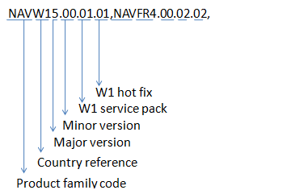

# Designing Application Objects
All [!INCLUDE[navnow](includes/navnow_md.md)] applications are based on the following types of application objects.  

|Application object|[!INCLUDE[bp_tabledescription](includes/bp_tabledescription_md.md)]|  
|------------------------|---------------------------------------|  
|[Tables](Tables.md)|You use tables to store data. For example, a business application may contain a customer table that stores information about each customer, such as, name, address, telephone number, and contact person.|  
|[Reports](Reports.md)|You use reports to present data. You use filters and sorting to select the data that you want to present in a report.|  
|[XMLports](XMLports.md)|You use XMLports to import and export data in .xml, .txt, or .csv format.|  
|[Codeunits](Codeunits.md)|A codeunit contains user-defined functions that are written in C/AL code. You can use the functions in a codeunit from the other objects in your application.|  
|[MenuSuites](MenuSuites.md)|A MenuSuite object contains the set of menus that are displayed in the navigation pane.|  
|[Pages](Pages.md)|Pages display data from the database and allow users to enter new data into the database. **Note:**  Every application object is identified by an ID number. However, there are restrictions about which numbers you should use when you create your own application objects. Contact your Microsoft Certified Partner for more information.|  
|[Queries](Queries.md)|A query specifies a set of data from the database.|  

 You use the [!INCLUDE[nav_dev_long](includes/nav_dev_long_md.md)] to create business applications. Object Designer is a tool in the [!INCLUDE[nav_dev_short](includes/nav_dev_short_md.md)] that you use to design application objects in [!INCLUDE[navnow](includes/navnow_md.md)]. Object Designer lets you do the following:  

-   Design new tables, reports, XMLports, codeunits, MenuSuites, pages, and queries.  

-   View existing application objects.  

-   Modify existing application objects.  

-   Run application objects.  

   

 With the exception of MenuSuite objects, you can work on any number of application objects at the same time, each in its own designer. This means that you can run multiple instances of these designers. For example, if you work on three new pages at the same time, then each page is displayed in its own Page Designer window. However, you can only run one instance of Object Designer.  

## Elements of [!INCLUDE[navnow](includes/navnow_md.md)] Objects  

### Properties  
 Properties control the appearance and behavior of the application objects and data. For more information, see [Properties](Properties.md).  

### Triggers  
 A trigger activates a function when a certain event occurs on an application object. The event and the function together make a trigger. You can add C/AL code to the trigger to modify the default behavior of the application object or extend its functionality. For more information, see [Triggers](Triggers.md).  

### Keys  
 Keys define the order in which data is stored in your tables. You can speed up searches in tables by defining several keys which sort information in different ways. For more information, see [Table Keys](Table-Keys.md).  

### Fields  
 A field on a table is a building block in the database that stores a piece of data. A field typically stores information such as a name or a number. For more information, see [Overview of Tables](Overview-of-Tables.md).  

## Object Designer and MenuSuite Objects  
 When you choose the **MenuSuite** button in Object Designer, select a MenuSuite object and then choose **Design**, the content of the object is displayed in Navigation Pane Designer. This is where you modify the content.  

 When you choose the **MenuSuite** button and then choose **New**, a dialog opens asking you to specify which menu suite level (for example, Developer or Administrator) that you want to create. If you have created a MenuSuite object for each level that you have permissions for, then the **New** button is disabled. This is because only one MenuSuite object is allowed per level. After you have made a selection, the Navigation Pane Designer opens and you have the appropriate design permissions.  

## Object-Oriented vs. Object-Based  
 The [!INCLUDE[nav_dev_long](includes/nav_dev_long_md.md)] is not object-oriented but object-based. This is an important distinction. In an object-oriented language or environment, a developer can create new types of objects based on the ones already in the system. In [!INCLUDE[navnow](includes/navnow_md.md)], you can only create objects that are either tables, reports, XMLports, codeunits, MenuSuites, pages, or queries.  

## Standard Microsoft Dynamics NAV Version Conventions  
 The following illustration shows the version convention that is used in [!INCLUDE[navnow](includes/navnow_md.md)].  

   

 Product family code, country/region reference, major version, and minor version are required. Service pack and hotfix are optional.  

### Standard Object with Local Functionality Modifications Version Convention  
 A standard object with local functionality modifications contains the following version strings.  

-   A standard object version string.  

-   A local functionality version string.  

 The following example shows a standard object with local functionality modifications.  

 **NAVW15.00.01.01**, **NAVFR4.00.02.02**  

 This version string contains the following information:  

-   The object is based on a standard (W1) object and has been modified to support local functionality.  

-   The W1 object was created or last changed with Microsoft Dynamics NAV 5.0 with W1 Service Pack 1 and W1 hotfix 1.  

-   The local functionality that is contained in the object was created or last changed in Microsoft Dynamics NAV 4.0 for France with the local Service Pack 2 and local hotfix 2.  

### Microsoft CertifiedPartner Object Version Convention  
 Microsoft Certified Partners must follow the same version convention. Instead of using the two-letter country/region code, partners should use two letters that refer to their company. For example, the Fabrikam Company would use FC as their code. The rest of the version information should be updated as appropriate.
