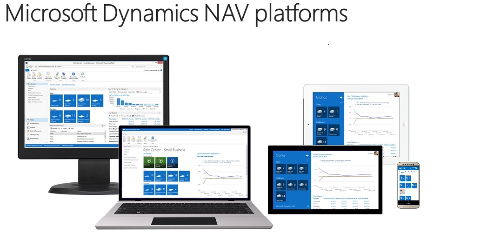

# Designing for Different Screen Sizes on Tablet and Phone
When designing application pages for the [!INCLUDE[nav_tablet](../dynamics-nav/includes/nav_tablet_md.md)] and the [!INCLUDE[nav_phone](../dynamics-nav/includes/nav_phone_md.md)], it is best practice to consider the size of the tablets or phones that your end\-users have access to. It is an advantage if the solution works well on both small screen sizes and also on larger screen sizes, but we also recommend that you consider thoroughly the most frequently used screen sizes for your end\-user experience. Designing for small screens can be a challenge, because pages will show fewer fields, columns, and tiles.  
  
 In many cases, end\-users will have access to a broad range of devices having different screen sizes and resolutions. End\-users may have one device at work, and a different device at home, and expect the experience on both devices to be equally good. A good way to identify issues on how your application pages will look is to test on the smallest supported screen size. Currently tablet sizes start in the 7” range and phones range from 3” up to just below 7”. There are certain requirements for running the [!INCLUDE[nav_uni_app](../dynamics-nav/includes/nav_uni_app_md.md)] on tablets and phones. For more information, see [System Requirements for Microsoft Dynamics NAV 2016](../dynamics-nav/System-Requirements-for-Microsoft-Dynamics-NAV-2016.md).  
  
   
  
## Form Factor Considerations  
 Users can scroll the content area of the [!INCLUDE[nav_uni_app](../dynamics-nav/includes/nav_uni_app_md.md)] on a tablet to access all data for a given page. However, some elements of the screen, for example, the app bar cannot be scrolled. The app bar is the blue area of [!INCLUDE[nav_uni_app](../dynamics-nav/includes/nav_uni_app_md.md)] and it is designed to provide easy access to important information and tasks that the user should not lose sight of when scrolling. The static elements will display only as much data as they can reasonably fit on the screen. Developers should design to make sure that the important static elements are displayed first so that these will be shown even on the smallest, available devices.  
  
 On phones there is no app bar, and the [!INCLUDE[nav_uni_app](../dynamics-nav/includes/nav_uni_app_md.md)] displays only one part at a time on the Role Center. On the Home page, the Activity tiles are always displayed first, and you navigate through the top menu to explore the content area.  
  
### Guidance for Page Element Types on Smallest Tablet Devices  
 The following table provides a list of non\-scrollable elements in the page content or the app bar.  
  
|Page Type|Displays on smallest tablet device|  
|---------------|----------------------------------------|  
|RoleCenter|4 tiles in 1 group, or 2 groups together with 2 tiles|  
|List Pages|5 columns of type Text50 or 8 columns of type Text20|  
|Card Pages|-   CardPage Factbox with up to 15 fields -   2 CardPage Factboxes with up to 6 fields each -   Activities Factboxes with 4 tiles in 1 group, or 2 groups together with 2 tiles|  
|Document Pages|-   CardPage Factbox with up to 15 fields -   2 CardPage Factboxes with up to 6 fields each -   Activities Factboxes with 4 tiles in 1 group, or 2 groups together with 2 tiles|  
  
### Testing Using a Browser  
 Using a browser you can test how your application pages will look on various device sizes. For more information, see [How to: Open the Microsoft Dynamics NAV Tablet or Phone Client from a Browser](../Topic/How%20to:%20Open%20the%20Microsoft%20Dynamics%20NAV%20Tablet%20or%20Phone%20Client%20from%20a%20Browser.md). When running [!INCLUDE[nav_tablet](../dynamics-nav/includes/nav_tablet_md.md)] or [!INCLUDE[nav_phone](../dynamics-nav/includes/nav_phone_md.md)] in a browser, you can use Microsoft Edge Developer Tools to emulate different screen sizes. For more information, see [Using the F12 developer tools](http://go.microsoft.com/fwlink/?LinkId=620949). Also, for more information see [Troubleshooting: Client Returns Wrong CLIENTTYPE](../Topic/Troubleshooting:%20Client%20Returns%20Wrong%20CLIENTTYPE.md).  
  
## See Also  
 [Deciding on Your Tablet and Phone Strategy](../dynamics-nav/Deciding-on-Your-Tablet-and-Phone-Strategy.md)   
 [Differences and Limitations When Developing Pages for the Microsoft Dynamics NAV Universal App](../dynamics-nav/Differences-and-Limitations-When-Developing-Pages-for-the-Microsoft-Dynamics-NAV-Universal-App.md)