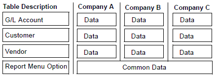

# Dividing the Database into Companies
[!INCLUDE[navnow](includes/navnow_md.md)] can only access one logical database at a time, but this database can be divided into one or more companies. A company is a "subdatabase," and its primary use is to separate and group data in the same database. Fields and tables are identified by a number, but companies are identified by a name. A company bundles one or more data tables together into a logical superstructure that is identified by the company name. Other than the shared company name, the different tables in a company have nothing in common.  
  
 Opening a company is the first step that you perform after you open the database or connect to a server.  
  
 The following illustration shows a database that has four tables.  
  
   
  
 The four table descriptions on the left side apply to each of the data tables of  three companies. The records in the tables, G\/L Account, Customer, and Vendor have the same structure and the same field definitions, even though they belong in three different companies. Only the data stored in the fields differ. The information in a Table Description can be used by tables from more than one company, no redundant information will be stored. This minimizes the size of the database.  
  
 Even though you have selected a specific company, you can still access data in any table in any other company. Use the [CHANGECOMPANY Function \(Record\)](CHANGECOMPANY-Function--Record-.md) to explicitly define which other company that you want to access.  
  
## See Also  
 [How to: Create and Delete a Table Description](How%20to:%20Create%20and%20Delete%20a%20Table%20Description.md)