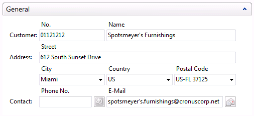
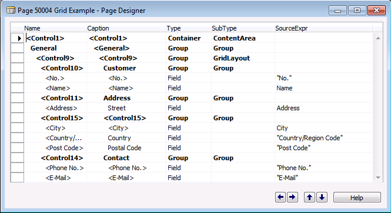

# How to: Arrange Fields in Rows and Columns Using the GridLayout Control
By default, fields in a FastTab are arranged automatically in two columns that are based on the number of fields. You can use the **GridLayout** control to arrange the fields manually in one or more rows and columns. The **GridLayout** control gives you the following options:  
  
-   Set up your grid row\-by\-row or column\-by\-column.  
  
-   Span a field across multiple rows and columns.  
  
-   Show or hide field captions.  
  
 The following figure illustrates a page that uses the **GridLayout** control to display fields from table 18, Customer, in the [!INCLUDE[demolong](includes/demolong_md.md)]. The fields are arranged in four rows.  
  
   
  
 The following figure shows Page Designer for the GridLayout example.  
  
   
  
## Setting Up Fields in Rows and Columns on a Page  
 To add rows and columns of fields to a page, you set up a **GridLayout** control in a FastTab of the page. When you set up the **GridLayout** control, you specify whether fields are arranged in rows or columns. After you set the **GridLayout** control, you can add fields in rows and columns of fields by adding **Group** controls under the **GridLayout** control. Each **Group** control defines either a row or column, depending on the setup of the **GridLayout** control.  
  
#### To set up a GridLayout control in a FastTab  
  
1.  In Page Designer, open a page.  
  
2.  Insert a row, and then set the **Type** column to **Group**.  
  
     This defines the FastTab that contains the fields of the grid.  
  
3.  To specify a heading for the FastTab, type the text in the **Caption** column.  
  
4.  Under the new **Group** control, insert a row, and then set the **Type** column to **Group** and the **Subtype** column to **GridLayout**.  
  
5.  Select the new **GridLayout** control, and on the **View** menu, choose **Properties**.  
  
6.  In the **Properties** window, in the **Value** column of the **Layout** property, choose the drop\-down arrow. Set the [Layout Property](Layout-Property.md) as follows:  
  
    1.  Select **Rows** to set up fields row\-by\-row.  
  
    2.  Select **Columns** to set up fields column\-by\-column. This is the default setting.  
  
#### To add a row or column of fields to the GridLayout control  
  
1.  In Page Designer, under the **GridLayout** control, insert a row, and then set the **Type** column to **Group** and the **Subtype** column to **Group**.  
  
     This defines a container for the row or column of fields, depending on the value that you set the **Layout** property to in the previous procedure.  
  
2.  To specify a heading for the row or column, type the text in the **Caption** field of the **Group** control.  
  
    > [!NOTE]  
    >  If you are setting up a row, then a colon is automatically added to the end of a row heading on the rendered page.  
  
3.  To add fields to the row or column, do the following:  
  
    1.  Under the **Group** control, insert a blank line, and then set the **Type** column to **Field**.  
  
    2.  In the **SourceExpr** column, type the name of the data source, such as a field in the table that is associated to the page.  
  
    3.  To include a caption for the field, type the text in the **Caption** column.  
  
        > [!NOTE]  
        >  By default, field captions display above the field. If you want to hide or reposition the caption, then see [Hiding Field Captions](How%20to:%20Arrange%20Fields%20in%20Rows%20and%20Columns%20Using%20the%20GridLayout%20Control.md#position).  
  
## Setting Fields to Span Multiple Rows and Columns  
 You can set a field to span multiple rows or columns. When you set a field to span multiple rows, the field occupies the cells in the rows below it, and existing fields in the occupied cells are moved to the right. For example, the following figure illustrates a **GridLayout** control that consists of six fields arranged in three rows.  
  
   
  
 If you set **Field 2** to span two rows, then the following layout is displayed:  
  
   
  
 When you set a field to span multiple columns, the field occupies the cells in the columns to the right, and existing fields in the occupied cells are moved to the right. Using the previous **GridLayout** example, if you set **Field 2** to span two columns instead of two rows, the following layout is displayed:  
  
   
  
 You can also set a field to span multiple rows and columns. For example, if you set **Field 2** to span two rows and two columns, the following layout is displayed:  
  
   
  
> [!IMPORTANT]  
>  The [!INCLUDE[nav_web](includes/nav_web_md.md)] does not support row and column spanning for fields. If the page displays in the [!INCLUDE[nav_web](includes/nav_web_md.md)], the fields appear without spanning.  
  
#### To set a field to span rows and columns  
  
1.  Under the **GridLayout** control, select the field that you want to set to span rows or columns, and then on the **View** menu, choose **Properties**.  
  
2.  In the **Properties** window, do the following:  
  
    -   To set a field to span one or more rows, set the value of the [RowSpan Property](RowSpan-Property.md) to the number of rows.  
  
    -   To set a field to span one or more columns, set the value of the [ColumnSpan Property](ColumnSpan-Property.md) to the number of columns.  
  
##   Hiding Field Captions  
  
#### To hide a field caption  
  
1.  Select the field, and then on the **View** menu, choose **Properties**.  
  
2.  In the **Properties** window, set the value of the [ShowCaption Property](ShowCaption-Property.md) to **No**  
  
## See Also  
 [Arranging Fields in Rows and Columns](Arranging-Fields-in-Rows-and-Columns.md)   
 [Field Arrangement on FastTabs](Field-Arrangement-on-FastTabs.md)