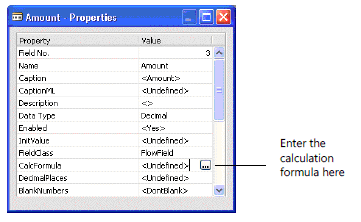
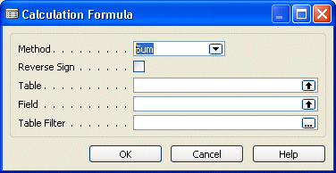
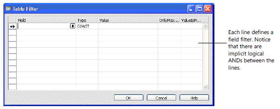
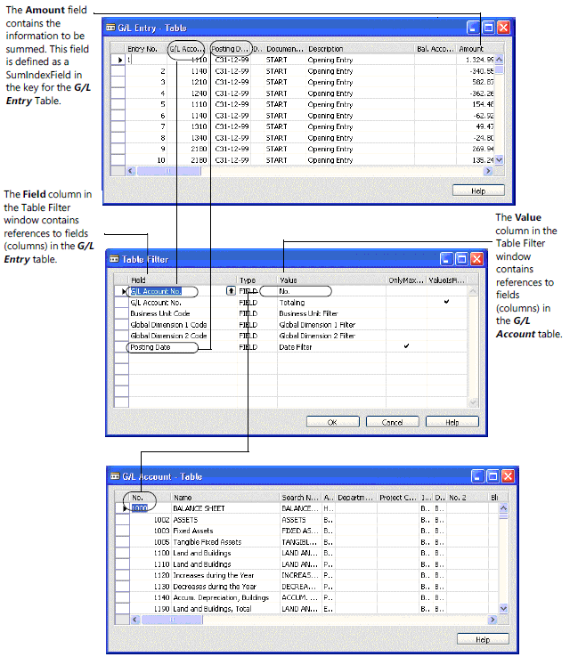
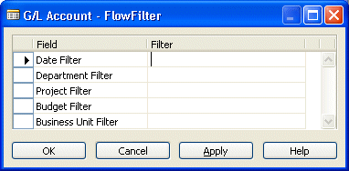

# How to: Create, View, and Edit a Calculation Formula
The following procedure describes the steps to take to create and revise a calculation formula for a FlowField of a table.  
  
### To create, view, and edit a calculation formula  
  
1.  On the **Tools** menu, choose **Object Designer**. Open the table to which you want to add a calculation formula.  
  
2.  Select the field for which you want to create, view, or edit the calculation formula.  
  
3.  On the **View** menu, choose **Properties** to open the **Properties** window.  
  
4.  Find the **CalcFormula** property.  
  
       
  
5.  Enter the calculation formula directly or choose the **AssistEdit** button. When you choose the **AssistEdit** button, the following dialog box is displayed.  
  
       
  
6.  Choose the drop-down button to select the appropriate calculation method.  
  
7.  Select the **Reverse Sign** option to reverse the sign of the result \(only for **Sum** and **Average**\).  
  
8.  Use the up arrows to select the table and field from which to get the information.  
  
9. If necessary, you can add a table filter to specify a limited set of records. Choose the **AssistEdit** button to the right of the **Table Filter** field and the **Table Filter** window opens.  
  
       
  
10. On each line in this window, you can define a field filter. For each field filter, specify a field, a type, and a value. You can also set the **OnlyMaxLimit** and the **ValueIsFilter** options.  
  
 The following example illustrates where the information in the **Table Filter** window comes from. The **Balance at Date** field in the **G/L Account** table is a decimal type **FlowField**. This field is calculated from values in the **Amount Column** in the **G/L Entry** table.  
  
   
  
 Some of the fields in the **G/L Account** table are **FlowFilter** fields. By entering filter expressions into these fields, the user can affect the calculation of **FlowFields** field, such as **Balance at Date**, at run time. The user can enter filter values on a **FlowFilter** page.  
  
   
  
 If the user enters a date filter expression in the **Date Filter** field, it is transferred via the table filter and used in the **Date** column in the **G/L Entry** table.  
  
 You can use the **OnlyMaxLimit** option to remove the lower limit from a range defined by a filter expression. For example, if the filter expression is defined as a range **x..y**, setting the **OnlyMaxLimit** option transforms the expression into **..y**.  
  
 The **ValueIsFilter** option determines how the system interprets the contents of the field referred to in the **Value** column in the **Table Filter** window. For example, if the field contains the value **1000..2000**, setting the **ValueIsFilter** option will cause this value to be interpreted as a filter rather than as a specific value.  
  
## See Also  
 [FlowFields](FlowFields.md)   
 [FlowFilter Overview](FlowFilter-Overview.md)