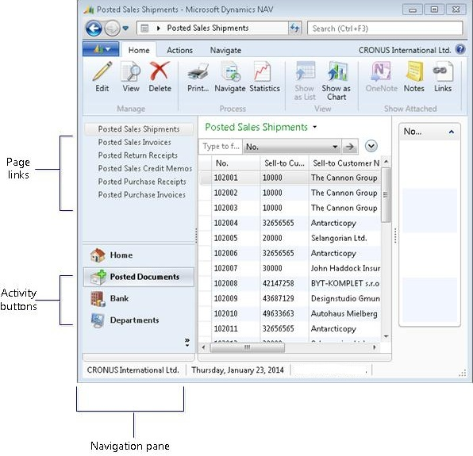

# How to: Create an Activity Button and Page Links in the Navigation Pane
An activity button in the navigation pane displays a menu of links to additional pages in the RoleTailored client. The following illustration shows activity buttons in the navigation pane.  
  
   
  
 You create activity buttons and page links for the navigation pane by adding actions on the page that defines the Role Center. For more information, see [Creating Activity Buttons for the Navigation Pane](Creating-Activity-Buttons-for-the-Navigation-Pane.md).  
  
### To create an activity button for the navigation pane  
  
1.  In the [!INCLUDE[nav_dev_short](includes/nav_dev_short_md.md)], on the **Tools** menu, choose **Object Designer**.  
  
2.  In Object Designer, choose **Page**, select the Role Center page, and then choose **Design** to open Page Designer.  
  
3.  On the **View** menu, choose **Page Actions**.  
  
4.  In Action Designer, activity buttons are set up under an action control that has the **Type** set to **ActionContainer** and the **SubType** set to **ActivityButtons**. If this action control already exists, then go to the next step. Otherwise, do the following to add the activity button container:  
  
    1.  Select a blank row.  
  
         To insert a row above another row, right\-click the row, and then choose the **New** button.  
  
        > [!NOTE]  
        >  The location of the activity button container with regard to other containers is not important. However, if you are inserting a row, then insert the container at the end of the actions that belong to the container above.  
  
    2.  In the row, set **Type** to **ActionContainer** and **SubType** to **ActivityButtons**.  
  
    3.  Choose another row, and then go back on the row to fill in **Name** and **Caption** automatically.  
  
5.  To add an activity button, select a blank row after the **ActivityButtons** container row.  
  
     The order of the activity buttons in the **Action Designer** determines the default order in the navigation pane of the RoleTailored client. If there are existing activity buttons, then locate the new activity button where you want it now or you use the UP ARROW and DOWN ARROW keys to move it later.  
  
6.  Set **Type** to **ActionGroup**.  
  
7.  In the **Caption** field, type the text to display on the activity button in the RoleTailored client.  
  
    > [!NOTE]  
    >  You can also include an image on the activity button. For more information, see [How to: Set an Icon on an Activity Button](../Topic/How%20to:%20Set%20an%20Icon%20on%20an%20Activity%20Button.md)  
  
8.  Use the RIGHT ARROW and LEFT ARROW keys to indent the row one level from the **ActivityButtons** container row.  
  
> [!NOTE]  
>  If the RoleTailored client is currently open, you will not see your changes until you close and restart.  
  
### To add a page link to an activity button  
  
1.  In Action Designer, select the action that defines the activity button to which you want to add the page link.  
  
2.  On the **View** menu, choose **Properties**.  
  
3.  In the **Properties** window, set the **RunObject** property value to **page \<name\>** and substitute \<name\> with either the page name or ID. For example, to link to the page with the ID 142 and name Posted Sales Shipments, you can type **page 142** or **page Posted Sales Shipments**.  
  
    > [!NOTE]  
    >  Instead of typing **page**, you can just type **p** followed by the ID or name, such as **p421** or **Posted Sales Shipments**.  
  
4.  Use the RIGHT ARROW and LEFT ARROW keys to indent the row one level from the **ActionGroup** row.  
  
> [!NOTE]  
>  If the RoleTailored client is currently open, you will not see your changes until you close and restart.  
  
## See Also  
 [Creating Activity Buttons for the Navigation Pane](Creating-Activity-Buttons-for-the-Navigation-Pane.md)   
 [Adding Actions to Pages](Adding-Actions-to-Pages.md)   
 [Walkthrough: Creating a Role Center](../Topic/Walkthrough:%20Creating%20a%20Role%20Center.md)   
 [Pages](Pages.md)