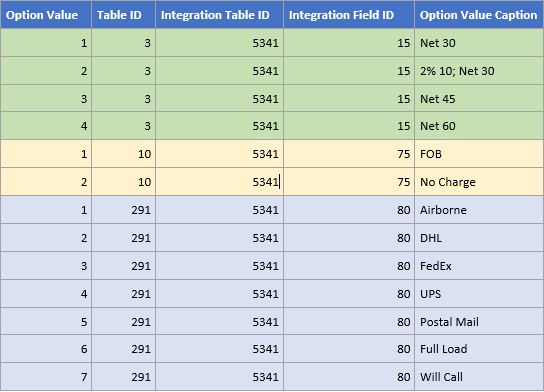
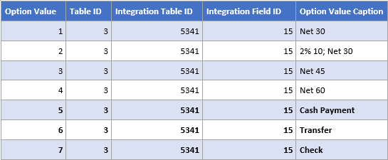

# Integrating Dynamics 365 for Sales in Dynamics NAV
[!INCLUDE[navnow_md](includes/navnow_md.md)] enables seamless integration in the lead-to-cash process for customers who use [!INCLUDE[crm_md](includes/crm_md.md)] for customer engagement and [!INCLUDE[navnow_md](includes/navnow_md.md)] for order processing and financials. Tight integration with [!INCLUDE[crm_md](includes/crm_md.md)] provides the following capabilities:  

-   Enables users to work in both [!INCLUDE[crm_md](includes/crm_md.md)] and [!INCLUDE[navnow_md](includes/navnow_md.md)].  

    User can view the data for equivalent records, such as [!INCLUDE[navnow_md](includes/navnow_md.md)] customers and [!INCLUDE[crm_md](includes/crm_md.md)] accounts from either system. They can work in the application that they prefer and are most efficient in, and make more informed decisions without switching applications.  

-   Data can be shared and synchronized between [!INCLUDE[crm_md](includes/crm_md.md)] and [!INCLUDE[navnow_md](includes/navnow_md.md)].  

    Changes to records in [!INCLUDE[crm_md](includes/crm_md.md)], such as accounts, can be copied to corresponding records in [!INCLUDE[navnow_md](includes/navnow_md.md)], such as customers. This enables users to keep information up-to-date in both applications.  

## Features of [!INCLUDE[crm_md](includes/crm_md.md)] Integration  
[!INCLUDE[crm_md](includes/crm_md.md)] integration enables you to couple [!INCLUDE[crm_md](includes/crm_md.md)] records with [!INCLUDE[navnow_md](includes/navnow_md.md)] records - essentially linking the records together. Once coupled, you can access [!INCLUDE[crm_md](includes/crm_md.md)] records from [!INCLUDE[navnow_md](includes/navnow_md.md)] and, for some entities, access [!INCLUDE[navnow_md](includes/navnow_md.md)] records from [!INCLUDE[crm_md](includes/crm_md.md)] (see the note after the following table). You can also synchronize data between records so that data is the same in both systems.

> [!NOTE]  
> For [!INCLUDE[navnow_md](includes/navnow_md.md)] fields of type Option, only records for options that also exist in [!INCLUDE[crm_md](includes/crm_md.md)] can be synchronized. During synchronization, such non-mapped options are ignored, the missing options are appended to the related [!INCLUDE[navnow_md](includes/navnow_md.md)] table and added to the **CRM Option Mapping** system table for manual handling later, for example, by adding the missing options in either product and then updating the mapping. For more information, see the "Handling Missing Option Values" section.

The following table describes the [!INCLUDE[crm_md](includes/crm_md.md)] entities that are integrated with [!INCLUDE[navnow_md](includes/navnow_md.md)] record types (tables) in the default implementation and the supported features.  

|[!INCLUDE[crm_md](includes/crm_md.md)] entity|[!INCLUDE[navnow_md](includes/navnow_md.md)] record type (table)|Features|  
|------------------------------|------------------------------------------------|--------------|  
|Account|Customer|<ul><li>In [!INCLUDE[navnow_md](includes/navnow_md.md)]:   <ul><li>Create a customer in [!INCLUDE[navnow_md](includes/navnow_md.md)] based on an account in [!INCLUDE[crm_md](includes/crm_md.md)]. Or, create an account in [!INCLUDE[crm_md](includes/crm_md.md)] based on a customer in [!INCLUDE[navnow_md](includes/navnow_md.md)]. The records in [!INCLUDE[navnow_md](includes/navnow_md.md)] and [!INCLUDE[crm_md](includes/crm_md.md)] are coupled and can be synchronized as changes are made in either system.</li><li>Access a coupled account in [!INCLUDE[crm_md](includes/crm_md.md)] from a customer in [!INCLUDE[navnow_md](includes/navnow_md.md)].</li><li>View and access opportunities, cases, and quotes that are associated with a corresponding account in [!INCLUDE[crm_md](includes/crm_md.md)].</li><li>Manual and scheduled data synchronization from [!INCLUDE[navnow_md](includes/navnow_md.md)] to [!INCLUDE[crm_md](includes/crm_md.md)] and from [!INCLUDE[crm_md](includes/crm_md.md)] to [!INCLUDE[navnow_md](includes/navnow_md.md)].</li></ul></li><li>In [!INCLUDE[crm_md](includes/crm_md.md)]:   <ul><li>Access a customer in [!INCLUDE[navnow_md](includes/navnow_md.md)] from an account.</li><li>View customer statistics from [!INCLUDE[navnow_md](includes/navnow_md.md)] in a quick view form.</li><li>Posts are automatically added on accounts in [!INCLUDE[crm_md](includes/crm_md.md)] when sales orders are posted for a customer in [!INCLUDE[navnow_md](includes/navnow_md.md)].</li></ul></li></ul>|  
|Contact|Contact|<ul><li>In [!INCLUDE[navnow_md](includes/navnow_md.md)]:   <ul><li>Create a contact in [!INCLUDE[navnow_md](includes/navnow_md.md)] based on a contact in [!INCLUDE[crm_md](includes/crm_md.md)]. Or, create a contact in [!INCLUDE[crm_md](includes/crm_md.md)] based on a contact in [!INCLUDE[navnow_md](includes/navnow_md.md)]. The records in [!INCLUDE[navnow_md](includes/navnow_md.md)] and [!INCLUDE[crm_md](includes/crm_md.md)] are coupled and can be synchronized as changes are made in either system.</li><li>Access a coupled [!INCLUDE[crm_md](includes/crm_md.md)] contact from a [!INCLUDE[navnow_md](includes/navnow_md.md)] contact.</li><li>Manual and scheduled data synchronization from [!INCLUDE[navnow_md](includes/navnow_md.md)] to [!INCLUDE[crm_md](includes/crm_md.md)] and from [!INCLUDE[crm_md](includes/crm_md.md)] to [!INCLUDE[navnow_md](includes/navnow_md.md)].</li></ul></li><li>In [!INCLUDE[crm_md](includes/crm_md.md)]:   <ul><li>Access a coupled [!INCLUDE[navnow_md](includes/navnow_md.md)] contact from a [!INCLUDE[crm_md](includes/crm_md.md)] contact.</li></ul></li></ul>|  
|User|Salesperson/Purchaser|<ul><li>In [!INCLUDE[navnow_md](includes/navnow_md.md)]:   <ul><li>Access a coupled user in [!INCLUDE[crm_md](includes/crm_md.md)] from a salesperson in [!INCLUDE[navnow_md](includes/navnow_md.md)].</li><li>Manual and scheduled data synchronization from [!INCLUDE[crm_md](includes/crm_md.md)] to [!INCLUDE[navnow_md](includes/navnow_md.md)].</li></ul></li><li>In [!INCLUDE[crm_md](includes/crm_md.md)]:   <ul><li>Access a coupled salesperson in [!INCLUDE[navnow_md](includes/navnow_md.md)] from a user in [!INCLUDE[crm_md](includes/crm_md.md)].</li></ul></li></ul>|  
|Product|Item and Resource|<ul><li>In [!INCLUDE[navnow_md](includes/navnow_md.md)]:   <ul><li>Create and couple a new product in [!INCLUDE[crm_md](includes/crm_md.md)] from an item or resource in [!INCLUDE[navnow_md](includes/navnow_md.md)].</li><li>Access a coupled product in [!INCLUDE[crm_md](includes/crm_md.md)] from an item or resource in [!INCLUDE[navnow_md](includes/navnow_md.md)].</li><li>Manual and scheduled data synchronization from [!INCLUDE[navnow_md](includes/navnow_md.md)] to [!INCLUDE[crm_md](includes/crm_md.md)].</li></ul></li><li>In [!INCLUDE[crm_md](includes/crm_md.md)]:   <ul><li>Access an item or resource in [!INCLUDE[navnow_md](includes/navnow_md.md)] from a product in [!INCLUDE[crm_md](includes/crm_md.md)].</li></ul></li></ul>|  
|Unit Group|Unit of Measure|<ul><li>In [!INCLUDE[navnow_md](includes/navnow_md.md)]:   <ul><li>Create a new unit group in [!INCLUDE[crm_md](includes/crm_md.md)] from a unit of measure in [!INCLUDE[navnow_md](includes/navnow_md.md)].</li><li>Access a coupled [!INCLUDE[crm_md](includes/crm_md.md)] unit group from a [!INCLUDE[navnow_md](includes/navnow_md.md)] unit of measure.</li><li>Manual and scheduled data synchronization from [!INCLUDE[navnow_md](includes/navnow_md.md)] to [!INCLUDE[crm_md](includes/crm_md.md)].</li></ul></li></ul>|
|Transaction Currency|Currency|<ul><li>In [!INCLUDE[navnow_md](includes/navnow_md.md)]:   <ul><li>Create and couple a new transaction in [!INCLUDE[crm_md](includes/crm_md.md)] from a currency in [!INCLUDE[navnow_md](includes/navnow_md.md)].</li><li>Access a coupled transaction currency in [!INCLUDE[crm_md](includes/crm_md.md)] from a currency in [!INCLUDE[navnow_md](includes/navnow_md.md)].</li><li>Manual and scheduled data synchronization from [!INCLUDE[navnow_md](includes/navnow_md.md)] to [!INCLUDE[crm_md](includes/crm_md.md)].</li></ul></li></ul>|  
|Price List|Customer Price Group|<ul><li>In [!INCLUDE[navnow_md](includes/navnow_md.md)]:   <ul><li> Create and couple a price list in [!INCLUDE[crm_md](includes/crm_md.md)] from a customer price group in [!INCLUDE[navnow_md](includes/navnow_md.md)].</li><li> Access a coupled price list in [!INCLUDE[crm_md](includes/crm_md.md)] from a customer price group in [!INCLUDE[navnow_md](includes/navnow_md.md)].</li><li>Manual and scheduled data synchronization from [!INCLUDE[navnow_md](includes/navnow_md.md)] to [!INCLUDE[crm_md](includes/crm_md.md)].</li></ul></li></ul> **Note:** Due to differences in price lists and customer price groups between [!INCLUDE[navnow_md](includes/navnow_md.md)] and [!INCLUDE[crm_md](includes/crm_md.md)], you must pay attention to the following:   <ul><li>Sales prices for sales type other than customer price groups are ignored.</li><li>When sales prices for customer price group have prices in different currencies in [!INCLUDE[navnow_md](includes/navnow_md.md)], you must create a separate customer price group for each currency to accommodate price list differences in [!INCLUDE[crm_md](includes/crm_md.md)].</li><li>Starting and ending dates are not synchronized to price lists as they are defined for sales prices in [!INCLUDE[navnow_md](includes/navnow_md.md)] and on price lists in [!INCLUDE[crm_md](includes/crm_md.md)]. </li></ul></li></ul>|  
|Sales Order|Sales Order|<ul><li>In [!INCLUDE[navnow_md](includes/navnow_md.md)]:   <ul><li>Create and couple a sales order in [!INCLUDE[navnow_md](includes/navnow_md.md)] based on a submitted sales order in [!INCLUDE[crm_md](includes/crm_md.md)].</li><li>Access a coupled sales order in [!INCLUDE[crm_md](includes/crm_md.md)] from the sales order in [!INCLUDE[navnow_md](includes/navnow_md.md)].</li></ul></li><li>In [!INCLUDE[crm_md](includes/crm_md.md)]:   <ul><li>Access a sales order in [!INCLUDE[navnow_md](includes/navnow_md.md)] from a sales order in [!INCLUDE[crm_md](includes/crm_md.md)].</li><li>When a sales order is posted in [!INCLUDE[navnow_md](includes/navnow_md.md)], the status of the coupled [!INCLUDE[crm_md](includes/crm_md.md)] sales order changes to invoiced.</li></ul></li></ul> **Note:**  After a sales order is created in [!INCLUDE[navnow_md](includes/navnow_md.md)], you cannot synchronize data between the [!INCLUDE[navnow_md](includes/navnow_md.md)] sales order and the [!INCLUDE[crm_md](includes/crm_md.md)] sales order.|

> [!IMPORTANT]  
>  Navigating from [!INCLUDE[crm_md](includes/crm_md.md)] records to [!INCLUDE[navnow_md](includes/navnow_md.md)] records is only supported if the [!INCLUDE[navnow_md](includes/navnow_md.md)] integration solution is installed in [!INCLUDE[crm_md](includes/crm_md.md)]. For more information, see [How to: Prepare Dynamics 365 for Sales for Integration with Dynamics NAV](How-to-prepare-Dynamics-CRM-for-Integration.md).  

## Handling Missing Option Values
[!INCLUDE[crm_md](includes/crm_md.md)] contains only three so-called option set fields that contain option values, which can be mapped to [!INCLUDE[navnow_md](includes/navnow_md.md)] fields of type Option for automatic synchronization. During synchronization, such non-mapped options are ignored, the missing options are appended to the related [!INCLUDE[navnow_md](includes/navnow_md.md)] table and added to the **CRM Option Mapping** system table for manual handling later, for example by adding the missing options in either product and then updating the mapping. This is described in the following.

The **Integration Table Mapping** table contains three maps for fields in the current version that contain one or more mapped option values.

After a full synchronization, the **CRM Option Mapping** table contains the non-mapped options in the three fields respectively. Green rows are for payment term option. Yellow rows for shipment method options. Blue rows are for shipping agent option.

The content of the **CRM Option Mapping** table is based on option strings in the **CRM Account** table.

In [!INCLUDE[crm_md](includes/crm_md.md)], the following fields on the Account entity are mapped to fields on the Customer record:

- **Address 1: Freight Terms** of data type Option Set, where options are defined as follows.
    
- **Address 1: Shipping Method** of data type Option Set, where options are (from 1 to 7).
    
- **Payment Terms** of data type Option Set, where options are (from 1 to 4).
    

All the above [!INCLUDE[crm_md](includes/crm_md.md)] option sets are mapped to options in [!INCLUDE[navnow_md](includes/navnow_md.md)].

> [!NOTE]
> Do not rename records in tables mapped to [!INCLUDE[crm_md](includes/crm_md.md)] options as that will break the synchronization of the renamed option.

### Extending Option Sets in [!INCLUDE[crm_md](includes/crm_md.md)]
Add the three new options,  with values from 5 to 7.

Then, you are able to access them in the **CRM Account** table.

> [!NOTE]
> Make sure that the first ten characters of the new option value names are [!INCLUDE[crm_md](includes/crm_md.md)] are unique. For example, two options named "Transfer 20 working days" and "Transfer 20 calendar days" will cause a failure because both have the same first 10 characters, "Transfer 2". Name them, for example, "TRF20 WD" and "TRF20 CD".

### Extending the CRM Account Table in [!INCLUDE[navnow_md](includes/navnow_md.md)]
You can now regenerate the **CRM Account** table, either by the PowerShell script or by modifying it manually.

Modify the **PaymentTermsCode** field by adding new options.

The **OptionOrdinalValues** property is not visible in the Development Environment, but you can update it in the text object.

### Update the CRM Option Mapping table
Now you can recreate the mapping between [!INCLUDE[crm_md](includes/crm_md.md)] options and [!INCLUDE[navnow_md](includes/navnow_md.md)] records.

In the **Integration Table Mapping** window, select the line for the Payment Terms map, and then choose the **Synchronize Modified Records** action.

This, in turn, updates the **CRM Option Mapping** table.

The **Payment Terms** table in [!INCLUDE[navnow_md](includes/navnow_md.md)] will then have new records for the [!INCLUDE[crm_md](includes/crm_md.md)] options. (New  options are in bold font below. Yellow rows represent all options that can now be synchronized. Gray rows represent options are not in use and will be ignored during synchronization. You can remove them or extend [!INCLUDE[crm_md](includes/crm_md.md)] options with the same names.)

## See Also  
[Setting Up Dynamics 365 for Sales Integration in Dynamics NAV](Setting-Up-Dynamics-CRM-Integration.md)  
[Customizing Dynamics 365 for Sales and Dynamics NAV Integration](Customizing-Dynamics-CRM-and-Dynamics-NAV-Integration.md)  
