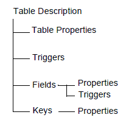

# Overview of Tables
The records in the database are stored in tables. A table can be visualized as a two-dimensional matrix, consisting of columns and rows. The following illustration shows a table where each row is a record and each column is a field.  
  
 A table consists of two parts: the table data and a table description. The table data is the part users often think of as comprising the database, because it contains the actual records with their data fields. The layout and properties of those fields, however, are specified by the table description. The table description is not directly visible to the user. The following illustration shows how the table data and the table description together form a table.  
  
   
  
 When you design a table, you assign a number of characteristics to it, such as a name, an ID number, and the fields it contains. You also assign a number of characteristics \(such as name, ID number, data type, and initial value\) to each field. When you design a new table, you also specify which keys you want the system to maintain. All these characteristics are stored in the table description when you save your table design.  
  
 The information in the table description is used by SQL Server and occasionally by database users who need information about the table structure. The table description makes the database flexible, as it lets the system access tables with different structures. The database can extract the definitions of the table structure from the table description and thereby correctly access any table.  
  
 The following illustration shows that a table description contains properties, triggers, fields, and keys and shows how these are related.  
  
   
  
 The table description contains some properties that are related to the table, others that are related to the fields in the table, and other properties related to keys. You can also see that triggers are defined both for the table and for the fields in the table.  
  
## See Also  
 [How to: Create a Table](How-to--Create-a-Table.md)   
 [Table Keys](Table-Keys.md)   
 [Special Tables](Special-Tables.md)   
 [Table and Field Triggers](Table-and-Field-Triggers.md)