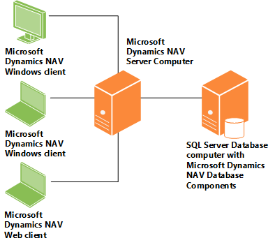

# Product and Architecture Overview
The [!INCLUDE[navnowlong](includes/navnowlong_md.md)] architecture comprises three core components as well as various additional tools and components. Use [!INCLUDE[navnow](includes/navnow_md.md)] Setup to install all components.  
  
## The [!INCLUDE[navnow](includes/navnow_md.md)] Three-Tier Architecture  
 For every deployment of [!INCLUDE[navnowlong](includes/navnowlong_md.md)] you must install the core components, which are the three tiers that make up the [!INCLUDE[navnow](includes/navnow_md.md)] architecture.  
  
1.  The [!INCLUDE[rtc](includes/rtc_md.md)] is the *client tier*, which includes a [!INCLUDE[nav_windows](includes/nav_windows_md.md)] and a [!INCLUDE[nav_web](includes/nav_web_md.md)].  
  
     In addition to the [!INCLUDE[rtc](includes/rtc_md.md)], [!INCLUDE[navnowlong](includes/navnowlong_md.md)] also supports additional client types, including web service clients and a NAS services client for programmatic access. For details on the various client types, see [Client Types](Client-Types.md).  
  
2.  [!INCLUDE[nav_server](includes/nav_server_md.md)] is the *middle or server tier*, managing all business logic and communication.  
  
3.  SQL Server, augmented by [!INCLUDE[navnowlong](includes/navnowlong_md.md)] database components, is the *data tier*.  
  
     If you deploy [!INCLUDE[navnow](includes/navnow_md.md)] in a multitenant deployment architecture, the data tier consists of an application database and one or more tenant databases.  
  
> [!IMPORTANT]  
>  When you install [!INCLUDE[navnowlong](includes/navnowlong_md.md)], all components must be from the same version and build of [!INCLUDE[navnow](includes/navnow_md.md)] for the software to run correctly.  
  
 You can have multiple instances of any of the core components in a production environment. The following diagram shows a simple installation with two [!INCLUDE[nav_windows](includes/nav_windows_md.md)]s and a [!INCLUDE[nav_web](includes/nav_web_md.md)] connecting to a single [!INCLUDE[nav_server](includes/nav_server_md.md)] computer, which in turn connects to a computer with SQL Server and the [!INCLUDE[navnow](includes/navnow_md.md)] database components.  
  
   
  
 Some common configurations are:  
  
-   All three components on the same computer. This is the configuration for a demo install, and is also typical for a development environment, so that a developer can work on [!INCLUDE[navnow](includes/navnow_md.md)] applications without worrying about network connections and inter-component security. See [Walkthrough: Installing the Demo Version](Walkthrough:-Installing-the-Demo-Version.md).  
  
-   [!INCLUDE[rtc](includes/rtc_md.md)] and [!INCLUDE[nav_server](includes/nav_server_md.md)] on the same computer, data tier on a separate computer. This scenario is described in [Walkthrough: Installing the Three Tiers On Two Computers](Walkthrough:-Installing-the-Three-Tiers-On-Two-Computers.md).  
  
-   Each of the three tiers on a separate computer. This scenario is described in [Walkthrough: Installing the Three Tiers on Three Computers](Walkthrough:-Installing-the-Three-Tiers-on-Three-Computers.md).  
  
## Additional Components  
 In addition to the three core components, there are additional components that enhance or supplement the core components.  
  
|Component|Purpose|  
|---------------|-------------|  
|[Microsoft Dynamics NAV Help Server](Microsoft-Dynamics-NAV-Help-Server.md)|A website with the Help content for [!INCLUDE[navnow](includes/navnow_md.md)] in the languages that your version of [!INCLUDE[navnow](includes/navnow_md.md)] includes. You can deploy a single Help Server for all users, or customer-specific Help Servers, depending on your requirements.|  
|Web Server Components. See [How to: Install the Web Server Components](How-to--Install-the-Web-Server-Components.md).|The components that are needed to enable [!INCLUDE[nav_web](includes/nav_web_md.md)]s to connect with a browser.|  
|[Microsoft Dynamics NAV Server Administration Tool](Microsoft-Dynamics-NAV-Server-Administration-Tool.md)|A tool for configuring and managing [!INCLUDE[nav_server](includes/nav_server_md.md)] and [!INCLUDE[navnow](includes/navnow_md.md)] sites.|  
|[Development Environment \(C-SIDE\)](Development-Environment--C-SIDE-.md)|The Development Environment for creating and modifying [!INCLUDE[navnow](includes/navnow_md.md)] applications in C/AL.|  
|[Microsoft Office Outlook Add-In](Microsoft-Office-Outlook-Add-In.md)|A component for synchronizing data, such as to-dos, contacts, and tasks, between [!INCLUDE[navnow](includes/navnow_md.md)] and Outlook.|  
|[Automated Data Capture System](Automated-Data-Capture-System.md)|A [!INCLUDE[navnow](includes/navnow_md.md)] tool for accurately capturing data for inbound, outbound, and internal documents, primarily in connection with warehouse activities. With ADCS, company employees use handheld devices and radio frequency technology to continuously validate warehouse inventories.|  
|ClickOnce Installer Tools. See [Deploying Microsoft Dynamics NAV Using ClickOnce](Deploying-Microsoft-Dynamics-NAV-Using-ClickOnce.md).|A set of tools designed to create ClickOnce deployments for applications for the [!INCLUDE[nav_windows](includes/nav_windows_md.md)].|  
  
## See Also  
 [Deployment](Deployment.md)   
 [Working with Microsoft Dynamics NAV Setup](Working-with-Microsoft-Dynamics-NAV-Setup.md)   
 [Multitenant Deployment Architecture](Multitenant-Deployment-Architecture.md)