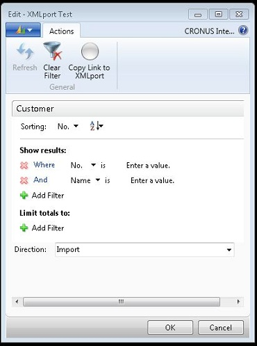

# Request Pages (XMLPorts)
A request page is a dialog box that appears when an XMLport is run from Object Designer. It enables the user to set a filter on the data, sort the data, and choose whether the XMLport imports or exports the data. For more information about how to run XMLports from Object Designer, see [How to: Run an XMLport from Object Designer](How-to--Run-an-XMLport-from-Object-Designer.md).  
  
 The filters are located on the **Options** FastTab. You design the **Options** FastTab of a request page by using Request Options Page Designer in the [!INCLUDE[nav_dev_short](includes/nav_dev_short_md.md)]. To access Request Options Page Designer, open XMLport Designer, choose **View**, and then choose **Request Page**.  
  
 You design the filters on request pages by using the following properties:  
  
-   [ReqFilterHeading Property](ReqFilterHeading-Property.md)  
  
-   [ReqFilterHeadingML Property](ReqFilterHeadingML-Property.md)  
  
-   [ReqFilterFields Property](ReqFilterFields-Property.md)  
  
-   [Direction Property](Direction-Property.md)  
  
-   [UseRequestPage Property](UseRequestPage-Property.md)  
  
 The following illustration shows the request page for an XMLport that imports and exports from the **Customer** table. The **No.** and **Name** fields have been set as filters.  
  
   
  
## Filtering on Request Pages  
 The fields that you define as **ReqFilterFields** are shown on the request page. In addition, a user can add more fields on which to filter.  
  
> [!NOTE]  
>  We recommend that you add fields that users of the XMLport will frequently set filters on.  
  
 By default, for every data item in the XMLport, a FastTab for defining filters and sorting is created on the request page. To remove a FastTab from a request page, do not define any **ReqFilterFields** property for the data item and set the **SourceTableView** property \(XMLports\) property to define sorting. In this case, the request page is displayed but there is no tab for this data item.  
  
 If you set the **UseRequestPage** property to **No**, then the request page will not be presented to the user.  
  
 In a complex XMLport that uses data from several tables, the functionality may depend on a specific key and sort order. Design your XMLports so that users cannot change the sort order in a way that affects the functionality of the XMLport.  
  
## Exporting and Importing Data  
 If the [Format Property \(XMLports\)](Format-Property--XMLports-.md) of the XMLport is set to **Both**, the XMLport can be used to import or export data. In that case, from the request page, users can choose whether to import or export the data from the **Direction** list. By default, **Import** is selected. If **Import** is selected and you choose the **OK** button, the **Import** window, where you can select the file to import opens. If you select **Export** and you choose the **OK** button, the **Export File** dialog box is displayed. On the dialog box, you can open the file or save it to your computer.  
  
 If the [Format Property \(XMLports\)](Format-Property--XMLports-.md) is set to either **Import** or **Export**, then the **Direction** list box is not displayed on the request page.  
  
## See Also  
 [Designing XMLports](Designing-XMLports.md)   
 [XMLport Walkthroughs](XMLport-Walkthroughs.md)   
 [How to: Run an XMLport from Object Designer](How-to--Run-an-XMLport-from-Object-Designer.md)