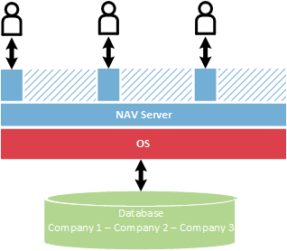
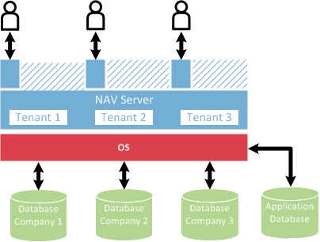

# Scaling the Microsoft Dynamics NAV Network Topology
When you deploy for the first time, you will have a [!INCLUDE[navnow](includes/navnow_md.md)] environment that is configured for a single [!INCLUDE[navnow](includes/navnow_md.md)] company. The environment typically consists of a [!INCLUDE[navnow](includes/navnow_md.md)] web server instance, [!INCLUDE[nav_server](includes/nav_server_md.md)] instance, and [!INCLUDE[navnow](includes/navnow_md.md)] database. Depending on the network topology that you chose for deployment, the components will be deployed on one, two, or three computers or virtual machines.  
  
 After the initial deployment, you can begin to scale the topology by adding companies, [!INCLUDE[navnow](includes/navnow_md.md)] web server instances, [!INCLUDE[nav_server](includes/nav_server_md.md)] instances, and [!INCLUDE[navnow](includes/navnow_md.md)] databases.  
  
## Scaling Configurations  
 There are four basic configurations for scaling up the [!INCLUDE[navnow](includes/navnow_md.md)] environment: single-server instance, multiple companies - single database, multiple server instances - multiple databases, and multiple-tenant.  
  
### Single Server Instance  
 With the single server instance configuration, each company has its own computer or virtual machine that hosts the [!INCLUDE[navnow](includes/navnow_md.md)] web server instance, [!INCLUDE[nav_server](includes/nav_server_md.md)] instance, and [!INCLUDE[navnow](includes/navnow_md.md)] database. Companies or instances do not share resources.  
  
   
  
### Multiple Companies - Single Database  
 With this configuration, companies share the same [!INCLUDE[navnow](includes/navnow_md.md)] web server instance and [!INCLUDE[nav_server](includes/nav_server_md.md)] instance, and [!INCLUDE[navnow](includes/navnow_md.md)] database on the same computer or virtual machine.  
  
   
  
### Multiple Server Instances - Multiple Databases  
 With this configuration, companies have their own [!INCLUDE[navnow](includes/navnow_md.md)] web server instance, [!INCLUDE[nav_server](includes/nav_server_md.md)] instance, and [!INCLUDE[navnow](includes/navnow_md.md)] database. Unlike the single-instance configuration, the [!INCLUDE[navnow](includes/navnow_md.md)] components for the companies are installed on the same computer or virtual machine.  
  
   
  
### Multiple Tenants  
 With this configuration, companies share a [!INCLUDE[nav_server](includes/nav_server_md.md)] instance and application database, but have their own business database. The application database contains tables and information that describe the [!INCLUDE[navnow](includes/navnow_md.md)] application and is not specific to companies. The business database, which is referred to as a tenant, stores business data that is specific to the company.  
  
   
  
> [!NOTE]  
>  A tenant database can contain data for one or more companies.  
  
 To support this scenario, you must configure the [!INCLUDE[navnow](includes/navnow_md.md)] environment for multitenancy. For more information, see [Migrating to Multitenancy](Migrating-to-Multitenancy.md).  
  
## How to Scale the Network Topology  
 To scale the network topology, depending on the task, you use can use [!INCLUDE[nav_shell](includes/nav_shell_md.md)], [!INCLUDE[nav_admin](includes/nav_admin_md.md)], [!INCLUDE[nav_dev_long](includes/nav_dev_long_md.md)], [!INCLUDE[nav_windows](includes/nav_windows_md.md)] or [!INCLUDE[nav_web](includes/nav_web_md.md)]. The following table lists the tasks and the methods that you can use to perform the tasks.  
  
|Task|Administration Shell|Administration Tool|Development Environment|Windows/Web client|For more information, see|  
|----------|--------------------------|-------------------------|-----------------------------|-------------------------|-------------------------------|  
|Add [!INCLUDE[nav_server](includes/nav_server_md.md)] instance|X|X|||[How to: Add a Microsoft Dynamics NAV Server Instance](How%20to:%20Add%20a%20Microsoft%20Dynamics%20NAV%20Server%20Instance.md) \(Administration Shell\)   [How to: Create a Microsoft Dynamics NAV Server Instance](How%20to:%20Create%20a%20Microsoft%20Dynamics%20NAV%20Server%20Instance.md) \(Administration Tool\)|  
|Add [!INCLUDE[navnow](includes/navnow_md.md)] web server instance|X||||[How to: Add a Microsoft Dynamics NAV Web Server Instance](How%20to:%20Add%20a%20Microsoft%20Dynamics%20NAV%20Web%20Server%20Instance.md)|  
|Mount a tenant on a [!INCLUDE[nav_server](includes/nav_server_md.md)] instance|X|X|||[How to: Mount a Tenant](How%20to:%20Mount%20a%20Tenant.md) \(Administration Shell\)   [How to: Mount or Dismount a Tenant on a Microsoft Dynamics Server Instance](How%20to:%20Mount%20or%20Dismount%20a%20Tenant%20on%20a%20Microsoft%20Dynamics%20Server%20Instance.md) \(Administration Tool\)|  
|Add [!INCLUDE[navnow](includes/navnow_md.md)] database|X||X||[How to: Add a Microsoft Dynamics NAV Database](How%20to:%20Add%20a%20Microsoft%20Dynamics%20NAV%20Database.md) \(Administration Shell\)   [How to: Create Databases](How%20to:%20Create%20Databases.md) \(Development Environment\)|  
|Add [!INCLUDE[navnow](includes/navnow_md.md)] company|X|||X|[How to: Add a Microsoft Dynamics NAV Company](How%20to:%20Add%20a%20Microsoft%20Dynamics%20NAV%20Company.md) \(Administration Shell\)   [How to: Create a New Company](How%20to:%20Create%20a%20New%20Company.md) \(Windows or Web client\)|  
  
> [!NOTE]  
>  For [!INCLUDE[navnow](includes/navnow_md.md)] deployment on Microsoft Azure, we recommend that you establish a remote desktop connection to the virtual machines.  
  
## See Also  
 [Multitenant Deployment Architecture](Multitenant-Deployment-Architecture.md)   
 [Network Topologies for Microsoft Dynamics NAV on Azure](Network-Topologies-for-Microsoft-Dynamics-NAV-on-Azure.md)   
 [Deploying and Managing Microsoft Dynamics NAV on Microsoft Azure](Deploying-and-Managing-Microsoft-Dynamics-NAV-on-Microsoft-Azure.md)