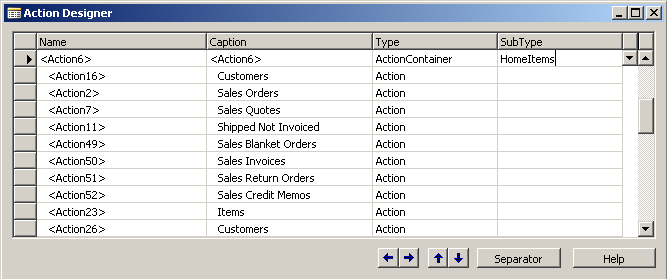

# Setting Up the Home Button and Home Items
**Home** is a default activity button in the navigation pane of [!INCLUDE[navnow](includes/navnow_md.md)] and displays items that link to List Places.  
  
## Adding Items to the Home Button  
 There are two ways that you can add items to the **Home** button:  
  
-   Add actions on the Role Center page.  
  
     You use the Action Designer to add actions under the **HomeItems** control. You set up the actions to open list pages. Each action appears as an item under the **Home** button. For example, the following illustration shows the Action Designer for the **Home** button items that are shown in the previous illustration.  
  
       
  
     For information about how to add an action under the **HomeItems** control, see [How to: Add Actions to a Page](How-to--Add-Actions-to-a-Page.md).  
  
-   Add Cues on the Role Center page.  
  
     Items from Cues are added to the **Home** button automatically. When you add a cue, you set the [DrillDownPageID Property](DrillDownPageID-Property.md) to a list page for displaying the data. If there is a relevant parent entity to place the Cue item under, that link is automatically added in the navigation pane. For example, if you have a Cue named **Sales Return Orders – Open**, this item will be added under the parent item **Sales Return Orders** in the navigation pane. For more information, see [Walkthrough: Creating a Cue Based on a FlowField](Walkthrough--Creating-a-Cue-Based-on-a-FlowField.md).  
  
### Child Items  
 An item is automatically positioned as a child to another item according to the following conditions:  
  
-   The child item targets a list page that displays filtered data from a table.  
  
-   The parent item targets the same list page as the child item, except that list page data is not filtered.  
  
-   The parent item is defined by an action, not a Cue.  
  
## Hiding and Customizing the Home Button and Items in the [!INCLUDE[nav_windows](includes/nav_windows_md.md)]  
 The **Home** button is always present in the navigation pane and cannot be removed or modified that included its icon. From the [!INCLUDE[nav_windows](includes/nav_windows_md.md)], end-users and administrators can use customization to change the items under the **Home** button including:  
  
-   Removing home items.  
  
    > [!NOTE]  
    >  Home items that are created from Cues cannot be removed using customization. The only way to remove these items is to remove the Cue by using Page Designer.  
  
-   Moving home items to other Activity buttons.  
  
-   Restoring the default Home items as defined in the Action Designer on the Role Center page.  
  
 As an end-user, the changes are only implemented on the user’s Role Center. For more information, see [Profiles and Role Centers](Profiles-and-Role-Centers.md).  
  
 If you are an administrator, then you can open the [!INCLUDE[nav_windows](includes/nav_windows_md.md)] in the Configuration mode and the changes that you make will be implemented on the Role Center for all users. For more information, see [How to: Open Microsoft Dynamics NAV in Configuration Mode](How-to--Open-Microsoft-Dynamics-NAV-in-Configuration-Mode.md).  
  
## See Also  
 [Customization: Configuration and Personalization](Customization:-Configuration-and-Personalization.md)   
 [Creating Activity Buttons for the Navigation Pane](Creating-Activity-Buttons-for-the-Navigation-Pane.md)