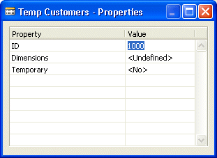

---
title:"Temporary Tables"
ms.custom: na
ms.date: 06/05/2016
ms.reviewer: na
ms.suite: na
ms.tgt_pltfrm: na
ms.topic: article
ms-prod:"dynamics-nav-2017"
ms.assetid: 55ab1366-7406-4060-8a41-41ec12f1bdea
caps.latest.revision: 14
---
# Temporary Tables
A temporary table is a temporary variable that holds a table. A temporary table is used as a buffer for table data in your C\/AL programs.  
  
 You can use a temporary table just like you use a database table. The differences between a temporary table and a database table are as follows:  
  
-   A temporary table is not stored in the database, but is only held in memory until the table is closed.  
  
-   The write transaction principle that applies to a database table does not apply to a temporary table.  
  
## Advantage of a Temporary Table  
 The advantage of using a temporary table is that all the interaction with a temporary table occurs on [!INCLUDE[nav_server](includes/nav_server_md.md)]. This reduces the load on both the network and the SQL database server.  
  
 When you want to perform many operations on the data in a specific table in the database, you can load the data into a temporary table when you modify it. Loading the data into a temporary table speeds up the process because all the operations are performed in memory on the [!INCLUDE[nav_server](includes/nav_server_md.md)].  
  
## Defining and Using a Temporary Table  
 You must define the temporary table before you can use it in your C\/AL code. The variable that holds a temporary table is defined just like any other global or local variable.  
  
> [!NOTE]  
>  XMLPort and report objects include a Temporary property that enables you to use temporary tables for storing the elements of data set that is generated by the objects. For more information, see [Temporary Property \(XMLports\)](Temporary-Property--XMLports-.md) and [Temporary Property \(Reports\)](Temporary-Property--Reports-.md).  
  
#### To define a temporary table  
  
1.  On the **Tools** menu, choose **Object Designer,** and then create a new table.  
  
     For information about how to create a table, see [How to: Create a Table](../Topic/How%20to:%20Create%20a%20Table.md).  
  
2.  Choose **View**, and then choose **C\/AL Globals** or **C\/AL Locals**, depending on whether your variable will be global or local.  
  
     If you choose **C\/AL Globals**, the **C\/AL Globals** window appears.  
  
       
  
3.  Enter a name for the temporary table variable, and enter or select **Record** as the data type. Use the up arrow in the **Subtype** field to select the table to copy.  
  
4.  With the cursor still on the line that defines the temporary table, choose **View**, and then choose **Properties** \(Shift\+F4\) to display the **Properties** window.  
  
       
  
5.  Change the value of the **Temporary** property to Yes.  
  
 After you have created a temporary table, you can use it in your C\/AL code. You can apply filters and perform searches just as you can with a database table.  
  
## See Also  
 [Special Tables](Special-Tables.md)   
 [Programming in C\-AL](Programming-in-C-AL.md)