# Touring the RoleTailored Client Pages
In [!INCLUDE[navnow](includes/navnow_md.md)], pages are the main way to display and organize data in the [!INCLUDE[rtc](includes/rtc_md.md)]. You can create pages to offer users a visual experience that is closely aligned to Microsoft Office and Windows. There are different page types that you use for different situations. The page type that you choose depends on the application task that you want to support, the content that you want to display, and how you want to display it. For example, the Role Center page is the main page of the [!INCLUDE[rtc](includes/rtc_md.md)] and it displays when the [!INCLUDE[rtc](includes/rtc_md.md)] opens. The Role Center page is similar to a home page that helps users focus on their most important daily activities, by giving an overview of the information relevant to their tasks on one page. Other types of pages, such as List pages, display lists of customers or sales orders, while others such as Document task pages, focus on user tasks.  
  
> [!NOTE]  
>  The term [!INCLUDE[rtc](includes/rtc_md.md)], which in [!INCLUDE[nav_2009_long](includes/nav_2009_long_md.md)] referred only to the [!INCLUDE[nav_windows](includes/nav_windows_md.md)], now the [!INCLUDE[rtc](includes/rtc_md.md)] includes either the [!INCLUDE[nav_windows](includes/nav_windows_md.md)] or the [!INCLUDE[nav_web](includes/nav_web_md.md)].  
  
 You can choose from the following page types:  
  
-   [Role Center Page Type](#RoleCenterPage)  
  
-   [Card Page Type](#CardPage)  
  
-   [Card Part Page Type](#CardPartPage)  
  
-   [ConfirmationDialog Page](#ConfirmationDialog)  
  
-   [Document Page Type](#DocumentPage)  
  
-   [List Page Type](#ListPage)  
  
-   [List Plus Page Type](#ListPlus)  
  
-   [List Part Page Type](#ListPartPage)  
  
-   [Navigate Page Type for Wizards](#NavigatePage)  
  
-   [StandardDialog Page Type](#StandardDialogPage)  
  
-   [Worksheet Page](#WorksheetPage)  
  
## Designing Pages  
 You create page objects using Page Designer. In Page Designer, a page is basically an XML object comprised of a number of XML elements that determine the layout and the page content. The following illustration shows an example of Page Designer.  
  
 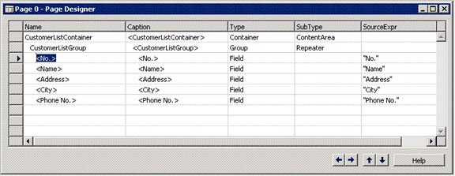  
  
 To add content to a page, you add containers that divide the page into separate areas which add different parts and content to the page. Each page type has a specific set of controls that can be used with that page type. For example, Cues can only be used on Role Center pages and FastTabs can only be used on Card and Document pages. The card page type shows a number of different controls used on one page type. It includes FastTabs, FactBoxes, Actions, and ribbon controls.  
  
 For more information, see the following.  
  
|To|See|  
|--------|---------|  
|Learn how to use Page Designer to create pages.|[Pages](Pages.md)|  
  
##   Role Center Page Type  
 The Role Center page is the main page of the [!INCLUDE[rtc](includes/rtc_md.md)]. You can customize the Role Center page for the individual user. The Role Center page provides the user with an overview of the day’s work, where the user can quickly access information and tasks on which to focus for the day. The following illustration shows a Role Center page.  
  
 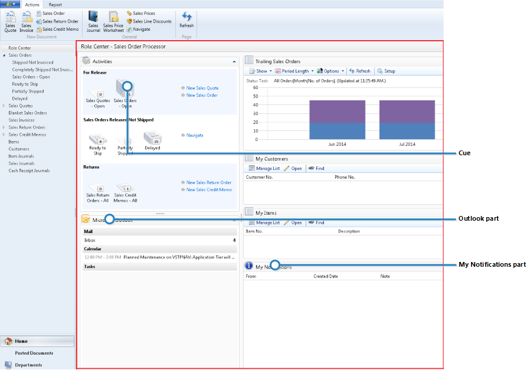  
  
> [!IMPORTANT]  
>  Only system parts, card parts, and list parts are supported page types for the Role Center.  
  
 The Role Center page uses [Cues](#Cue) and system parts, including My Notes and Recorder links.  
  
 For more information, see the following.  
  
|To|See|  
|--------|---------|  
|Learn how to create a page.|[How to: Create a Page](How-to--Create-a-Page.md)|  
|Go through an example of how to create a Role Center page.|[Walkthrough: Creating a Role Center](Walkthrough--Creating-a-Role-Center.md)|  
|Get more information about Cues.|[Cue](#Cue)|  
  
##   Card Page Type  
 A Card page is used to view and edit one record or entity from a table. The Card page displays selected fields from the table. An example of using a Card page is for editing a customer. The following illustration shows the Customer Card page.  
  
   
  
 You can group one or more fields in FastTabs. You can also include a FactBox that displays additional information about the record in the page.  
  
 For more information, see the following.  
  
|To|See|  
|--------|---------|  
|Learn how to create a page.|[How to: Create a Page](How-to--Create-a-Page.md)|  
|Go through an example of how to create a card page.|[Walkthrough: Creating a Customer Card Page in Page Designer](Walkthrough--Creating-a-Customer-Card-Page-in-Page-Designer.md)|  
|Get more information about FactBoxes.|[Adding a FactBox to Page](Adding-a-FactBox-to-Page.md)|  
|Get more information about FastTabs.|[FastTab](#FastTab)|  
  
##   Card Part Page Type  
 A Card Part page is used in a FactBox on another page to view or edit additional fields associated with a selected entity in the page. The following illustration shows an example of using a Card Part page on a List page that displays sales orders. In the FactBox on the right, a Card Part page displays details about the customer that placed the selected sales order. The following illustration shows a FactBox.  
  
 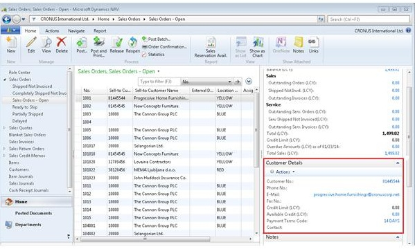  
  
 For more information, see the following.  
  
|To|See|  
|--------|---------|  
|Learn how to create a page.|[How to: Create a Page](How-to--Create-a-Page.md)|  
|Go through an example of how to use a card part on a Role Center page.|[Walkthrough: Creating a Role Center](Walkthrough--Creating-a-Role-Center.md)|  
|Go through an example of how to use a Card Part page in a FactBox.|[How to: Create a CardPart Page For Displaying Customer Data in a FactBox](How-to--Create-a-CardPart-Page-For-Displaying-Customer-Data-in-a-FactBox.md)|  
|Get more information about FactBoxes.|[How to: Add a FactBox to a Page](How-to--Add-a-FactBox-to-a-Page.md)|  
|Get more information about FastTabs.|[FastTab](#FastTab)|  
|See a Card Part page in Object Designer.|The page called Customer Details FactBox with ID 9084.|  
  
##   ConfirmationDialog Page  
 You use the ConfirmationDialog page to display messages or prompt users with a confirmation before they continue with the task that they are working on. For example, when filling out a sales order, a user can select a quantity for an item. This quantity might exceed the item's availability. Using a ConfirmationDialog page, you can display a message that indicates this condition to the user. The user can then choose to continue or cancel filling out the sales order. The following illustration shows a ConfirmationDialog page.  
  
 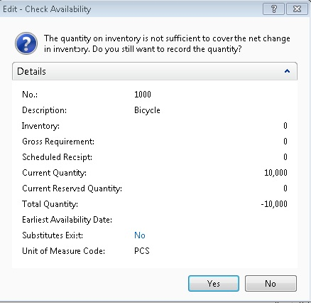  
  
 To create a ConfirmationDialog, you define the message and table fields that you want displayed.  
  
 For more information, see the following.  
  
|To|See|  
|--------|---------|  
|Learn how to create a page.|[How to: Create a Page](How-to--Create-a-Page.md)|  
|See a Confirmation page in Object Designer.|The page called Check Availability with ID 342.|  
  
##   Document Page Type  
 A Document page usually consists of two separate pages combined into one, with one page nested in the other. A Document page is suitable for use when you want to display data from two tables that are linked together. For example, this is the case with sales orders, which have two source tables: Sales Header and Sales Lines. The following illustration shows a sales order that is created using a Document page type. The following illustration shows a Document page.  
  
 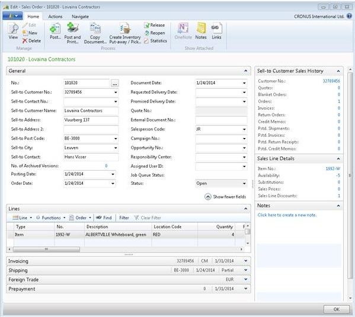  
  
 A Document page displays a [FastTab](#FastTab) at the top of the page for showing fields, followed by another FastTab with line items for the selected item. Optionally, you can add additional FastTabs to display more details about a selected item.  
  
 For more information, see the following.  
  
|To|See|  
|--------|---------|  
|Learn how to create a page.|[How to: Create a Page](How-to--Create-a-Page.md)|  
|Go through an example of how to create a Document page.|[Walkthrough: Creating a Document Page](Walkthrough--Creating-a-Document-Page.md)|  
|Get more information about FastTabs.|[FastTab](#FastTab)|  
|See a Document page in Object Designer|The page called Sales Order with ID 42.|  
  
##   List Page Type  
 A List page displays content from a table in a list format. List pages can display as List Places \(as part of the navigation layer\) or in Task pages. The following illustration shows a List page.  
  
 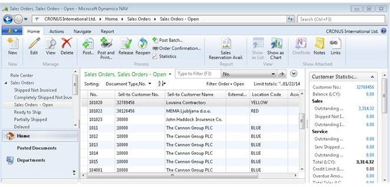  
  
 You can also add a FactBox to display additional information about a selected item in the list.  
  
 For more information, see the following.  
  
|To|See|  
|--------|---------|  
|Learn how to create a page.|[How to: Create a Page](How-to--Create-a-Page.md)|  
|Go through an example of how to create a List page.|[Walkthrough: Creating a Customer List in Page Designer](Walkthrough--Creating-a-Customer-List-in-Page-Designer.md)|  
|Learn more about List Places.|[Touring the RoleTailored Client Windows](Touring-the-RoleTailored-Client-Windows.md)|  
|Get more information about FactBoxes.|[Adding a FactBox to Page](Adding-a-FactBox-to-Page.md)|  
|See a List page in Object Designer.|The page called Sales Order List with ID 9305.|  
  
##   List Plus Page Type  
 Similar to a List page, a List Plus page displays content from a table in a list format. The difference is that the List Plus page type can contain two lists in one page, and can be used as a two-dimensional matrix. The following illustration shows a List Plus page that is used for viewing a production forecast.  
  
 For more information, see the following.  
  
 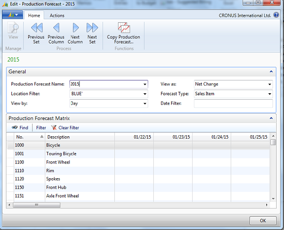  
  
|To|See|  
|--------|---------|  
|Learn how to create a page.|[How to: Create a Page](How-to--Create-a-Page.md)|  
|Get more information about FactBoxes.|[How to: Add a FactBox to a Page](How-to--Add-a-FactBox-to-a-Page.md)|  
  
##   List Part Page Type  
 Similar to a List page, a List Part page displays content from a table in a list format. The difference is that you use the List part page as another page in a FactBox or as a part of the Role Center page. The following illustration shows a List Part page that is used in the Role Center for viewing a list of the user's customers.  
  
   
  
 For more information, see the following.  
  
|To|See|  
|--------|---------|  
|Learn how to create a page.|[How to: Create a Page](How-to--Create-a-Page.md)|  
|Get more information about FactBoxes.|[Adding a FactBox to Page](Adding-a-FactBox-to-Page.md)|  
|See how a List Part page is used on a Role Center page.|The page called Order Processor Role Center with ID 9006.|  
  
##   Navigate Page Type for Wizards  
 You use a Navigate page type to create a wizard that leads the user through a sequence of steps for completing a task. The following illustration shows a Navigate page.  
  
 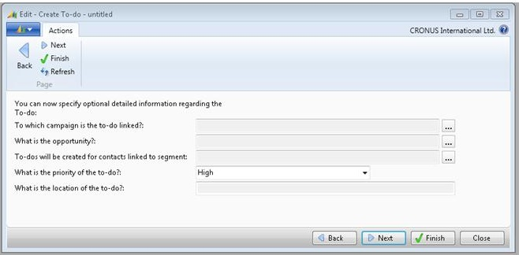  
  
 A wizard opens as a Task page.  
  
 For more information, see the following.  
  
|To|See|  
|--------|---------|  
|Learn how to create a page.|[How to: Create a Page](How-to--Create-a-Page.md)|  
|Go through an example that creates a Navigate page.|[Walkthrough: Creating a Wizard Page](Walkthrough--Creating-a-Wizard-Page.md)|  
|Learn more about task pages.|[Touring the RoleTailored Client Windows](Touring-the-RoleTailored-Client-Windows.md)|  
|See a Navigate page that is used as a wizard in Object Designer.|The page called Create To-do with ID 5097.|  
  
##   StandardDialog Page Type  
 The StandardDialog is a simple page type that you use when users only need to input data and do not need to perform other actions from the page. An example of a StandardDialog page type is page 511, Change Exchange Rate, in the [!INCLUDE[demolong](includes/demolong_md.md)]. The following illustration shows the Change Exchange Rate StandardDialog page.  
  
 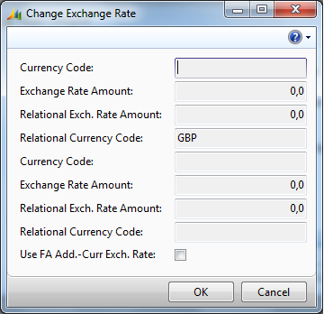  
  
 The StandardDialog page type has the following characteristics:  
  
-   It does not contain a ribbon, FastTabs, or FactBoxes.  
  
-   There is no customization of the page available from the [!INCLUDE[rtc](includes/rtc_md.md)].  
  
-   It is typically is not associated with a source table and gets its data based on a Card type page.  
  
 For more information, see the following.  
  
|To|See|  
|--------|---------|  
|Learn how to create a StandardDialog type page.|[How to: Create a Page](How-to--Create-a-Page.md)|  
|See an example of a StandardDialog type page.|The page called Page 511, Change Exchange Rate.|  
  
##   Worksheet Page  
 You use a Worksheet page type for creating worksheet or journal task pages. The Worksheet page consists of a single grid in the content area and a section at the bottom with details about the selected grid line or totals for the grid. The following illustration shows a Worksheet page.  
  
 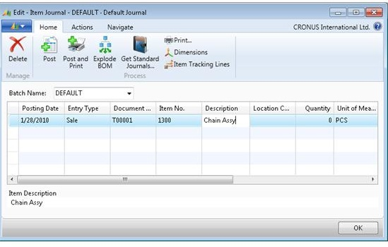  
  
 You can optionally include a FactBox.  
  
 For more information, see the following.  
  
|To|See|  
|--------|---------|  
|Learn how to create a page.|[How to: Create a Page](How-to--Create-a-Page.md)|  
|Go through an example that creates a Worksheet page.|[Walkthrough: Creating a Worksheet Page](Walkthrough--Creating-a-Worksheet-Page.md)|  
|Get more information about FactBoxes.|[Adding a FactBox to Page](Adding-a-FactBox-to-Page.md)|  
|See a Worksheet page.|The page called Standard Cost Worksheet with ID 5841.|  
  
## Page Controls and Parts  
  
### Ribbon  
 The ribbon is located under the Command bar on task pages and list places and contains shortcuts to actions. Actions display as icons, which the user can choose to complete a task or view information. The following illustration shows the ribbon.  
  
   
  
 To include an action in the ribbon, you use the Action Designer \(available from the View menu when a Page Designer window is open\) and promote the action. You should use the ribbon to display the tasks most frequently used by the user in the context of the page. For example, on a List page that displays sales orders, you should promote the action to process a sales order to the ribbon.  
  
 For more information, see the following.  
  
|To|See|  
|--------|---------|  
|Learn more about actions and navigation.|[Adding Actions to Pages](Adding-Actions-to-Pages.md)|  
|Learn how to promote actions to the action page.|[How to: Promote Actions on Pages](How-to--Promote-Actions-on-Pages.md)|  
|See a page that promotes actions to the ribbon.|The page called Customer List with ID 22.|  
  
###   Cue  
 A Cue is an icon that provides a shortcut link to an underlying filtered list, such as invoices, sales orders, or credit memos. A Cue icon depicts a stack of papers on the page, where the height of the stack roughly indicates the number of entities in the underlying list. A number value on each Cue gives the precise count. The following illustration shows a Cue.  
  
   
  
 A Cue can only be used on a Role Center page.  
  
 For more information, see the following.  
  
|To|See|  
|--------|---------|  
|Learn how to create a Cue.|[Walkthrough: Creating a Cue Based on a FlowField](Walkthrough--Creating-a-Cue-Based-on-a-FlowField.md)|  
|Go through an example that uses a Cue on the Role Center.|[Walkthrough: Creating a Role Center](Walkthrough--Creating-a-Role-Center.md)|  
|See a page that uses Cues.|The page called SO Processor Activities with ID 9060.|  
  
### Chart Pane  
 The Chart pane displays data from a list in graphic form, giving the user a visual overview of the value distribution. Chart panes are only available on List page types. The following illustration shows the Chart pane.  
  
 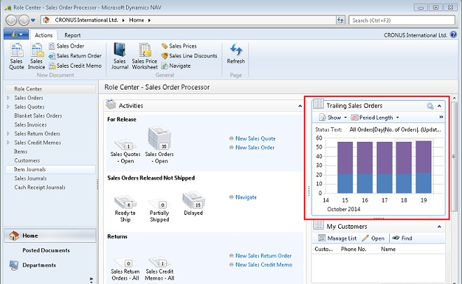  
  
 To view a chart pane, choose **Customize** on the page's command bar, and then select **Chart Pane**. To change the data that is displayed in a chart, choose **Measures** or **Dimensions**, and then select the fields that you want.  
  
 For more information, see the following.  
  
|To|See|  
|--------|---------|  
|See a chart pane on a List page.|The page called Sales Order List with ID 9305.|  
  
###   FactBox  
 A FactBox is an area that is located on the right side of a page which displays data related to information about an item on the page. For example, on a list page that shows sales orders, you can use a FactBox to show additional fields of a selected sales order in the list. The following illustration shows FactBoxes on the Customer Card page.  
  
 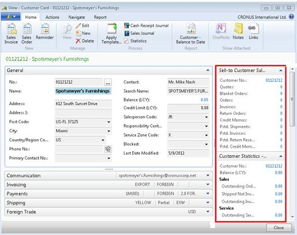  
  
 You can set a FactBox to display a page, system part, or a chart. If you set the FactBox to display a page, you can display the following page types:  
  
-   Card  
  
-   List  
  
-   List Plus  
  
-   Document  
  
-   Worksheet  
  
-   Navigation  
  
 For more information, see the following.  
  
|To|See|  
|--------|---------|  
|Go through an example that uses a FactBox.|[Walkthrough: Adding a FactBox to the Customer List Page](Walkthrough--Adding-a-FactBox-to-the-Customer-List-Page.md)|  
|See a page that uses a FactBox.|The page called Sales Order List with ID 9305.|  
  
###   FastTabs  
 FastTabs enable you to place data in separate groups on a page, where each group has a header that expands and collapses the group when clicked. The header of the FastTab displays a name, such as "Prepayment" on the Sales Order shown. You can also promote fields included on the FastTab to the header. Promoting a field to the header enables you to present key information to the user when the FastTab is collapsed. The following illustration shows FastTabs on a Customer Card page.  
  
 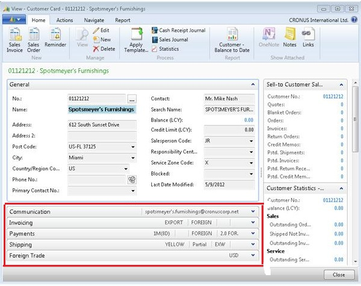  
  
 Organizing data using FastTabs helps users to find key information more quickly, while giving an overview of areas that otherwise would remain hidden.  
  
 For more information, see the following.  
  
|To|See|  
|--------|---------|  
|Learn how to add a FastTab to a page.|[How to: Add FastTabs to a Customer Card Page](How-to--Add-FastTabs-to-a-Customer-Card-Page.md)|  
|See a page that uses a FastTabs.|The page called Sales Order with ID 42.|  
  
### Filter Pane  
 The Filter pane is found on List pages and enables the user to filter and sort the items displayed in the list based on a given criteria. The following illustration shows the Filter pane on the Customer List page.  
  
 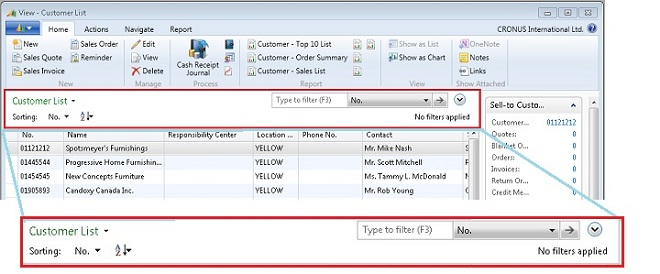  
  
 The Filter pane is automatically included on List pages and cannot be configured.  
  
### My Notifications  
 The My Notifications part allows users to view notifications that are assigned to them, similar to messenger service. The notifications are generated from a Notes control on a task page. For example, on a sales order page, the user can add a note and then target another user to receive the note. This note then shows up in the target user's My Notifications. The following illustration shows notifications from a Notes control on the Sales Orders page.  
  
 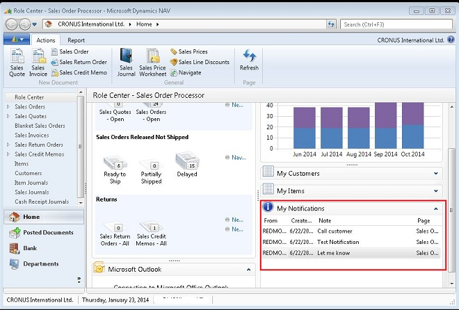  
  
 By double-clicking the link to the note in the notification, users can navigate directly to the relevant Task page to deal immediately and directly with the urgent issue or exceptions.  
  
 The My Notifications part is designed to be used on a Role Center page.  
  
 For more information, see the following.  
  
|To|See|  
|--------|---------|  
|Go through an example that uses My Notes.|[Walkthrough: Creating a Role Center](Walkthrough--Creating-a-Role-Center.md)|  
|See a page that uses the My Notifications part.|The page called Order Processor Role Center with ID 9006.|  
  
### Notes  
 The Notes part allows the user to attach a note to an item on a Task page. For example, when creating a sales order, a user can add a note about the order. The note will appear with the item when it is viewed. If another user is targeted to be notified, then the note will appear in that user's Role Center in the My Notifications part. The following illustration shows a Note part  
  
   
  
 You use Notes in a FactBox on a page.  
  
 For more information, see the following.  
  
|To|See|  
|--------|---------|  
|See a page that uses a Notes part.|The page called Sales Order with ID 42.|  
  
### RecordLinks  
 The RecordLinks part allows the user to add links to files on items on a Task page. For example, when creating a sales order, users can add a link to the Microsoft Word document that pertains to the order. The links will appear with the item when it is viewed. When a user chooses a link, the target file opens. The following illustration shows a RecordLink part.  
  
 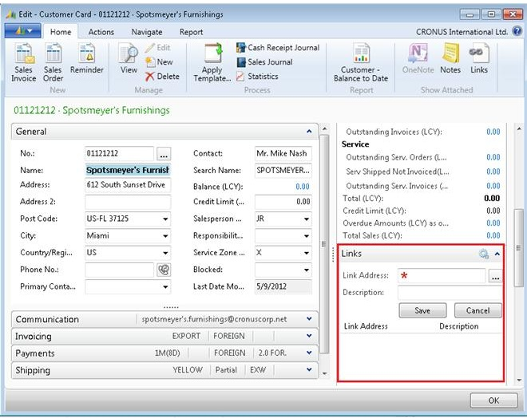  
  
 You use RecordLinks in a FactBox on a page.  
  
 For more information, see the following.  
  
|To|See|  
|--------|---------|  
|See a page that uses a RecordLinks part.|The page called Sales Order with ID 42.|  
  
## See Also  
 [Touring the RoleTailored Client Windows](Touring-the-RoleTailored-Client-Windows.md)