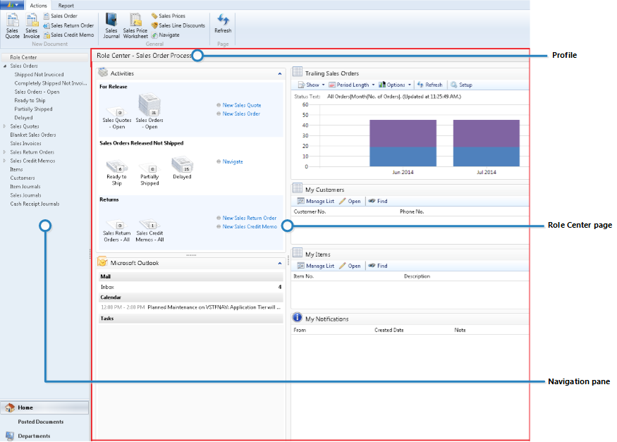
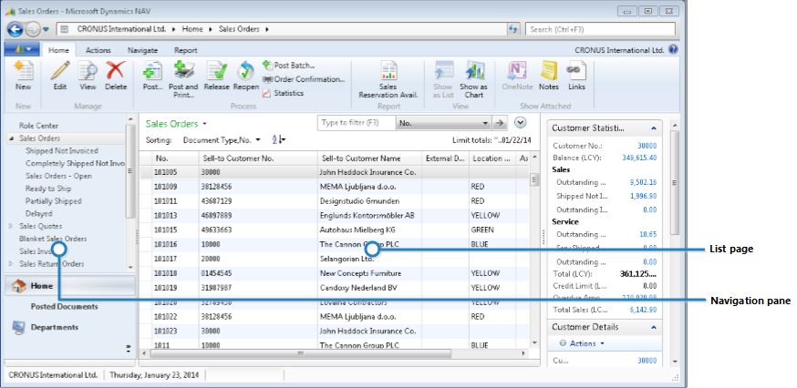
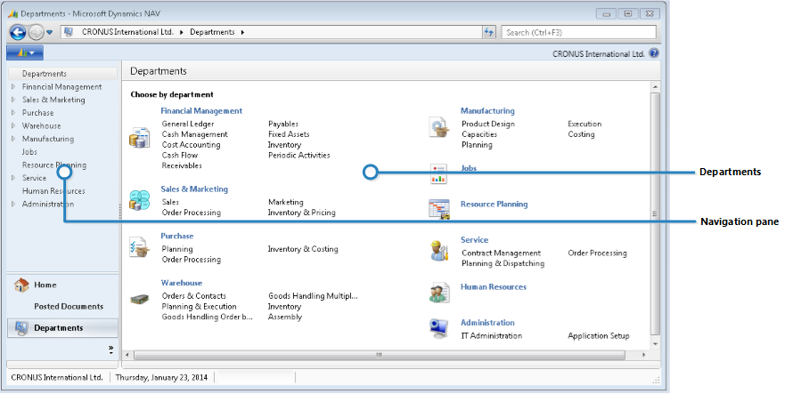
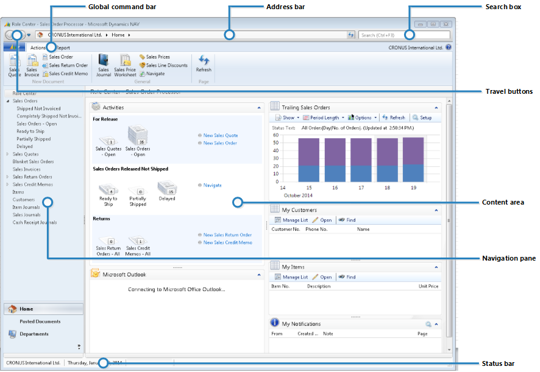

# Touring the RoleTailored Client Windows
The RoleTailored clients use several windows to display information. Two of the key window types are the navigation window and task page window. The navigation window is the main window in which users find the information that they have to work with. The navigation window is used for the Role Center, List Places, and Departments, as described in this topic. A task page window opens separately from the navigation window when the user selects an action from the navigation window or from other task page windows. It is common for a user to have more than one task page window open at a time.  
  
## Role Center  
 The Role Center is the main entry point into [!INCLUDE[navnow](includes/navnow_md.md)]. The Role Center opens when the user starts the [!INCLUDE[rtc](includes/rtc_md.md)]. You design the Role Center based on the user's business role, taking into consideration the information and tasks relevant to the user during a typical work day. The following illustration shows the Role Center page.  
  
   
  
 You create a Role Center by using a Role Center page. The Role Center page opens in the navigation window. Usually, there will only be a single navigation window open at a time. From there, users can open any number of task windows. The content area displays the Role Center page. The [navigation pane](#NavigationPane) includes a menu that links to [List Places](#ListPlaces) and [Departments](#Departments).  
  
 For more information, see the following.  
  
|To|See|  
|--------|---------|  
|Learn how to create a Role Center page|[Walkthrough: Creating a Role Center](Walkthrough:%20Creating%20a%20Role%20Center.md)|  
|Get an overview of the parts on a Role Center page|[Touring the RoleTailored Client Pages](Touring-the-RoleTailored-Client-Pages.md)|  
|Get an overview of the navigation window layout and its parts|[Navigation Window](#NavigationWindow)|  
  
##   List Places  
 A List Place displays information from a table in a list format with rows and columns. Typical uses for List Places include displaying sale orders or customers. Similar to the Role Center, List Places display in the navigation window and include the [navigation pane](#NavigationPane). The following illustration shows a List Place.  
  
   
  
 List Places only open from the menu items in the navigation pane. To create a List Place, you create List type and then include the List Place in the navigation pane by adding actions to the Role Center page using the Action Designer to create the menu items in the navigation pane.  
  
 For more information, see the following.  
  
|To|See|  
|--------|---------|  
|See an example of how to create a List page Role Center page|[Walkthrough: Creating a Customer List in Page Designer](Walkthrough:%20Creating%20a%20Customer%20List%20in%20Page%20Designer.md)|  
|Learn about List pages and parts, including FactBoxes|[Touring the RoleTailored Client Pages](Touring-the-RoleTailored-Client-Pages.md)|  
|Get an overview of the navigation window layout and its parts|[Navigation Window](#NavigationWindow)|  
  
##   Departments  
 The Departments item in the navigation pane only exists in the [!INCLUDE[nav_windows](includes/nav_windows_md.md)]. It provides links to all the pages of the [!INCLUDE[nav_windows](includes/nav_windows_md.md)]. The links and pages under Departments are generated automatically based on the menu suite of the [!INCLUDE[nav_windows](includes/nav_windows_md.md)] user. The following illustration shows the Department page.  
  
   
  
 To change Departments, you change the MenuSuite.  
  
 For more information, see the following.  
  
|To|See|  
|--------|---------|  
|Learn how to change the MenuSuite|[MenuSuites](MenuSuites.md)|  
|Get an overview of the navigation window layout and its parts|[Navigation Window](#NavigationWindow)|  
  
##   Navigation Window Overview  
 The following illustration shows the parts of the navigation window that are used by Role Centers, List Places, and Departments.  
  
   
  
### Content Area  
 The content area displays the content of a Role Center page, List page, or Department.  
  
 For more information, see the following.  
  
|To|See|  
|--------|---------|  
|Learn how to create a page|[How to: Create a Page](How%20to:%20Create%20a%20Page.md)|  
|Get an overview of the pages|[Touring the RoleTailored Client Pages](Touring-the-RoleTailored-Client-Pages.md)|  
  
###   Navigation Pane  
 The navigation pane displays a menu that links different pages of the RoleTailored client. Menu items are arranged in a hierarchical structure that lets the user drill down through the different levels of menu items.  
  
 You use the navigation pane to link to the different List Places of the RoleTailored client. To create menu items in the navigation pane, you add actions to the Role Center page using the Action Designer. You can include menu items under Activity buttons \(such as the Home button\). You can also add more buttons, such as Posted Documents, and include the menu items there. The Departments button and its menu items are generated automatically based on the [!INCLUDE[navnow](includes/navnow_md.md)] MenuSuite.  
  
 For more information, see the following.  
  
|To|See|  
|--------|---------|  
|See an overview of actions|[Actions Overview](Actions-Overview.md)|  
|Learn how to add actions to a page|[How to: Add Actions to a Page](How%20to:%20Add%20Actions%20to%20a%20Page.md)|  
|See an example of how to add an action to the navigation pane|[Walkthrough: Creating a Role Center](Walkthrough:%20Creating%20a%20Role%20Center.md)|  
  
### Address Bar  
 The address bar displays the location of the current page in the navigation hierarchy of the application. The Address bar updates when the user moves to a different page.  
  
> [!NOTE]  
>  The Address bar is not configurable.  
  
### Status Bar  
 The status bar displays information about the current state of the [!INCLUDE[navnow](includes/navnow_md.md)] session, including the name of the company, the date and, the user's name or ID.  
  
 For users who work with more than one company, the status bar provides access to all the companies that they work with. By choosing the company name, the user can open a drop\-down list which shows the companies available to them. Users can switch between companies.  
  
> [!NOTE]  
>  The status bar is not configurable.  
  
## Task Window  
 A Task window opens separately from the navigation window when a user chooses an action or menu item. A Task window typically shows a single object or element such as a task, list, or report. Common uses of Task pages include creating or editing sales orders, customer details, and items. The following illustration shows a Task window that displays a Card page for editing customers.  
  
   
  
 Task pages are similar in concept to the pop\-up windows in Microsoft Office Outlook that show an e\-mail, contact, or a task. It is typical for users to have multiple task pages open at the same time. Similar to the navigation window, a Task window includes a Command bar and ribbon. Unlike the navigation window, it does not include the navigation pane or status bar. The user can work with more than one Task window open at a time.  
  
 You create a Task window by creating a page and then linking the page to actions on other pages. The most common page types for Task windows are Card, Document, and List.  
  
 For more information, see the following.  
  
|To|See|  
|--------|---------|  
|Learn how to create a page|[How to: Create a Page](How%20to:%20Create%20a%20Page.md)|  
|Get an overview of the pages|[Touring the RoleTailored Client Pages](Touring-the-RoleTailored-Client-Pages.md)|  
  
## See Also  
 [Touring the RoleTailored Client Pages](Touring-the-RoleTailored-Client-Pages.md)