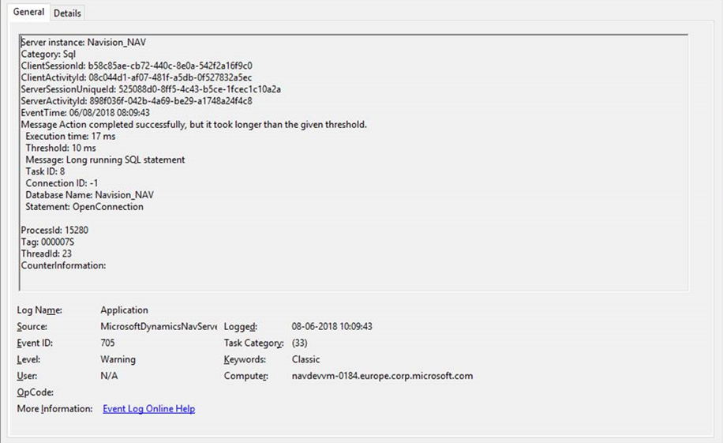

# Troubleshooting: Using the Event Viewer to Monitor Long Running SQL Queries in Dynamics NAV

This topic shows how you can use the Event Viewer to monitor long running SQL queries and decide which ones can be candidates for optimization. 


## Resolution
Identifying long running SQL queries can be a good starting point when doing a performance analysis. To find which SQL queries performed slower than expected, open the Event Viewer and go to the Windows Logs Application. 

> [!NOTE]  
> The SQL queries that exceed the set threshold will be displayed in the Application window of the Event Viewer as *Warning*. 

If the value of the [SqlLongRunningThreshold](configuring-microsoft-dynamics-nav-server.md) key was set to the default value of 1000 milliseconds, you will be see messages: "*Action completed successfully, but it took longer than the given threshold.*" for actions that took longer than that. To meet your performance expections in production, you can set the threshold to a different value without doing a server restart. For more information on how you can do this, see [Monitoring Long Running SQL Queries using the Event Log](monitoring-long-running-sql-queries-event-log.md). 




In some cases, you can see what caused the delay by looking at the SQL statement that was generated by the code listed in the `AL CallStack` column. The code below shows which AL method that generated a slow performing query.

```
Server instance: Navision_NAV
Category: Sql
ClientSessionId: 00000000-0000-0000-0000-000000000000
ClientActivityId: 828c9342-891a-4631-8eb3-a1da7304fdc9
ServerSessionUniqueId: 24b32889-9be9-439f-b86c-9615d5e51319
ServerActivityId: 19bf285d-a8f2-42b6-a4c0-4afe9fb5b4b4
EventTime: 06/08/2018 08:10:15
Message Action completed successfully, but it took longer than the given threshold.
  Execution time: 33 ms
  Threshold: 10 ms
  Message: Long running SQL statement 
  Task ID: 3
  Connection ID: 2
  Database Name: Navision_NAV
  Statement: SELECT "2161"."timestamp","2161"."User","2161"."Default Execute Time","2161"."Current Job Queue Entry" FROM "SQLDATABASE".dbo."CRONUS International Ltd_$Calendar Event User Config_" "2161"  WITH(UPDLOCK)  WHERE ("2161"."User"=@0) OPTION(OPTIMIZE FOR UNKNOWN)
    AppObjectType: CodeUnit
  AppObjectId: 2160
  AL CallStack: "Calendar Event Mangement"(CodeUnit 2160).GetCalendarEventUserConfiguration line 2
"Calendar Event Mangement"(CodeUnit 2160).FindJobQueue line 1
"Calendar Event Mangement"(CodeUnit 2160).FindOrCreateJobQueue line 1
"Calendar Event Mangement"(CodeUnit 2160).CreateOrUpdateJobQueueEntry line 1
"Calendar Event"(Table 2160).Schedule line 12
"Calendar Event"(Table 2160).OnInsert(Trigger) line 1
"Calendar Event Mangement"(CodeUnit 2160).CreateCalendarEventForCodeunit line 6
"Create Telemetry Cal. Events"(CodeUnit 1352).OnRun(Trigger) line 5

ProcessId: 15280
Tag: 000007L
ThreadId: 10
CounterInformation:
```


## See Also
[Troubleshooting: Analyzing Long Running SQL Queries Involving FlowFields by Disabling SmartSQL](troubleshooting-queries-involving-flowfields-by-disabling-smartsql.md#how-to-isolate-and-test-flowfield-queries)
[Monitoring Long Running SQL Queries using the Event Log](monitoring-long-running-sql-queries-event-log.md)  
[Tools for Monitoring Performance Counters and Events](tools-for-monitoring-performance-counters-and-events.md)
[Microsoft Dynamics NAV Server Administration Tool](Microsoft-Dynamics-NAV-Server-Administration-Tool.md)  
[Troubleshooting: Using Query Store to Monitor Query Performance in Dynamics NAV](troubleshooting-query-performance-using-query-store.md)  
[SQL Trace](https://docs.microsoft.com/en-us/sql/relational-databases/sql-trace/sql-trace)

