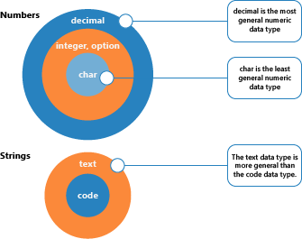

# Type Conversion in Expressions
This topic describes type conversions in C\/AL expressions.  
  
## C\/AL Expression Statements and Type Conversion  
 Consider the following statements.  
  
```  
CharVar := 15; // A char variable  
integerVar := 56000; // An integer variable  
Sum := CharVar + integerVar;  
```  
  
 The last statement involves one or two type conversions. The rightmost statement involves the evaluation of the expression CharVar \+ integerVar \(char \+ integer\). In order to evaluate this expression, the first operand \(CharVar\) will have to be converted from char to integer. The addition operator will then return an integer result.  
  
 If the type of the leftmost variable has been declared as, for example, decimal, the result must be converted from integer to decimal before its value can be assigned to Sum. For more information, see the “Assignment and Type Conversion” section in [C\-AL Variables](C-AL-Variables.md).  
  
 The following examples illustrate the type conversions which can occur when expressions are evaluated. The following guidelines are used:  
  
-   When asked to evaluate an expression of mixed data types, if it is possible, the system will always convert at least one of the operands to a more general data type.  
  
-   The data types in the two main groups, numbers and strings, can be ranked from "most general" to "least general."  
  
       
  
-   The most general data types include all the possible values from the less general data types: a decimal is more general than an integer, which is more general than a char.  
  
-   Type conversion can occur in some cases even though two operands have the same type.  
  
 These rules can be illustrated by the following examples.  
  
## Example 1  
 The following example shows the evaluation of a numeric expression.  
  
```  
integer + decimal  
```  
  
 This expression contains two sub\-expressions of different data types. Before it can add these two sub\-expressions, the system must convert the leftmost sub\-expression to decimal.  
  
```  
decimal + decimal  
```  
  
 When the leftmost sub\-expression has been converted, the expression can be evaluated, and the resulting data type will be decimal.  
  
```  
decimal + decimal = decimal  
```  
  
## Example 2  
 The following example shows the evaluation of a string expression.  
  
```  
text + code  
```  
  
 This expression contains two sub\-expressions that must be concatenated. To do this, the system must convert the sub\-expression of the least general data type \(code\) to the most general data type \(text\).  
  
```  
text + text  
```  
  
 When the rightmost argument has been converted, the expression can be evaluated, and the resulting data type will be text.  
  
```  
text + text = text  
```  
  
## See Also  
 [Type Conversion](Type-Conversion.md)