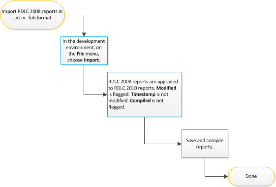

# Upgrading Reports from Earlier Versions
If you want to use reports from earlier versions of [!INCLUDE[navnow](includes/navnow_md.md)], you must upgrade the reports before you can run or modify them. The report formats that were supported in [!INCLUDE[nav7long](includes/nav7long_md.md)] were client report definition \(RDLC\) 2008. In [!INCLUDE[navsicily](includes/navsicily_md.md)], the report formats were replaced with client report definition \(RDLC\) 2010. This format is also used in [!INCLUDE[navnowlong](includes/navnowlong_md.md)].  
  
 Typically, upgrading reports is part of upgrading the [!INCLUDE[navnow](includes/navnow_md.md)] application. However, you can also import reports from .txt files or .fob files.  
  
> [!IMPORTANT]  
>  You cannot import reports from versions earlier than [!INCLUDE[nav7long](includes/nav7long_md.md)] into [!INCLUDE[navnowlong](includes/navnowlong_md.md)]. If you want to import a [!INCLUDE[nav2009](includes/nav2009_md.md)] report, you must first upgrade the report to [!INCLUDE[nav7long](includes/nav7long_md.md)], and then import it into [!INCLUDE[navnowlong](includes/navnowlong_md.md)]. For more information, see [How to: Upgrade Reports](http://go.microsoft.com/fwlink/?LinkId=276767) in the MSDN Library for [!INCLUDE[nav7long](includes/nav7long_md.md)].  
  
 This topic provides an overview of suggested options to upgrade reports from [!INCLUDE[nav7long](includes/nav7long_md.md)] to [!INCLUDE[navnowlong](includes/navnowlong_md.md)].  
  
## Importing RDLC 2008 Reports  
 If you import reports that have RDLC 2008 format from [!INCLUDE[nav7long](includes/nav7long_md.md)], then you must upgrade the reports to [!INCLUDE[navnowlong](includes/navnowlong_md.md)].  
  
 Upgrading reports is part of the [Upgrading the Application Code](Upgrading-the-Application-Code.md) section of the upgrade process.  
  
 The following illustration shows the upgrade process for the reports.  
  
   
  
 When you import the report, [!INCLUDE[navnow](includes/navnow_md.md)] automatically upgrades it to RDLC 2010. SQL Server Report Builder first validates that the reports have the correct RDLC 2008 format and then upgrades them to RDLC 2010 format.  
  
 In Object Designer, when the upgrade is complete, the **Modified** flag is set to **Yes**. All other properties for the report are not changed.  
  
 After the upgrade, you can open the layout in Visual Studio. For more information, see [How to: Integrate Report Dataset Designer and Visual Studio Report Designer](How-to--Integrate-Report-Dataset-Designer-and-Visual-Studio-Report-Designer.md). You must compile the imported report before you can run it.  
  
## Importing RDLC 2010 Reports  
 You can import reports that have RDLC 2010 format to [!INCLUDE[navnowlong](includes/navnowlong_md.md)]. Upgrading the reports is an automated process. SQL Server Report Builder first validates that the reports have the correct RDLC 2010 format and then imports them.  
  
 In Object Designer, no properties for the report are changed.  
  
## See Also  
 [Designing Reports](Designing-Reports.md)   
 [How to: Integrate Report Dataset Designer and Visual Studio Report Designer](How-to--Integrate-Report-Dataset-Designer-and-Visual-Studio-Report-Designer.md)   
 [Upgrading to Microsoft Dynamics NAV 2017](Upgrading-to-Microsoft-Dynamics-NAV-2017.md)   
 [How to: Export Objects](How-to--Export-Objects.md)