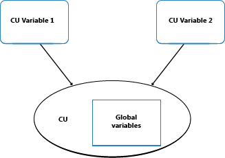

# Using Codeunits
By using codeunits, you eliminate the need to duplicate code and you make the code easier to maintain. For example, if you use the same code repeatedly in your objects, then you should create a global function for the code in a codeunit. After you create a codeunit and a global function in that codeunit, you can access the function from another codeunit by declaring a variable of type Codeunit and specifying the name of the codeunit as the subtype of the variable. You can then access the function by using *\<CodeunitVariableName\>*.*\<FunctionName\>*.  
  
> [!NOTE]  
>  Unlike a local function, a global function can be accessed from outside the codeunit. To make a global function, you set [Local Property](Local-Property.md) of the function to **No**.  
  
## Example  
 For this example, assume that you have created a codeunit that contains two statistical global functions named F and G. The following example shows you how to access these functions from a page.  
  
### Codeunit Named Stat  
  
```  
F(x:integer) a : Integer  
Begin  
  // Do some processing.  
  // a:= ..  
End  
G(x:integer) a : Integer  
Begin  
  // Do some processing.  
  // a:= ..  
End  
  
```  
  
### Page Objects  
 In the page object, create the following variables.  
  
|Variable name|DataType|Subtype|  
|-------------------|--------------|-------------|  
|StatVariable|Codeunit|Stat|  
|Result|Integer||  
  
```  
…  
Result := StatVariable.F(3425)+StatVariable.G(346);  
…  
```  
  
## Accessing Codeunits  
 Using the method in the previous example, from any application object, you can access functions in other application objects by writing the name of the application object that contains the function followed by the name of the function.  
  
 You can access codeunits through codeunit variables either by explicitly declaring a variable with the data type codeunit or by setting the RunObject property on pages to a codeunit. A codeunit variable does not contain a codeunit, but only a reference to a codeunit. More than one codeunit variable can refer to the same codeunit, as shown in the following illustration.  
  
   
Codeunit Variables  
  
 Codeunits contain internal variables that are defined as global variables. These variables cannot be accessed directly from code outside the codeunit, but they can be accessed through user\-defined functions on the codeunit. When a codeunit variable is used for the first time, a new instance of the codeunit is created, that is, a new set of internal variables is initialized so that different codeunit variables use different sets of internal variables.  
  
## CLEAR on Codeunits  
 When you use the CLEAR function on a codeunit variable that has a reference to a codeunit instance with two or more references, CLEAR only deletes the reference to the codeunit and not the actual instance of the codeunit. The codeunit stays intact and can still be used by other codeunit variables that may have been assigned a reference to this codeunit.  
  
 To delete an instance of a codeunit, you must clear all the references to the codeunit with the CLEAR function. To clear the internal variables in a codeunit, you must call the CLEARALL function from a user\-defined function in the codeunit. A local codeunit variable is automatically cleared when it goes out of scope and is no longer used by the codeunit.  
  
 For more information, see [CLEAR Function](CLEAR-Function.md) and [CLEARALL Function](CLEARALL-Function.md).  
  
## Single Instance Codeunit  
 In some cases, only one instance of a codeunit needs to exist. This means that all the codeunit variables of a particular codeunit use the same set of variables. When you set the SingleInstance property of the codeunit to Yes, all the codeunit variables of that codeunit use the same instance. This lets you create global variables.  
  
> [!NOTE]  
>  We recommended that you avoid using global variables for most types of code. However, in certain situations, you may have to use them, for example, to make sure that you are only using one instance of an external variable.  
  
 A single instance codeunit is instantiated when you use it for the first time. Typically, codeunit instances \(codeunits that do not have the SingleInstance property set\) are deleted when the last codeunit variable that uses that codeunit instance goes out of scope. However, single instance codeunits remain instantiated until you close the company.  
  
 For an example of a single instance codeunit, see [Walkthrough: Using Codeunits](../Topic/Walkthrough:%20Using%20Codeunits.md).  
  
## Limitations on Codeunits  
 Global variables and temporary tables in a codeunit cannot be accessed directly from other application objects. The only way to access these values is through the functions that you have created in the codeunit.  
  
 Every C\/AL function can be used in a codeunit. However, you cannot create a function that has the same name as a pre\-defined function. Also, two or more user\-defined functions cannot have the same name, unless they are part of different application objects.  
  
## See Also  
 [Understanding Codeunits](Understanding-Codeunits.md)   
 [Creating and Modifying Codeunits](Creating-and-Modifying-Codeunits.md)