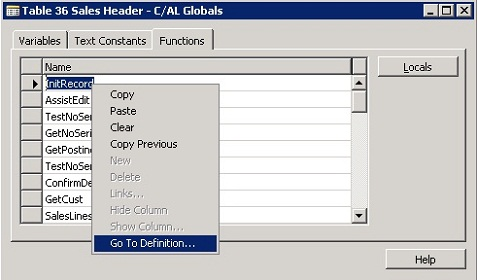
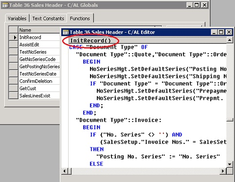
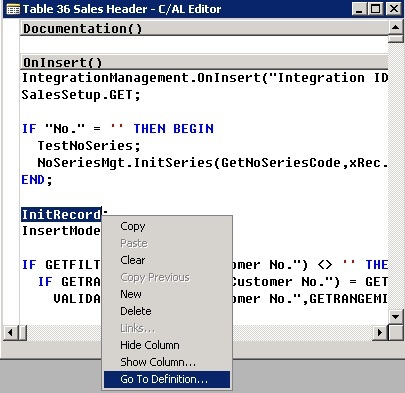
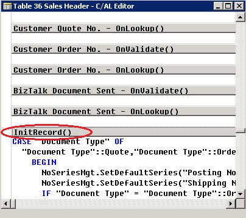
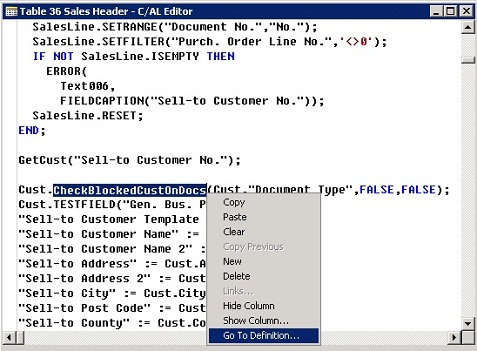
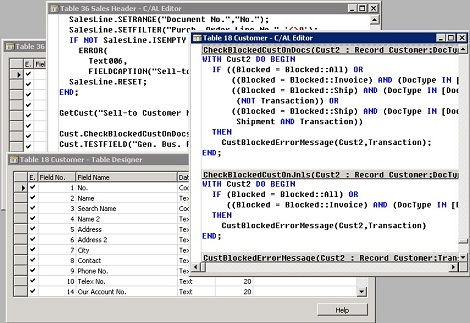
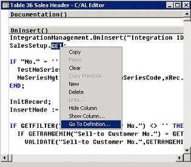
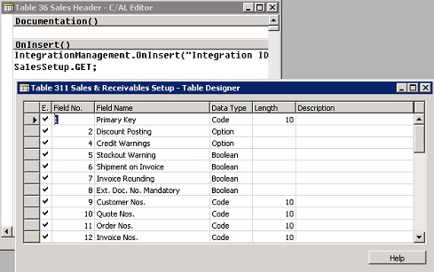
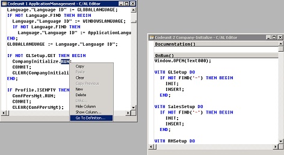
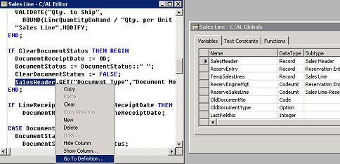

---
title:"Viewing the Definition of a Function or Object by Using Go To Definition"
ms.custom: na
ms.date: 06/04/2016
ms.reviewer: na
ms.suite: na
ms.tgt_pltfrm: na
ms.topic: article
ms-prod:"dynamics-nav-2017"
ms.assetid: e453930e-af9f-446e-aa45-8ed75a684836
caps.latest.revision: 19
manager: edupont
---
# Viewing the Definition of a Function or Object by Using Go To Definition
You can view the definition of a function or object by selecting the item in the C\/AL Editor and then choosing **Go To Definition**. You can also view the definition of a function by selecting it in the **C\/AL Globals** window and then choosing **Go To Definition**.  
  
 To go to the definition of a function or object, select or place the cursor anywhere in the function name or object variable name, and then do one of the following:  
  
-   On the **View** menu, choose **Go To Definition**.  
  
-   Right\-click the function name or object variable name, and then choose **Go To Definition**.  
  
-   Press Ctrl\+F12.  
  
 The following table describes how you can go to the definition of a function or object.  
  
|Starting location|Result|  
|-----------------------|------------|  
|[User-Defined Function from the C/AL Globals Window](Viewing-the-Definition-of-a-Function-or-Object-by-Using-Go-To-Definition.md#BKMK_UserdefinedFunctionFromTheCALGlobalsWindow)|The C\/AL Editor goes to the C\/AL code that defines the selected function.|  
|[User-Defined Function from the C/AL Editor](Viewing-the-Definition-of-a-Function-or-Object-by-Using-Go-To-Definition.md#BKMK_UserdefinedFunctionFromTheCALEditor)|The C\/AL Editor goes to the C\/AL code that defines the selected function.|  
|[User-Defined Function from the C/AL Editor for an Object Variable](Viewing-the-Definition-of-a-Function-or-Object-by-Using-Go-To-Definition.md#BKMK_UserdefinedFunctionFromTheCALEditorForAnObjectVariable)|-   The object is opened in the corresponding designer. -   A new C\/AL Editor window opens to the C\/AL code that defines the selected function.|  
|[System Function from the C/AL Editor](Viewing-the-Definition-of-a-Function-or-Object-by-Using-Go-To-Definition.md#BKMK_SystemFunctionFromTheCALEditor)|If the system function is called on an object variable, such as a record, codeunit, or report, then the object is opened in the corresponding designer. If the system function is not called on an object variable, then nothing occurs.|  
|[Object Variable from the C/AL Editor](Viewing-the-Definition-of-a-Function-or-Object-by-Using-Go-To-Definition.md#BKMK_VariableFromTheCALEditor):   -   Record -   Page -   Report -   Codeunit -   XMLport -   Query|The object is opened in the corresponding designer or editor:   -   Table Designer -   Page Designer -   Report Dataset Designer -   C\/AL Editor -   XMLport Designer -   Query Designer **Note:**  If you select a variable that is a fundamental data type, such as Integer or Decimal, then information about the variable is displayed in the status bar.|  
  
## Examples  
 This section shows examples of using the Go To Definition shortcut menu item.  
  
###   User\-Defined Function from the C\/AL Globals Window  
 From the **C\/AL Globals** window, right\-click a user\-defined function, and then choose **Go To Definition**.  
  
   
  
 The result is that the C\/AL Editor jumps to the C\/AL code that defines the selected function.  
  
   
  
###   User\-Defined Function from the C\/AL Editor  
 From the C\/AL Editor, right\-click a user\-defined function, and then choose **Go To Definition**.  
  
   
  
 The result is that the C\/AL Editor jumps to the C\/AL code that defines the selected function.  
  
   
  
###   User\-Defined Function from the C\/AL Editor for an Object Variable  
 From the C\/AL Editor, right\-click a user\-defined function that is called on an object variable, and then choose **Go To Definition**.  
  
   
  
 The result is that the object on which the function is called is opened in the corresponding designer and a new C\/AL Editor window opens to the C\/AL code that defines the selected function.  
  
   
  
###   System Function from the C\/AL Editor  
 From the C\/AL Editor, right\-click a system function that is called on an object variable, and then choose **Go To Definition**.  
  
   
  
 If the system function is called on a record variable, then the table that the record is from is opened in Table Designer.  
  
   
  
 If the system function is the \<*codeunit*\>.RUN function, then the codeunit is opened in a new C\/AL Editor window.  
  
   
  
 If the system function is called on any other object type variable, then the object is opened in the corresponding designer. For any other system function that is not called on an object variable, nothing occurs.  
  
###   Object Variable from the C\/AL Editor  
 From the C\/AL Editor, right\-click a variable that is one of the following object types, and then choose **Go To Definition**:  
  
-   Record  
  
-   Page  
  
-   Report  
  
-   Codeunit  
  
-   XMLport  
  
-   Query  
  
   
  
 The object is opened in the corresponding designer:  
  
-   Table Designer  
  
-   Page Designer  
  
-   Report Dataset Designer  
  
-   C\/AL Editor  
  
-   XMLport Designer  
  
-   Query Designer  
  
   
  
## Permissions  
 To go to a definition, you must have the correct permissions. If you do not have permission to view the definition of an object by selecting the object in Object Designer and then choosing **Design**, then you cannot view it with the **Go To Definition** option.