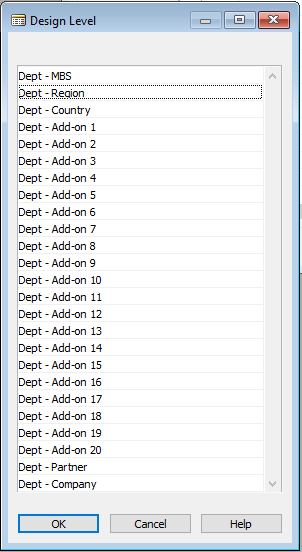
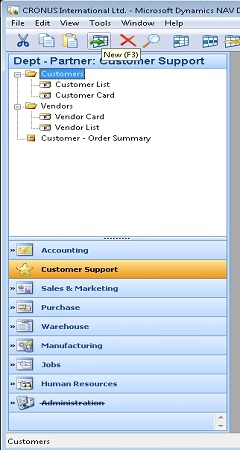

# Walkthrough: Creating MenuSuites for the Microsoft Dynamics NAV Windows Client
MenuSuites display menus on the Departments page in the [!INCLUDE[nav_windows](includes/nav_windows_md.md)]. MenuSuites contain links that enable you to browse application or objects, and make the applications or objects easier to access in the [!INCLUDE[nav_windows](includes/nav_windows_md.md)]. A MenuSuite contains a set of menus that enable you to access reports, pages, codeunits, and so on, from the [!INCLUDE[nav_windows](includes/nav_windows_md.md)].  
  
 [!INCLUDE[navnowlong](includes/navnowlong_md.md)] provides a basic MenuSuite that you can modify, or you can create new MenuSuites from the basic MenuSuite. You create MenuSuites in Object Designer and modify them in Navigation Pane Designer. This walkthrough demonstrates how to create a MenuSuite from the basic Menusuite for the [!INCLUDE[nav_windows](includes/nav_windows_md.md)]. For information about how to modify MenuSuites, see [How to: Modify Menu Items in a MenuSuite](../Topic/How%20to:%20Modify%20Menu%20Items%20in%20a%20MenuSuite.md).  
  
## About This Walkthrough  
 This walkthrough shows you how to create a MenuSuite and modify department menus and menu items. This walkthrough illustrates the following tasks:  
  
-   Creating a MenuSuite.  
  
-   Adding a new department to the Departments page.  
  
-   Modifying a department menu.  
  
-   Modifying menu items in a department.  
  
### Prerequisites  
 To complete this walkthrough, you will need:  
  
-   [!INCLUDE[navnowlong](includes/navnowlong_md.md)] installed with a developer license.  
  
-   The [!INCLUDE[demolong](includes/demolong_md.md)].  
  
## Story  
 Simon is a Microsoft Certified Partner working for [!INCLUDE[demoname](includes/demoname_md.md)] The company has recently reorganized. The Financial Management department has been converted to Accounting department and some of the menu items in the department will no longer be needed in the new Accounting department. The Human Resources department is no longer needed because the functions of that department have been contracted out to an agency. The functions of the Services department have been suspended because the department will closed until further notice. A new Customer Support department has been created at [!INCLUDE[demoname](includes/demoname_md.md)]. This new department will contain customer and vendor support information, including pages and reports.  
  
 Simon has been asked to perform the following tasks and create a MenuSuite that meets the following requirements:  
  
-   Create a new department named Customer Support. This department should contain customer and vendor information such as a Customer Card page, Vendor List page, and Customer\-Order Summary report. The information will be grouped under vendor and customer submenus. The List page should be accessed from the Lists category and the card page should be accessed from the Tasks subcategory.  
  
-   Add customer reports to the Reports and Analysis submenu The MenuSuite should contain the Customer\-Order Summary report, which should be accessed from the Reports and Analysis subcategory in the Customer Support department.  
  
-   Remove departments and menu items that are no longer needed.  
  
-   Modify the MenuSuite to reflect all the changes at have been made at [!INCLUDE[demoname](includes/demoname_md.md)]  
  
 Simon knows that he can create a MenuSuite in Object Designer and make the changes in Navigation Pane Designer to accomplish his task.  
  
## Creating the MenuSuite  
 You create MenuSuites from the basic MenuSuite that is provided in [!INCLUDE[navnow](includes/navnow_md.md)] and design it in Navigation Pane Designer. To create a new MenuSuite, choose a design level that your license allows. For this walkthrough, you will design the MenuSuite at the Dept–Partner design level. For more information about design permission levels, see [Designing MenuSuites](Designing-MenuSuites.md).  
  
#### To create the MenuSuite  
  
1.  In the [!INCLUDE[nav_dev_long](includes/nav_dev_long_md.md)], choose **Tools** and then choose **Object Designer**.  
  
2.  In Object Designer, choose **MenuSuite** and then choose **New**. The **Design Level** window is displayed.  
  
     The following image shows the MenuSuite design levels that are available in [!INCLUDE[navnow](includes/navnow_md.md)].  
  
       
  
3.  In the **Design Level**  window, choose **Dept \- Partner** and then choose **OK** to open **Navigation Pane Designer**.  
  
     The design level that you selected is shown in the header section of **Navigation Pane Designer**.  
  
4.  Right\-click the **Navigation Pane Designer** header and then choose **Close Navigation Pane Designer**.  
  
5.  In the **Save Changes** dialog box, verify that **Compile** is selected and then choose **Yes**.  
  
     The MenuSuite that you created has an ID 1080, which is the ID for MenuSuites that are designed at the Partner level.  
  
## Adding a New Department  
 The next step is to create a menu for the new Customer Support department. You will make changes to the department menu and add menu items later.  
  
#### To add a department  
  
1.  In Object Designer, choose the MenuSuite that you just created and then choose **Design**.  
  
2.  In Navigation Pane Designer, right\-click the department tabs section and then choose **Create Menu**.  
  
3.  In the **Create Menu** window, in the **Caption** text box, enter **Customer Support**. This is name of the new department.  
  
4.  In the **CaptionML** text box, choose the **EditAssist**  button to open the Multilanguage Editor.  
  
    > [!NOTE]  
    >  By default, the language setting on your computer is used for **CaptionML**, so clicking the text box automatically enters the defaults values.  
  
5.  In the **Multilanguage Editor** window, verify that **Language** is set to **English \(United States\)** and **Value** is set to **Customer Support**, and then choose the **OK** button. You can change the language in the **Windows Language List** window by choosing the up arrow in the **Language** column.  
  
6.  In the **Bitmap** text box, enter **10** and then choose **OK**. The Customer Support department menu is added to the MenuSuite. Valid bitmap numbers are 0\-15. This is the bitmap that is displayed on the department menu in Navigation pane. However, the icons that are displayed on the departments on the [!INCLUDE[nav_windows](includes/nav_windows_md.md)] are different.  
  
## Modifying the Department Menus  
 Next, you will make the changes that were requested in the department menus. First, you will change the **Financial Management** menu to **Accounting**. You will also make changes to the menu items in the departments. You will delete the **Human Resources** department and hide the **Services** department. Simon knows that he may need the **Services** department in the future so he will hide it for now.  
  
#### To modify the department menus  
  
1.  In Navigation Pane Designer, select the **Financial Management** menu, from the shortcut menu, choose **Properties**.  
  
2.  In the **Menu Properties** window, in the **Caption** text box, change the text to **Accounting** and then choose the **OK** button.  
  
3.  Select the **Human Resources** menu, and from the shortcut menu, choose **Delete**.  
  
4.  In the dialog box that opens, choose **Yes**. This removes this department from the MenuSuite.  
  
5.  Select the **Services** department menu. From the shortcut menu, choose **Hide in Designer**. This removes it from the list but is not deleted.  
  
6.  Select the **Customer Support** department menu. From the shortcut menu, choose **Move Up**. Move **Customer Support** below **Accounting**.  
  
## Modifying the Menu Items in a Department  
 You will now modify the menu items in the **Accounting** department and add menu items to the **Customer Support** department.  
  
#### To modify the menu items  
  
1.  Select the **Accounting** department and notice the menu items that appear in the top half of Navigation Pane Designer.  
  
2.  Select the **Periodic Activities** group folder. From the shortcut menu, choose **Properties** to open the **Group Properties** window.  
  
3.  Clear the **Department Page** check box and then choose **OK**. This removes the **Periodic Activities** group folder from the department page in the [!INCLUDE[nav_windows](includes/nav_windows_md.md)].  
  
4.  Select the **Cash Management** group folder. From the shortcut menu, choose **Delete**. This removes the folder and all menu items that are in it.  
  
5.  Select the **Customer Support** department you created earlier. Notice that it does not contain any menu items or group folders.  
  
6.  Right\-click the menu items section, choose **Create Group**, and then name the folder **Customers**. You will add pages that are related to customers in this group.  
  
7.  Expand the Customer folder node, right\-click **\[Empty Group\]**, and then choose **Create Item** to open the **Create Item** window.  
  
8.  In the **Object Type** list, choose the drop\-down arrow, and then select **Page**.  
  
9. In the **Object ID** text box, choose the up arrow to open the **Page List** window and then choose **Customer Card** \(21\) and then choose **OK**.  
  
10. Accept the defaults values for the **Caption** and **CaptionML** text boxes.  
  
11. In the **Department** list box, select **Tasks** and then choose the **OK** button. This puts this menu item in the **Tasks** sub menu.  
  
12. In the **Create Item** window, choose the **OK** button.  
  
13. Right\-click the **Customer Card** menu item that you just created and then choose **Create Item** to open the **Create Item**  window.  
  
14. Repeat steps 8 through 12 and set the following values in the **Create Item** window to add the **Customer List \(22\)** Page.  
  
    |||  
    |-|-|  
    |**Object Type**|Page.|  
    |**Object ID**|Customer List.|  
    |**Caption**|Customer List.|  
    |**CaptionML**|ENU\=Customer List.|  
    |**Department**|Lists.   This puts this menu item in the **Lists** sub category.|  
  
15. Right\-click the menu items section, choose **Create Group** and then name the folder **Vendors**. You will add pages that are relate to vendors in this group.  
  
16. Expand the **Vendors** group folder node, right\-click **\[Empty Group\]**, and choose **Create Item** to open the **Create Item**  window.  
  
17. Repeat steps 8 through 12 and set the following values in the **Create Item** window to add the **Vendor Card \(26\)** page.  
  
    |||  
    |-|-|  
    |**Object Type**|Page.|  
    |**Object ID**|Vendor Card.|  
    |**Caption**|Vendor Card.|  
    |**CaptionML**|ENU\=Vendor Card.|  
    |**Department**|Tasks.   This puts this menu item in the **Tasks** sub category.|  
  
18. Right\-click the **Vendor Card** menu item you just added and then choose **Create Item…** to open the **Create Item**  window.  
  
19. Repeat steps 8 through 12 and set the following values in the **Create Item** window to add the **Vendor List \(27\)** pages.  
  
    |||  
    |-|-|  
    |**Object Type**|Page.|  
    |**Object ID**|Vendor List.|  
    |**Caption**|Vendor List.|  
    |**CaptionML**|ENU\=Vendor List.|  
    |**Department**|Lists.   This puts this menu item in the **Lists** sub category.|  
  
20. Right\-click **Vendors** and then choose **Create Item…** to open the **Create Item** window.  
  
21. Repeat steps 8 through 12 and set the following values in the **Create Item** window to add the **Customer\-Order Summary** \(107\) report.  
  
    |||  
    |-|-|  
    |**Object Type**|Report.|  
    |**Object ID**|Customer\-Order Summary.|  
    |**Caption**|Customer\-Order Summary.|  
    |**CaptionML**|ENU\=Customer\-Order Summary.|  
    |**Department**|Reports and Analysis.   This puts this menu item in the **Reports and Analysis** sub category.|  
  
     If the item you want to create already exists, instead of creating a new one you can just insert the existing item. For information about how to insert an item, see [How to: Insert Items in a MenuSuite](../Topic/How%20to:%20Insert%20Items%20in%20a%20MenuSuite.md).  
  
     You have made all the changes that were requested. You will now save the MenuSuite and run it.  
  
     The following image shows the departments and menu items in the **Customer Support** department in Navigation Pane Designer. The MenuSuite you have created in Navigation Pane Designer is similar to this image.  
  
       
  
22. Right\-click the Navigation Pane Designer header and choose **Close Navigation Pane Designer** to save the MenuSuite. Notice the ID and the name of the MenuSuite you are saving. The ID and the name are given by [!INCLUDE[navnow](includes/navnow_md.md)].  
  
23. In the **Save Changes** dialog box, verify that **Compile** is selected and then choose the **OK** button.  
  
## Running and Testing the MenuSuite  
 MenuSuites cannot be run directly in the development environment. You run MenuSuites in the [!INCLUDE[nav_windows](includes/nav_windows_md.md)]. In the [!INCLUDE[nav_windows](includes/nav_windows_md.md)], menus are located under **Departments** and the submenus under the departments. Menus can be selected by department or by category.  
  
#### To run and test the MenuSuite  
  
1.  Open the [!INCLUDE[nav_windows](includes/nav_windows_md.md)].  
  
    > [!NOTE]  
    >  If the [!INCLUDE[nav_windows](includes/nav_windows_md.md)] is already open, you must close it and reopen it. Otherwise, the MenuSuite that you created will be displayed.  
  
2.  In the leftmost pane, choose **Departments**.  
  
3.  Verify that the **Customer Support** department and all the changes that you made appear in the [!INCLUDE[nav_windows](includes/nav_windows_md.md)].  
  
## Next Steps  
 You might want to create another MenuSuite at the Dept \- Company level. This MenuSuite will inherit from the MenuSuite that you just created in this walkthrough.  
  
## See Also  
 [MenuSuites](MenuSuites.md)   
 [Designing MenuSuites](Designing-MenuSuites.md)   
 [How to: Modify a Department Menu in a MenuSuite](../Topic/How%20to:%20Modify%20a%20Department%20Menu%20in%20a%20MenuSuite.md)   
 [Bitmap Property](Bitmap-Property.md)   
 [\($ S\_2490 Menu Properties $\)](-$-S_2490-Menu-Properties-$-.md)