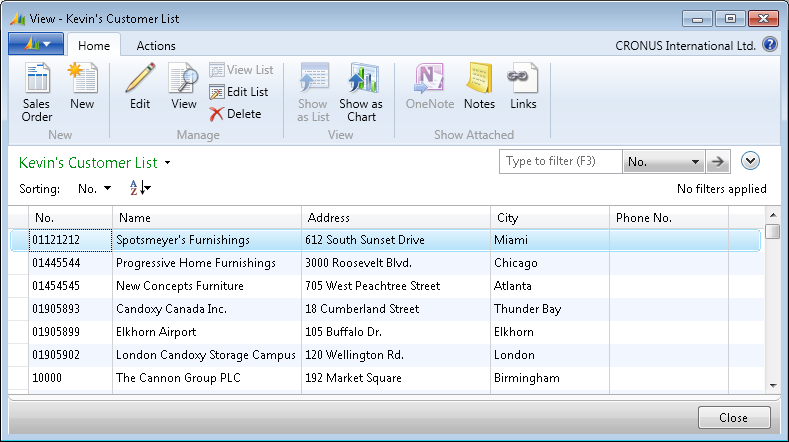

# Walkthrough: Creating a Customer List in Page Designer
In this walkthrough, you will learn how to create a basic page that displays a list of customers.  
  
 Pages are used in [!INCLUDE[navnowlong](includes/navnowlong_md.md)] the same way that forms are used in earlier versions. Unlike forms, pages can be displayed on multiple clients, including the [!INCLUDE[nav_windows](includes/nav_windows_md.md)]. This flexibility lets you display the same information in different clients. Pages cannot be viewed in the [!INCLUDE[nav_dev_long](includes/nav_dev_long_md.md)].  
  
## About this Walkthrough  
 This walkthrough provides an overview of how to create and run a simple list page in [!INCLUDE[navnow](includes/navnow_md.md)], and demonstrates how to:  
  
-   Create a list page.  
  
-   Add controls to the page to display specific fields from a table.  
  
-   Save the page.  
  
-   Run the page in the [!INCLUDE[rtc](includes/rtc_md.md)].  
  
### Prerequisites  
 The following prerequisites are required for this walkthrough:  
  
-   [!INCLUDE[navnowlong](includes/navnowlong_md.md)] installed with a developer license.  
  
-   [!INCLUDE[demolong](includes/demolong_md.md)]  
  
## Story  
 Simon is a partner working for CRONUS International Ltd. Kevin, the Sales Manager at CRONUS, has contacted Simon and asked him to create a customer list.  
  
## Creating a List Page  
 To create Kevin's customer list, Simon knows that he needs to create a list page. Simon also needs to ensure that the card for a specific customer will open when Kevin selects the customer from the list.  
  
> [!NOTE]  
>  In this walkthrough, to learn about the properties and controls of a list page you will create a list page from a blank page. Object Designer also includes a wizard that you can use to create a list page that sets up many properties and controls for you. For more information about the wizard, see [How to: Create a Page](How-to--Create-a-Page.md).  
  
#### To create a List page  
  
1.  Open the [!INCLUDE[nav_dev_long](includes/nav_dev_long_md.md)], and then on the **Tools** menu, choose **Object Designer**.  
  
2.  In Object Designer, choose **Page**, and then choose **New**. The **New Page** window opens.  
  
3.  In the **Table** text box, choose the up arrow, select the **Customer** table, and then choose the **OK** button.  
  
4.  Select **Create blank page**, and then choose **OK**.  
  
     The new page opens in Page Designer.  
  
5.  In the **Name** column of the first row, enter **CustomerListContainer** and accept the defaults values for the **Type** and the **SubType** fields.  
  
6.  Select a blank row, and on the **View** menu, choose **Properties**.  
  
7.  In the **PageType** property, set the **Value** field to **List**.  
  
8.  In the **CardPageID** property, set the **Value** field to **21 Customer Card**.  
  
9. Close the **Properties** window.  
  
## Adding Customer Information to the Page  
 Now that Simon has created a basic list page, he wants to add a control and the appropriate fields so that the page will display the number, name, address, city, and phone number for each customer in the list.  
  
#### To add controls to the page  
  
1.  In Page Designer, in the **Name** column in the second row, type **CustomerListGroup**. Set **Type** to **Group** and set **SubType** to **Repeater**.  
  
    > [!NOTE]  
    >  The **CustomerListGroup** is indented one level below the **CustomerListContainer**, indicating that it is a child of, and will be displayed within, the **CustomerListContainer**.  
  
2.  Select the third row.  
  
3.  On the **View** menu, choose **Field Menu**.  
  
     The **Field Menu** window opens, displaying the list of available fields from the **Customer** table \(Table 18\).  
  
4.  Select multiple fields by holding down the Ctrl key while you select the following rows:  
  
    -   No.  
  
    -   Name  
  
    -   Address  
  
    -   City  
  
    -   Phone No.  
  
5.  Choose the **OK** button.  
  
     A message box appears with the following message: "Do you want to add the fields that are selected in the field menu?"  
  
    > [!NOTE]  
    >  If the **OK** button in the **Field Menu** window is inactive, you can commit the field changes by choosing Page Designer.  
  
6.  Choose **Yes**.  
  
     The following illustration shows the Page Designer window.  
  
       
  
## Saving and Running the Page  
 Now that Simon's page is complete, he wants to see how it looks. Eventually, he will add an action to another page so Kevin can access the page. But while he is still working on it, Simon can save the page and then quickly run it in the [!INCLUDE[rtc](includes/rtc_md.md)] using the following procedure.  
  
#### To save and run the page  
  
1.  From the **File** menu, choose **Save**, or press Ctrl + S.  
  
     The **Save As** dialog box opens.  
  
2.  In the **ID** field, enter **50000**.  
  
3.  In the **Name** field, enter **Kevin's Customer List**.  
  
4.  Make sure **Compile** is selected and choose the **OK** button.  
  
     This name is displayed in the page's ribbon.  
  
5.  In Object Designer, select the page **50000 Kevin's Customer List**, and then choose **Run** to view the page.  
  
     The [!INCLUDE[rtc](includes/rtc_md.md)] opens and displays the customer list page. The following illustration shows a customer list page.  
  
       
  
## Next Steps  
 Next, Simon needs to add actions to the customer list page. He decides that he wants to add a Sales Order action. When selected, this action will create a new sales order.  
  
## See Also  
 [Walkthrough: Adding Actions to a Customer List Page](Walkthrough--Adding-Actions-to-a-Customer-List-Page.md)   
 [Walkthrough: Adding a FactBox to the Customer List Page](Walkthrough--Adding-a-FactBox-to-the-Customer-List-Page.md)   
 [How to: Create a Page](How-to--Create-a-Page.md)   
 [Touring the RoleTailored Client Pages](Touring-the-RoleTailored-Client-Pages.md)   
 [How to: Run a Page](How-to--Run-a-Page.md)