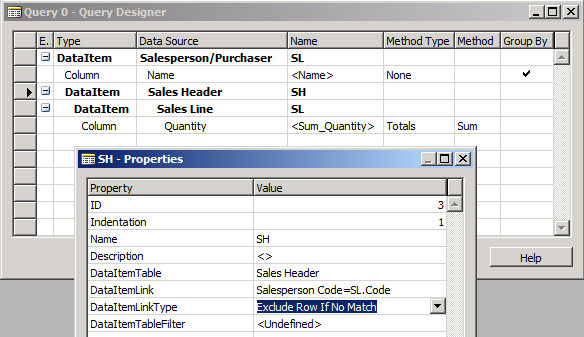
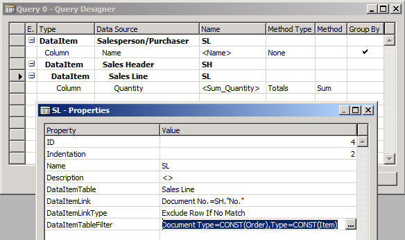
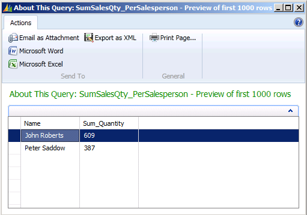

# Walkthrough: Creating a Query to Link Three Tables
This walkthrough demonstrates how to create a query that links three tables. It also includes the SQL query that this query object represents.  
  
## About This Walkthrough  
 This walkthrough illustrates the following tasks:  
  
-   Creating a query that uses three tables and includes fields from those tables.  
  
-   Setting up a totals method on a query column.  
  
-   Specifying how to link the tables.  
  
-   Specifying filters to limit the resulting dataset.  
  
-   Running the query to view the data that this query describes.  
  
## Prerequisites  
 To complete this walkthrough, you will need:  
  
-   [!INCLUDE[navnowlong](includes/navnowlong_md.md)] with a developer license.  
  
-   [!INCLUDE[demolong](includes/demolong_md.md)].  
  
## Story  
 Viktor is a Microsoft Certified Partner working for [!INCLUDE[demoname](includes/demoname_md.md)] He has been asked to create a query that displays the total number of items in each sales order for each salesperson. Viktor knows how to do this in SQL, but he wants to create a [!INCLUDE[navnow](includes/navnow_md.md)] query.  
  
 The SQL query for this dataset that Viktor wants is the following:  
  
```  
SELECT SP.Name, SUM(SL.Quantity)  
FROM "Salesperson/Purchaser" AS SP INNER JOIN "Sales Header" AS SH  
  ON SP.Code = SH."Salesperson Code" INNER JOIN "Sales Line" AS SL  
  ON SL."Document No." = SH."No."   
WHERE SL."Document Type" = 'Order' AND SL.Type = 'Item'  
GROUP BY SP.Name  
```  
  
## Creating the Query with Three Tables  
 Viktor must create a query with Query Designer. The salesperson name is stored in the **Salesperson\/Purchaser** table. The salesperson code for sales orders is stored in the **Sales Header** table. The quantity of items in sales orders is stored in the **Sales Line** table. To create this query, Viktor must do the following:  
  
-   Add tables and fields by specifying data items and columns.  
  
-   Set up a **Totals** method on the **Quantity** of the **Sales Line** table to return the total number of items in each sales order for each salesperson.  
  
-   Link the **Salesperson\/Purchase** table and the **Sales Header** table on the condition that the salesperson code matches, and then link the resulting dataset with the **Sales Line** table to find all sales lines for each sales header.  
  
#### To add tables and fields to the query  
  
1.  In the development environment, on the **Tools** menu, choose **Object Designer**.  
  
2.  In Object Designer, choose **Query**, and then choose the **New** button.  
  
3.  In Query Designer, add four rows as described in the following table. Choose the drop\-down arrow to select tables and fields from the drop\-down list box.  
  
    |Line No.|Type|Data Source|Name|  
    |--------------|----------|-----------------|----------|  
    |Line 1|DataItem|Salesperson\/Purchaser|**SP**|  
    |Line 2|Column|Name|\<Name\>|  
    |Line 3|DataItem|Sales Header|**SH**|  
    |Line 4|DataItem|Sales Line|**SL**|  
  
> [!TIP]  
>  The **Name** column in Query Designer is equivalent to using the AS keyword in an SQL statement. It defines an alias for the data item. Type a value in this column when you want to replace the default value with an alias.  
  
> [!NOTE]  
>  The Sales Header data item is indented. This indicates that this data item, which is the **Sales Header** table, is linked to the upper data item, which is the **Salesperson\/Purchaser** table.  
  
> [!NOTE]  
>  The Sales Line data item is indented. This indicates that this data item, which is the **Sales Line** table, is joined to the parent data item, which is the result of the previous join.  
  
#### To set up a totals method on the Quantity column  
  
1.  In Query Designer, on the next line after the **Sales Line** data item, in the **Type** column, choose **Column** from the drop\-down list box.  
  
2.  In the **Data Source** column, select **Quantity** from **Sales Line \- Field List** window, and then choose the **OK** button.  
  
3.  In the **Method Type** column, choose **Totals** from the drop\-down list box.  
  
    > [!NOTE]  
    >  You want the query results to group by the **Name** field of the **Salesperson\/Purchaser** table. This is automatically done for you. The query groups all fields that are not totals fields. In Query Designer, grouped fields are indicated by a check mark in the **Group By** column. In this example, the only column that is grouped is the **Name** field under the **Salesperson\/Purchaser** data item.  
  
4.  In the **Method** column, choose **Sum** from the drop\-down list box.  
  
 The following figure shows the Query Designer for this example.  
  
   
  
## Specifying the Data Item Links  
 Viktor has added the data items and columns to the query, but he must specify how to link the data items to display the information he wants and eliminate unwanted records. For this query, Viktor wants the following:  
  
-   Only salespersons who have sales orders.  
  
     The **Salesperson\/Purchase** table and the **Sales Header** table have a field for the sales person's code in common. Viktor will link the **Salesperson\/Purchase** table and the **Sales Header** table on the condition that the code for the salesperson in the two tables matches. This will exclude any salesperson who is not assigned a sales order.  
  
-   Only sales headers that have sales lines.  
  
     The **Sales Header** table and the **Sales Lines** table have a field for the document number in common. Viktor will link the **Sales Header** table and **Sales Line** table on the condition that the document number in the two tables matches. This will exclude any sales headers that do not have sales lines.  
  
#### To link the Salesperson\/Purchase table and the Sales Header table  
  
1.  In Query Designer, select the **SH** data item row.  
  
2.  On the **View** menu, choose **Properties**. The **SH \- Properties** window opens.  
  
3.  In the **Value** field of the **DataItemLink** property, choose the **AssistEdit** button.  
  
     The **DataItem Link** window opens. You use this window to create a reference link between the **Salesperson Code** field of the **Sales Header** table and the **Code** field of the **Salesperson\/Purchaser** table.  
  
4.  In the **DataItem Link** window, in the **Field** column, choose the up arrow.  
  
5.  In the **Sales Header – Field List** window, select **Salesperson Code**, and then choose the **OK** button.  
  
6.  In the **Reference DataItem** field, choose the up arrow.  
  
     The **DataItem List – Table** window opens. You use this window to create a link to the **Salesperson\/Purchaser** table.  
  
7.  In the **DataItem List – Table** window, select the **SP** data item, and then choose the **OK** button.  
  
8.  In the **Reference Field**, choose the up arrow.  
  
9. In the **Salesperson\/Purchaser – Field List** window, select **Code**, and then choose the **OK** button.  
  
10. Choose the **OK** button to close the **DataItem Link** window.  
  
11. In the **SH Properties** window, in the **Value** field of the **DataItemLinkType** property, choose **Exclude Row If No Match** from the drop\-down list box.  
  
     The following figure shows the **SH Properties** window and Query Designer.  
  
       
  
12. Close the **SH Properties** window, and then link the **Sales Line** table and the **Sales Header** table.  
  
#### To link the Sales Line table and the Sales Header table  
  
1.  In Query Designer, select the **SL** data item row.  
  
2.  On the **View** menu, choose **Properties**. The **SL \- Properties** window opens.  
  
3.  In the **Value** field of the **DataItemLink** property, choose the **AssistEdit** button.  
  
     The **DataItem Link** window opens. You use this window to create a reference link between the **Document No.** field of the **Sales Line** table and the **No.** field of the **Sales Header** table.  
  
4.  In the **DataItem Link** window, in the **Field** column, choose the up arrow.  
  
5.  In the **Sales Line – Field List** window, select **Document No.**, and then choose the **OK** button.  
  
6.  In the **Reference DataItem** column, choose the up arrow.  
  
     The **DataItem List – Table** window opens. You use this window to create a link to the **Sales Header** table.  
  
7.  In the **DataItem List – Table** window, select the **SH** data item, and then choose the **OK** button.  
  
8.  In the **DataItem Link** window, in the **Reference Field** column, choose the up arrow.  
  
9. In the **Sales Header – Field List** window, select **No.**, and then choose the **OK** button.  
  
10. Choose the **OK** button to close the **DataItem Link** window.  
  
11. In the **SL – Properties** window, in the **Value** field of the **DataItemLinkType** property, choose **Exclude Row If No Match** from the drop\-down list box.  
  
## Specifying Filters  
 Viktor wants to limit the records in the dataset to include only sales lines in which the **Document Type** is **Order** and the **Type** is **Item**. To achieve this, he will set up a filter on the **Sales Line** data item of the query.  
  
#### To specify filters  
  
1.  In the **SL – Properties** window, in the **Value** field of **DataItemTableFilter** property, choose the **AssistEdit** button.  
  
2.  In the **Table Filter** window, in the **Field** column, choose the up arrow.  
  
     The **Sales Line – Field List** opens. You use this window to select a field from the **Sales Line** table on which to filter.  
  
3.  In the **Sales Line – Field List** window, select **Document Type**, and then choose the **OK** button.  
  
4.  In the **Table Filter** window, set the **Type** column to **CONST**.  
  
5.  In the **Value** column of the **Document Type** entry, enter **Order**.  
  
6.  On the next line in the **Table Filter** window, in the **Field** column, choose the up arrow, select **Type** from the **Sales Line – Field List** window, and then choose the **OK** button.  
  
7.  In the **Table Filter** window, set the **Type** column to **CONST**.  
  
8.  In the **Value** column of the **Type** entry, enter **Item**, and then choose the **OK** button.  
  
    > [!TIP]  
    >  Specifying a filter in the **DataItemTableFilter** property is equivalent to using a WHERE clause in an SQL statement.  
  
       
  
9. Close the **Sales\_Line – Properties** window,  
  
## Saving and Running the Query  
 Viktor has finished designing his query. He saves the query and then runs it to verify that the resulting dataset is what he wants. He runs the query from Object Designer. The call to run the query runs on [!INCLUDE[nav_server](includes/nav_server_md.md)] and opens a view of the dataset in the [!INCLUDE[nav_windows](includes/nav_windows_md.md)].  
  
#### To save and run the query  
  
1.  On the **File** menu, choose **Save**.  
  
2.  In the **Save As** window, in the **ID** field, enter **50003**. In the **Name** field, enter **SumSalesQty\_PerSalesperson**. Verify that the **Compiled** check box is selected, and then choose the **OK** button.  
  
3.  In Object Designer, select query 50003, and then choose the **Run** button. When you run a query, you can see the data in the dataset.  
  
       
  
## See Also  
 [Queries](Queries.md)   
 [Understanding Data Item Links](Understanding-Data-Item-Links.md)   
 [Understanding Query Filters](Understanding-Query-Filters.md)   
 [Understanding Query Totals and Grouping](Understanding-Query-Totals-and-Grouping.md)