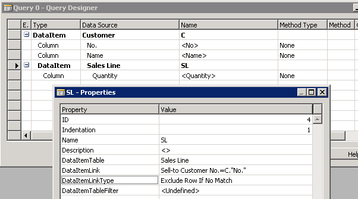
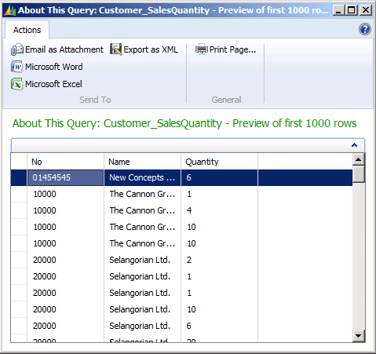

# Walkthrough: Creating a Query to Link Two Tables
This walkthrough demonstrates how to create a query that links two tables.  
  
## About This Walkthrough  
 This walkthrough illustrates the following tasks:  
  
-   Creating a query that links the **Customer** table and the **Sales Line** table.  
  
-   Running the query to view the data that this query describes.  
  
## Prerequisites  
 To complete this walkthrough, you will need:  
  
-   [!INCLUDE[navnowlong](includes/navnowlong_md.md)] with a developer license.  
  
-   [!INCLUDE[demolong](includes/demolong_md.md)].  
  
## Story  
 Viktor is a Microsoft Certified Partner working for [!INCLUDE[demoname](includes/demoname_md.md)] He has been asked to create a query that will get the quantity of items in every sales order for each customer. Viktor knows how to do this in SQL, but he wants to use a [!INCLUDE[navnow](includes/navnow_md.md)] query.  
  
 The SQL query for the dataset that Viktor wants is the following:  
  
```sql  
SELECT C.Name, C.'No.' SL.AmountFROM Customer AS C, 'Sales Line' AS SL WHERE C.'No.' = SL.'Sell-to Customer No.'  
```  
  
## Creating a Query That Links Two Tables  
 Viktor wants to create a dataset that contains the quantity of items and the customer name for every sales order. The customer name is stored in the **Customer** table. Sales order quantities are stored in the **Sales Line** table. To create this dataset, Viktor will use Query Designer to create a query and do the following:  
  
1.  Include data items and columns for the **Customer** and **Sales Lines** tables and their fields.  
  
     A *data item* defines a table to retrieve data from. Viktor will add one data item for the **Customer** table and another data item for the **Sales Line** table. A *column* specifies a field from a table to be displayed in the resulting dataset. Viktor will add columns for the **No.** and **Name** fields from the **Customer** table, and a column for the **Quantity** field from the **Sales Line** table.  
  
2.  Link the **Customer** table and **Sales Line** table.  
  
     To generate a dataset from the **Customer** table and **Sales Line** table, Viktor must *link* the two tables. A link specifies a condition between two fields of the tables that must be met for a record to be included in the dataset. To link the two tables, Viktor must first identify a field that is common in both tables. He determines that the **No.** field in the **Customer** table is the same as the **Sell\-to Customer No.** field in the **Sales Line** table. For a record to be included in the resulting dataset, the value of the **No.** field in the **Customer** table must equal the **Sell\-to Customer No.** field in the **Sales Line** table.  
  
 To create this dataset in a [!INCLUDE[navnow](includes/navnow_md.md)] query, Viktor creates a query in Object Designer.  
  
#### To create a query that includes columns from the Customer table and the Sales Line table  
  
1.  In the development environment, on the **Tools** menu, choose **Object Designer**.  
  
2.  In Object Designer, choose **Query**, and then choose the **New** button.  
  
3.  In Query Designer, add five rows as described in the following table. Choose the drop\-down arrow to select tables and fields from the drop\-down list box.  
  
    |Line No.|Type|Data Source|Name|  
    |--------------|----------|-----------------|----------|  
    |Line 1|DataItem|Customer|**C**|  
    |Line 2|Column|No.|\<No\>|  
    |Line 3|Column|Name|\<Name\>|  
    |Line 4|DataItem|Sales Line|**SL**|  
    |Line 5|Column|Quantity|\<Quantity\>|  
  
> [!TIP]  
>  The **Name** column in Query Designer is equivalent to using the AS keyword in an SQL statement. It defines an alias for the data item. Type a value in this column when you want to replace the default value with an alias.  
  
#### To link the Customer table and the Sales Line table  
  
1.  In Query Designer, select the **SL** data item.  
  
    > [!IMPORTANT]  
    >  When you create a link between two data items, you set up the link on the lower of the two data items in Query Designer.  
  
2.  On the **View** menu, choose **Properties**. The **SL \- Properties** window opens  
  
3.  In the **Value** field of the **DataItemLink** property, choose the **AssistEdit** button.  
  
     The **DataItem Link** window opens. You use this window to create a reference link between the **Sell\-to Customer No.** field of the **Sales Line** table and the **No.** field of the **Customer** table.  
  
4.  In the **DataItem Link** window, in the **Field** column, choose the up arrow.  
  
    > [!NOTE]  
    >  **DataItem Link** is like a WHERE clause in an SQL statement.  
  
5.  In the **Sales Line – Field List** window, select **Sell\-to Customer No.**, and then choose the **OK** button.  
  
6.  In the **Reference DataItem** column, choose the up arrow.  
  
     The **DataItem List – Table** window opens. You use this window to create a link to the **Customer** table.  
  
7.  In the **DataItem List** window. select the **C** data item row, and then choose the **OK** button.  
  
8.  In the **Reference Field** column, choose the up arrow.  
  
9. In the **Customer – Field List** window, select **No.**, and then choose the **OK** button.  
  
10. Choose the **OK** button to close the **DataItem Link** window.  
  
11. In the **SL Properties** window, in the **Value** field of the **DataItemLinkType** property, choose **Exclude If No Match** from the drop\-down list.  
  
    > [!NOTE]  
    >  **Exclude If No Match** only includes rows where the linked fields from both data items are equal.  
  
 The following figure shows Query Designer and **Properties** window.  
  
   
  
## Saving and Running the Query  
 Viktor wants to verify that the query describes the dataset that he wants. He saves the query, and then runs it from Object Designer. The call to run the query runs on [!INCLUDE[nav_server](includes/nav_server_md.md)] and opens a view of the dataset in the [!INCLUDE[nav_windows](includes/nav_windows_md.md)].  
  
#### To save and run a query  
  
1.  On the **File** menu, choose **Save**.  
  
2.  In the **Save As** window, in the **ID** field, enter **50001**. In the **Name** field, enter **Customer\_SalesQuantity**. Verify that the **Compiled** check box is selected, and then choose the **OK** button.  
  
    > [!NOTE]  
    >  If **50001** is already being used by another query, you will get an error when you try to save the query. If so, use another ID.  
  
3.  In Object Designer, select query 50001, and then choose the **Run** button. When you run a query, you can view the data in the dataset.  
  
       
  
## Next Steps  
 Viktor’s next steps are to create more complex queries. For more information, see  [Walkthrough: Creating a Query That Uses a Totaling Method and Sorting](../Topic/Walkthrough:%20Creating%20a%20Query%20That%20Uses%20a%20Totaling%20Method%20and%20Sorting.md) and [Walkthrough: Creating a Query to Link Three Tables](../Topic/Walkthrough:%20Creating%20a%20Query%20to%20Link%20Three%20Tables.md).  
  
## See Also  
 [Queries](Queries.md)