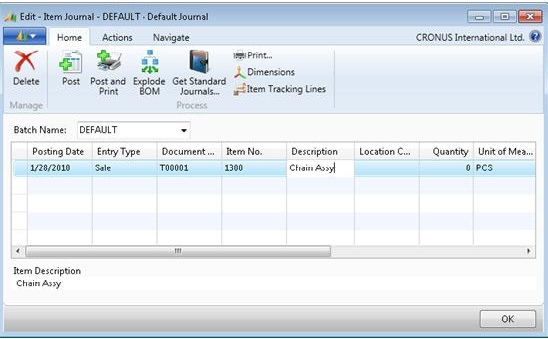
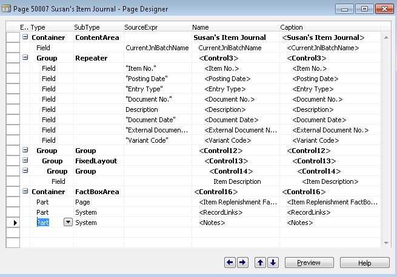

# Walkthrough: Creating a Worksheet Page
In [!INCLUDE[navnow](includes/navnow_md.md)], you can use a worksheet page type to create two types of pages:  

-   Worksheet pages – Used to present data in a list and offer a choice of actions to the user. For example, page 5841, Standard Cost worksheet, in Object Designer is a worksheet page.  

-   Journal pages – Used to perform tasks, such as posting transactions. For example, page 40, the Item Journal, in Object Designer is a journal page.  

     The following illustration shows an Item Journal page.  

       

 Worksheet pages always open in edit mode and can display lists of data in a grid control and in lines. Lines can be filled in by a user or by running a batch job. You can add other controls such as a filter or FactBox to a worksheet page but you cannot add a chart pane. As part of user personalization options, these controls can be added or removed by the user. Actions can be added to the navigation of a worksheet page, and may be promoted by the user to the ribbon.  

 In this walkthrough, you learn how to create a new Item Journal worksheet that displays item journal lines.  

## About This Walkthrough  
 This walkthrough provides on overview of how to create a journal worksheet page and how to add controls to display items from a table. In this walkthrough, you will display items from table 83, Item Journal Line.  

 This walkthrough illustrates the following tasks:  

-   Creating a worksheet page.  

-   Adding a batch name control.  

-   Adding a field repeater control.  

-   Adding a fixed layout control.  

-   Adding FactBoxes.  

-   Running the page.  

### Prerequisites  
 To complete this walkthrough, you will need:  

-   [!INCLUDE[navnowlong](includes/navnowlong_md.md)] installed with a developer license.  

-   The [!INCLUDE[demolong](includes/demolong_md.md)].  

## Story  
 Simon is a partner working for CRONUS International Ltd. Susan, the order processor asks Simon to create an Item Journal worksheet page for her, which she can use to keep her item inventory up to date. Susan often uses the posting action on the Item Journal page to adjust her inventory in relation to purchases and sales.  

## Creating a Worksheet Page  

> [!NOTE]  
>  In this walkthrough, you will create a worksheet page from a blank page and learn about the properties and controls of a worksheet page. Object Designer includes a wizard that you can use to create a worksheet page that sets up many properties and controls for you. For more information about the wizard, see [How to: Create a Page](How-to--Create-a-Page.md).  

#### To create a worksheet page  

1.  In [!INCLUDE[nav_dev_long](includes/nav_dev_long_md.md)], on the **Tools** menu, choose **Object Designer**.  

2.  In Object Designer, choose **Page**, and then choose **New**. The **New Page** window opens.  

3.  In the **Table** text box, choose the up arrow, select the table 83, **Item Journal Line**, and then choose the **OK** button.  

4.  Select **Create blank page**, and then choose the **OK** button.  

     The new page appears in Page Designer.  

5.  On the first row, ensure that the **Type** column is set to **Container** and that the **SubType** column is set to **ContentArea**. In the **Name** column, type **Susan's Item Journal**.  

6.  Select a blank row, and on the **View** menu, choose **Properties**.  

7.  In the **PageType** property, set the page type to **Worksheet**.  

8.  Close the **Properties** window.  

## Adding a Batch Name Control  
 First, Simon needs to add a batch name control to the top of his worksheet page, so Susan can select which batch item she wants to run from the Item Journal Batch table.  

#### To add a batch name control  

1.  In **Page Designer**, select the second row, type **CurrentJnlBatchName** in the **Name** field, and set **Type** to **Field**. This element is automatically indented one space below your **Container** element.  

2.  With the second row still selected, open the **Properties** window, and set the **SourceExpr** property to **CurrentJnlBatchName**.  

3.  Set the **LookUp** property to **Yes**.  

4.  On the **View** menu, choose **C/AL Globals**.  

5.  In the **Name** field, enter **CurrentJnlBatchName**, then in the **DataType** field, choose **Text**, and then close the **C/AL Globals** window.  

6.  Save your new page and name it **Susan's Item Journal**. Set the page **ID** to **50007** or another value in the 50000 range.  

## Adding a Field Repeater Control  
 Next, Simon must add fields to Susan's Item Journal page. In a worksheet page these fields are displayed horizontally, like lines.  

#### To add field repeater controls  

1.  In Page Designer for the page you just created, select a blank row. Set the **Type** column to **Group** and the **SubType** column to **Repeater**, and accept the default for the name. You can enter a name for control instead of accepting the default.  

2.  In the next blank row, set **Type** to **Field**. You cannot set a **SubType** when you select **Field**.  

3.  With the new **Field** row selected, on the **View** menu, choose **Field Menu**. The **Field Menu** window displays fields available from table 83, **Item Journal Line**.  

4.  Select multiple fields from this table by holding down the Ctrl key while you make your selection. For this walkthrough select the following fields:  

    -   Item No.  

    -   Posting Date  

    -   Entry Type  

    -   Document No.  

    -   Description  

    -   Document Date  

    -   External Document No.  

    -   Variant Code  

5.  Choose the **OK** button to add the fields and then choose **Yes** in the dialog box that appears.  

     You have now successfully added a Repeater control to your worksheet page.  

6.  Close Page Designer and save your changes.  

## Adding Fixed Layout Controls  
 Next, Simon needs to create a Fixed Layout control. On an Item Journal page, this type of control can be used to show a description at the bottom of the page for the item displayed in the batch line.  

#### To add a fixed layout control  

1.  Select page 50007, Susan's Item Journal and choose **Design** to open it in Page Designer, if it's not already open.  

2.  In the next available row below the repeater controls, set **Type** to **Group** and **SubType** to **Group**. Use the arrows provided in Page Designer to move this row to the left one space. The fixed layout control should be indented at the same level as your Repeater control.  

3.  On the next row, set **Type** to **Group** and **SubType** to **FixedLayout**.  

4.  In the next available row, set **Type** to **Group** and **SubType** to **Group**.  

5.  Finally, in the next available row, set **Type** to **Field**. Type **Item Description** in the **Name** field and accept the default indentation as you add these elements to the page.  

6.  Save and preview your page. You can now see that **Item Description** is displayed at the bottom of your worksheet page.  

    > [!NOTE]  
    >  To link Item Description to Batch Lines you must add the variable **Item Description** to C/AL Globals in Object Designer.  

## Adding FactBoxes  
 Simon has decided to add three FactBoxes to Susan's worksheet page:  

-   Item Replenishment  

-   RecordLinks  

-   Notes  

 **Item Replenishment** is a FactBox in an existing page, while **RecordLinks** and **Notes** are both system FactBoxes. Simon wants all these FactBoxes to be hidden unless Susan decides to show them as part of her personalization options.  

#### To add FactBoxes to a worksheet page  

1.  Select page 50007, **Susan's Item Journal** and choose **Design** to open it in Page Designer.  

2.  In the first available empty row, set **Type** to **Container** and **SubType** to **FactBoxArea**. Accept the default value in the **Name** column.  

3.  Use the left indentation arrow to negative indent the FactBox control until it has zero indention and matches the top level **ContentArea** container element.  

4.  In the next row, set **Type** to **Part**, and accept all other default values in this row.  

5.  With the same row selected, on the **View** menu, choose **Properties**. In the **PagePartID** property, choose the up arrow and select the **Item Replenishment FactBox** \(9090\) page from the **Page List** window.  

6.  Set the **Visible** property to **FALSE**. This FactBox remains hidden until the user adds it to the page.  

7.  Close the **Properties** window.  

8.  In the next available empty row, add another **Part** for the **RecordLinks** system FactBox.  

9. From the **View** menu, select **Properties**.  

10. In the **Properties** window, set the following properties.  

    |Property|Value|  
    |--------------|-----------|  
    |**SystemPartID**|**RecordLinks**|  
    |**PartType**|**System**|  
    |**Visible**|**FALSE**|  

11. In the next available empty row in Page Designer, add another **Part** for the **Notes** system FactBox.  

12. Select the row, and open the **Properties** window.  

13. In the **Properties** window, set the following properties.  

    |Property|Value|  
    |--------------|-----------|  
    |**SystemPartID**|**Notes**|  
    |**PartType**|**System**|  
    |**Visible**|**FALSE**|  

14. Go to the next available empty row in Page Designer, and open the **Properties** window if it is not already open.  

15. Locate the **DelayedInsert** property and choose **Yes**.  

16. Close the **Properties** window.  

17. Check the indentation of your page elements and adjust if necessary.  

18. The following illustration shows the indentation of elements on the worksheet page after adding FactBoxes.  

       

## Running the Page  
 You will now test your new worksheet page in the [!INCLUDE[nav_windows](includes/nav_windows_md.md)].  

#### To run the page  

1.  In Object Designer, select the page Susan’s Item Journal, page 50007, and then choose **Run**.  

     The [!INCLUDE[nav_windows](includes/nav_windows_md.md)] opens and displays the new worksheet page. Notice that no FactBoxes are displayed.  

2.  From the main menu, select **Customize**, then choose **Choose FactBoxes**. The **Customize Action Tab** window opens.  

3.  In **Available FactBoxes**, select the **Item Details-Replenishment** FactBox, and choose **Add**  

4.  Use the same procedure to add the **RecordLinks** and **Notes** FactBoxes. Choose the **OK** button, and then run the page again. Notice that the hidden FactBoxes you added are now displayed on the page.  

## Next Steps  
 Simon has now created a basic worksheet page. He must remember to add the variables, constants, and functions necessary to make the worksheet page function correctly. He knows that he add variables, constants and functions in the C/AL Globals or C/AL Locals window. For information about C/AL Globals window, see [\($ S\_10204 C-AL Globals $\)](uiref/-$-S_10204-C-AL-Globals-$-.md). For information about C/AL functions, see [C/AL Functions](C-AL-Functions.md).  

 For more information about adding variables, constants, and functions, see [Codeunits](Codeunits.md).  

## See Also  
 [How to: Add Actions to a Page](How-to--Add-Actions-to-a-Page.md)   
 [How to: Promote Actions on Pages](How-to--Promote-Actions-on-Pages.md)   
 [Page Designer Troubleshooting](Page-Designer-Troubleshooting.md)   
 [How to: Create a Page](How-to--Create-a-Page.md)   
 [Touring the RoleTailored Client Pages](Touring-the-RoleTailored-Client-Pages.md)   
 [How to: Run a Page](How-to--Run-a-Page.md)
