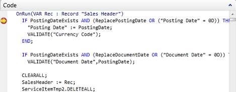
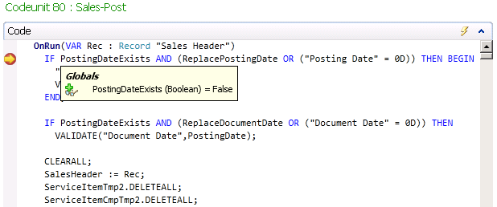

# Walkthrough: Debugging the Microsoft Dynamics NAV Windows Client
This walkthrough demonstrates debugging an action in the [!INCLUDE[nav_windows](includes/nav_windows_md.md)] with the [!INCLUDE[navnow](includes/navnow_md.md)] Debugger. The purpose of this walkthrough is to familiarize you with what you can do with the debugger. It does not describe how to debug and fix a specific error.  
  
## About This Walkthrough  
 This walkthrough illustrates the following tasks:  
  
-   Setting a breakpoint on codeunit 80, Sales\-Post, in the development environment.  
  
-   Activating the [!INCLUDE[navnow](includes/navnow_md.md)] Debugger.  
  
-   Posting a sales order so that the debugger breaks in codeunit 80, Sales\-Post.  
  
-   Using the debugger to:  
  
    -   View the parts of the debugger.  
  
    -   View variables and add watches.  
  
    -   Step through lines of code.  
  
    -   Add another breakpoint from the debugger.  
  
    -   Stop the current activity.  
  
### Prerequisites  
 To complete this walkthrough, you will need:  
  
-   [!INCLUDE[navnowlong](includes/navnowlong_md.md)] with a developer license.  
  
-   [!INCLUDE[demolong](includes/demolong_md.md)].  
  
-   To verify that no other users are connected to the [!INCLUDE[nav_server](includes/nav_server_md.md)] instance. If other users are connected, then you might debug a session other than the one you want.  
  
-   To verify that the user account that you use meets the requirements for setting breakpoints. For more information, see [Development Environment \(C\-SIDE\)](Development-Environment--C-SIDE-.md).  
  
## Story  
 Isaac is a business application developer working for CRONUS International Ltd. He has determined that there is an error in his code that posts sales orders. He wants to debug the scenario of posting a sales order. Isaac is not familiar with the [!INCLUDE[navnow](includes/navnow_md.md)] Debugger and wants to try all the functionality that the debugger offers.  
  
## Debugging the Post Action on a Sales Order  
 Isaac starts by setting a breakpoint at the first line of code in the Sales\-Post codeunit. Next, he activates the debugger, runs the code so that it breaks at his breakpoint, and then steps through lines of code in this codeunit and other codeunits and examines variables to try to find the error.  
  
#### To set a breakpoint in the development environment  
  
1.  Open the [!INCLUDE[nav_dev_long](includes/nav_dev_long_md.md)]. In Object Designer, choose **Codeunit**.  
  
2.  Select codeunit 80, Sales\-Post, and then choose **Design**.  
  
3.  In the **C\/AL Editor**, select the first line in the **OnRun** trigger.  
  
4.  On the **Tools** menu, choose **Debugger**, and then choose **Toggle Breakpoint** to add a breakpoint to the selected line of code.  
  
       
  
#### To activate the debugger  
  
1.  In Object Designer, on the **Tools** menu, choose **Debugger**, and then choose **Debug Session**.  
  
     The **Session List** page opens.  
  
2.  In the **Session List** page, on the **Home** tab, in the **Session** group, choose **Debug Next**.  
  
     The **Debugger** page opens, but no session is currently being debugged, and no code is displayed in the code viewer.  
  
#### To post a sales order and break in codeunit 80  
  
1.  Open a new [!INCLUDE[nav_windows](includes/nav_windows_md.md)] session.  
  
2.  In the [!INCLUDE[nav_windows](includes/nav_windows_md.md)], in the **Search** field, enter **Sales Orders**, and choose the related link.  
  
3.  In the **Sales Orders** list, select any sales order for which you want to debug the Post action, such as sales order 101016, and then, on the **Actions** tab, in the **Posting** group, choose **Post**.  
  
4.  In the dialog box, select **Ship and Invoice**, and then choose the **OK** button.  
  
     Go to the **Debugger** window. The code viewer shows the **OnRun** trigger of codeunit 80. Execution stops on the first line of code in the **OnRun** trigger, where you set the breakpoint in the development environment.  
  
#### To use the debugger  
  
1.  Now that you have hit a breakpoint in the code, you can become familiar with the parts of the **Debugger** page.  
  
    -   In the code viewer, the current line is identified by a yellow arrow in the margin. Breakpoints are identified by a red dot in the margin.  
  
           
  
    -   In the code viewer, you can point to a variable, field, or text constant to inspect the value.  
  
           
  
    -   In the **Call Stack** FactBox, you can view the function calls that led to the current line of code, starting with the Post action on page 9305.  
  
           
  
2.  On the **Home** tab, choose **Variables**.  
  
     The **Debugger Variables List** window displays all variables that are currently in scope, including the Rec variable.  
  
3.  In the **Debugger Variables List** window, expand **Rec**, expand **Fields**, select a field such as **Posting Date**, choose **Add Watch**, and then choose the **Close** button.  
  
     The *Posting Date* variable is added to the **Watches** FactBox on the **View \- Debugger** window. This is especially useful if there is a long list of variables in the **Debugger Variables List** window or if you want to view the value of a field in a record variable while you step through the code. Additionally, if you want to watch how the value of a variable changes, such as if you are in a loop, then it is useful to add the variable to the **Watches** FactBox.  
  
       
  
    > [!NOTE]  
    >  When adding watches from the **Debugger Variables List** window, the watches do not appear in the **Watches** FactBox on the **View \- Debugger** window until you choose the **Close** button.  
  
     In the **Debugger Variables List** window, you can also expand and view **Keys** and **Globals** on the record variable, and you can view the value of the **Filter Group** and **Filters** fields.  
  
4.  On the **Home** tab, in the **Code Tracking** group, choose **Step Over** to step over the current statement and on to the next statement.  
  
5.  Continue stepping over lines of code until the current line is the following.  
  
    ```  
    IF GenJnlCheckLine.DateNotAllowed("Posting Date") THEN  
    ```  
  
6.  Choose **Step Into** to step into the **DateNotAllowed** function in codeunit 11. Codeunit 11 is added to the call stack in the **Call Stack** FactBox. The variable that you added to the **Watches** FactBox is still listed, but the value is **\<Out Of Scope\>**.  
  
7.  Choose **Step Into** and **Step Over** to step through the lines of the **DateNotAllowed** function. To step out of the **DateNotAllowed** function and go back to the **OnRun** function of codeunit 80, choose **Step Out**.  
  
     After you choose **Step Out**, codeunit 11 is no longer in the call stack. The code viewer displays the **OnRun** trigger of codeunit 80. The current line is the line that called the **DateNotAllowed** function.  
  
8.  In the code viewer, scroll down several lines to the following line of code.  
  
    ```  
    SalesSetup.GET;  
    ```  
  
9. Add a breakpoint to this line of code by doing one of the following:  
  
    -   Click in the margin to the left of the line of code.  
  
    -   On the **Home** tab, in the **Breakpoints** group, choose **Toggle**.  
  
10. Scroll back to the current line of code, which is identified by the yellow arrow in the margin.  
  
11. On the **Home** tab, in the **Running Code** group, choose **Continue**. Execution of code continues until the next breakpoint. The current line of code is now the `SalesSetup.GET` line.  
  
12. Choose **Step Out** to step out of codeunit 80. The call stack and the code viewer display codeunit 81 on the line of code that called codeunit 80.  
  
    ```  
    CODEUNIT.RUN(Codeunit::"SalesPost",SalesHeader);  
    ```  
  
     The variables from codeunit 80 are no longer listed in the **Debugger Variables List** window. In the **Watches** FactBox, the value of the *Rec.Fields."Posting No."* variable is **\<Out Of Scope\>**.  
  
13. On the **Home** tab, in the **Running Code** group, choose **Stop**. This stops execution as if the code hit an error. The following error message is displayed on the session that was being debugged:  “The debugger stopped the current activity.” In this example, the sales order that you posted to start debugging is not posted. The error from the debugger when you chose **Stop** caused the transaction to roll back.  
  
     The **Stop** action is useful if you have to exit out of an endless loop. It is also useful if you performed several steps to set up data so that you could debug a scenario and do not want to continue executing code to commit and change that setup.  
  
## Next Steps  
 After Isaac is finished debugging, some possible next steps are:  
  
-   Delete or disable all breakpoints. For more information, see [How to: Manage Breakpoints from the Debugger Breakpoint List](../Topic/How%20to:%20Manage%20Breakpoints%20from%20the%20Debugger%20Breakpoint%20List.md).  
  
-   Delete watches. For more information, see [How to: Remove Variables from the Watches FactBox](../Topic/How%20to:%20Remove%20Variables%20from%20the%20Watches%20FactBox.md).  
  
 Isaac can also keep the breakpoints and watches in his breakpoint list so that he can use them in a future debugging session.  
  
## See Also  
 [Debugging](Debugging.md)