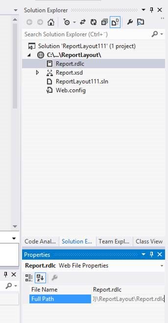
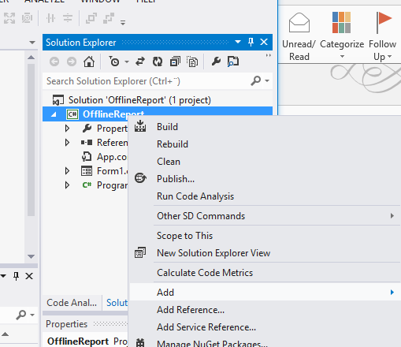
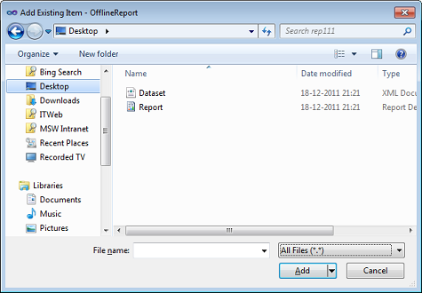
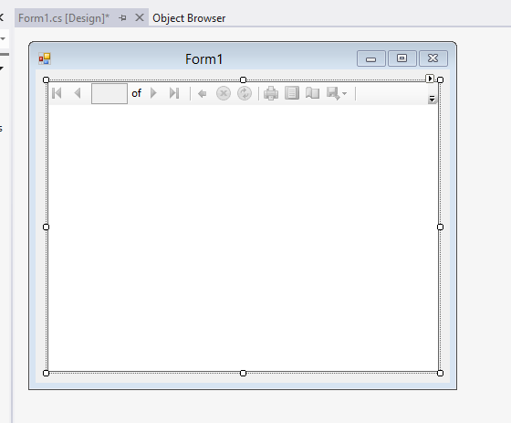
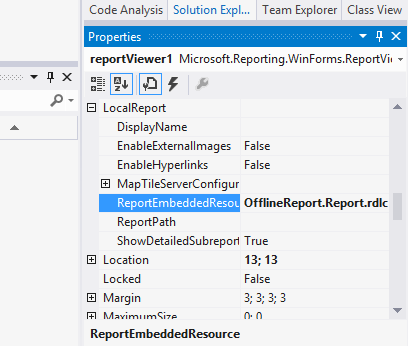
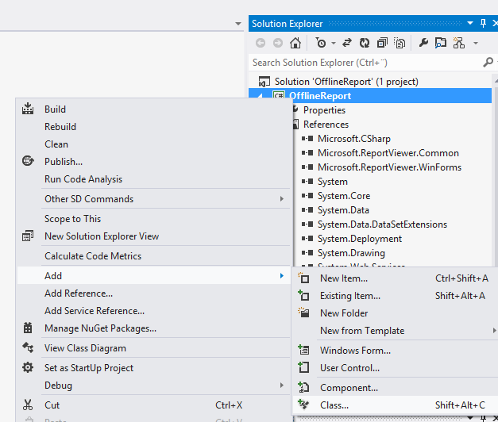
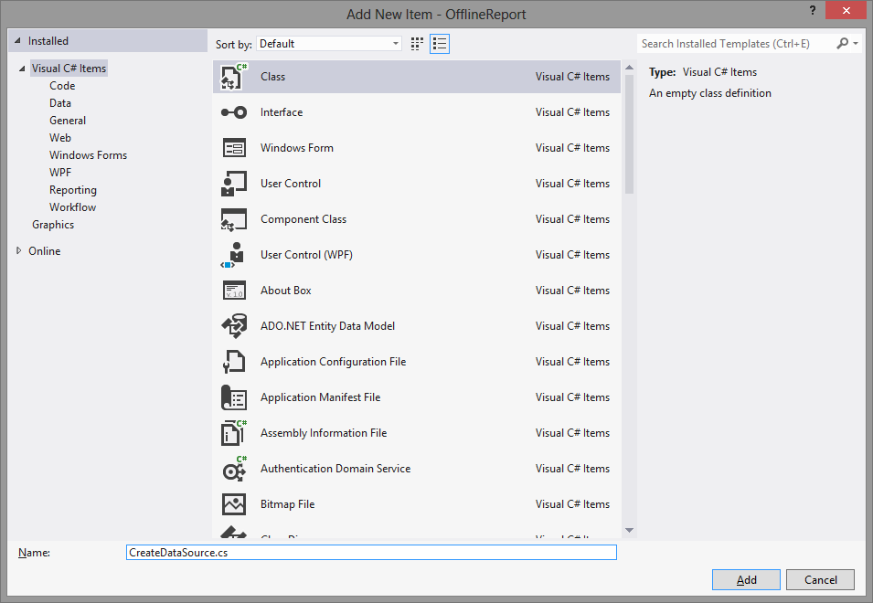
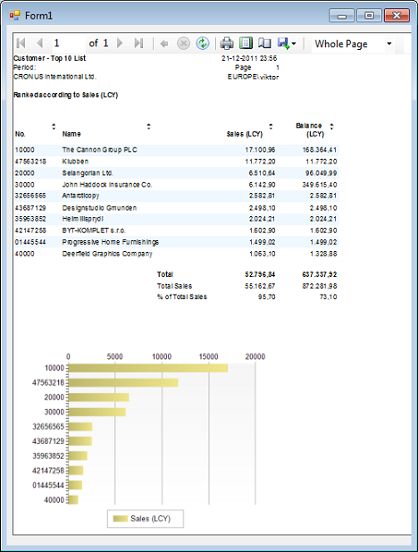

# Walkthrough: Running a Report Offline
You can view a report and view the dataset and layout on a computer that does not have [!INCLUDE[navnow](includes/navnow_md.md)] installed. To do this, you must have Microsoft Visual Studio installed and you must export the report dataset from [!INCLUDE[navnow](includes/navnow_md.md)] as an .xml file and export the report layout .rdlc file from Visual Studio Report Designer.  

> [!IMPORTANT]  
>  The dataset .xml file that you export contains actual data from the report. Do not share this file if you do not want to share actual database data.  

## About This Walkthrough  
 This walkthrough illustrates the following tasks:  

-   Exporting the report dataset as an .xml file.  

-   Copying the report layout .rdlc file.  

-   Running the report by using Microsoft Visual Studio.  

### Prerequisites  
 To complete this walkthrough, you will need:  

-   One computer with the following:  

    -   [!INCLUDE[navnowlong](includes/navnowlong_md.md)] with a developer license.  

    -   CRONUS International Ltd. demonstration database.  

    -   Microsoft Visual Studio installed. For more information about which version of Microsoft Visual Studio you need, see [System Requirements for Microsoft Dynamics NAV](System-Requirements-for-Microsoft-Dynamics-NAV.md). This walkthrough assumes that Microsoft Visual Studio 2012 or Microsoft Visual Studio 2013 is used.  

-   A second computer with Microsoft Visual Studio.  

## Story  
 Viktor is a Microsoft Certified Partner working for CRONUS International. He is working on some enhancements to the Customer – Top 10 List report, but during his development phase, he has encountered some problems. Viktor wants to send the report to Microsoft Support to help him troubleshoot the problems. The Microsoft Support engineer wants to be able to view the report and report data offline instead of on a computer that has [!INCLUDE[navnow](includes/navnow_md.md)] installed. Viktor saves the report dataset and the report layout and sends them to the Microsoft Support engineer, who runs the report on his computer by using Visual Studio.  

## Saving the report dataset and layout  
 First, Viktor exports the report dataset to an .xml file.  

#### To export the report dataset to an .xml file  

1.  On the computer with [!INCLUDE[navnow](includes/navnow_md.md)] installed, open the [!INCLUDE[nav_windows](includes/nav_windows_md.md)].  

2.  In the **Search** box, enter **Customer – Top 10 List**, and then choose the related link.  

3.  On the request page for the Customer – Top 10 List report, on the **Application** menu , choose **Help**, and then choose **About This Page** to activate the About This Report feature. For more information, see [How to: View and Export the Dataset for a Report](How-to--View%20and%20Export%20the%20Dataset%20for%20a%20Report.md).  

4.  Close the **About This Page** page.  

5.  On the request page for the Customer – Top 10 List report, choose **Preview** to open the Customer - Top 10 List report in Report Viewer.  

6.  On the report preview, on the Application menu , choose **Help**, and then choose **About This Report** to display the report dataset.  

7.  On the **About This Report** page, choose **Export as XML**.  

8.  In the **Export File** dialog box, choose **Save**.  

       

9. In the **Export File** dialog box, navigate to your Desktop, enter **Dataset** for the file name, set the **Save as type** field to **XML \(\*.xml\)**, and then choose **Save**.  

 Next, Viktor must save the report layout as an .rdlc file.  

#### To copy the report layout .rdlc file  

1.  In the development environment, choose **Tools**, and then choose **Object Designer**.  

2.  In Object Designer, choose **Report**, select report 111, **Customer – Top 10 List**, and then choose **Design**.  

3.  On the **View** menu, choose **Layout** to open the report layout in Visual Studio.  

4.  In Visual Studio, in **Solution Explorer**, select **Report.rdlc**, and then in the **Properties** window, note the path where the Report.rdlc file is located.  

       

    > [!TIP]  
    >  If the **Properties** window is not visible, then on the **View** menu, choose **Properties**.  

5.  Copy the Report.rdlc file from the location in the **Properties** window to your Desktop.  

 Viktor sends both the Dataset.xml file and the Report.rdlc file to the Microsoft Support engineer who is helping him troubleshoot the report.  

## Running the Report Offline  
 The Microsoft Support engineer has received the Dataset.xml file and the Report.rdlc file from Viktor and now runs the report on his computer by using Visual Studio.  

> [!NOTE]  
>  If the report references external assemblies, then you must install the assemblies in the global assembly cache on the computer on which you want to run the report. For more information, see [EnableExternalAssemblies Property](EnableExternalAssemblies-Property.md) and [Extending Microsoft Dynamics NAV Using Microsoft .NET Framework Interoperability](Extending-Microsoft-Dynamics-NAV-Using-Microsoft-.NET-Framework-Interoperability.md),  

#### To run the report by using Visual Studio  

1.  Copy the Dataset.xml file and Report.rdlc file from the first computer, which has [!INCLUDE[navnow](includes/navnow_md.md)] installed, to your desktop on the second computer, which does not have [!INCLUDE[navnow](includes/navnow_md.md)] installed.  

2.  On the second computer, open Visual Studio.  

3.  In Visual Studio, in the **File** menu, choose **New**, and then choose **Project**.  

4.  In the **New Project** window, under **Installed Templates**, expand **Visual C\#**, choose **Windows**, and then choose **Windows Forms Application**.  

       

    > [!TIP]  
    >  If **Visual C\#** is not listed under **Installed Templates**, then you must install the Visual C\# feature. To do this, in Control Panel, choose **Programs**, choose **Uninstall a program**, select your version of Microsoft Visual Studio, and then choose **Uninstall/Change**. In the setup wizard, follow the instructions to add or remove features, and then choose the Visual C\# feature.  

5.  In the **Name** field, enter **OfflineReport**, and then choose the **OK** button to create the solution.  

6.  In Solution Explorer, right-click the OfflineReport project, choose **Add**, and then choose **Existing Item**.  

       

7.  In the **Add Existing Item** dialog box, navigate to your Desktop, set the file type to **All Files \(\*.\*\)**, select the Dataset.xml file and the Report.rdlc file, and then choose **Add**.  

       

8.  In Solution Explorer, under OfflineReport, select Dataset.xml. In the **Properties** window, in the **Copy to Output Directory** field, choose **Copy Always** from the drop-down list.  

    > [!TIP]  
    >  If the **Properties** window is not visible, then on the **View** menu, choose **Properties**.  

9. In the **Toolbox** window, under **Reporting**, drag a new **Report Viewer** control to Form1.  

       

    > [!TIP]  
    >  If the **Toolbox** window is not visible, then on the **View** menu, choose **Toolbox**.  

    > [!NOTE]  
    >  You may need to resize the report viewer control or the form.  

10. Select the report viewer control, and then in the **Properties** window, under **Misc**, expand **Local Report**, and then set the **ReportEmbeddedResource** property, to **OfflineReport.Report.rdlc**.  

       

    > [!NOTE]  
    >  If your report includes external images, then in the **Properties** window of the report viewer control, you must set the **EnableExternalImages** property to **True**.  

    > [!NOTE]  
    >  If your report includes hyperlinks, then in the **Properties** window of the report viewer control, you must set the **EnableHyperlinks** property to **True**. For examples of creating reports that include hyperlinks, see [Walkthrough: Creating a Link from a Report to a Report](Walkthrough:%20Creating%20a%20Link%20from%20a%20Report%20to%20a%20Report.md) and [Walkthrough: Creating a Link from a Report to a Page](Walkthrough:%20Creating%20a%20Link%20from%20a%20Report%20to%20a%20Page.md).  

11. In Solution Explorer, select the OfflineReport project, and on the shortcut menu, choose **Add**, and then choose **Class**.  

       

12. In the **Add New Item** window, under **Installed Templates**, choose **Visual C\# Items**, and then choose **Class**.  

       

13. In the **Name** field, enter **CreateDataSource.cs**, and then choose **Add**.  

14. In the **CreateDataSource.cs** tab, replace the code with the following.  

    ```  
    using System.Data;  

    namespace OfflineReport  
    {  
        public static class CreateDataSource  
        {  
            public static DataTable CreateTable()  
            {  
                DataSet dataSet = new DataSet();  
                dataSet.ReadXml("Dataset.xml");  
                return dataSet.Tables[0];  
            }  
        }  
    }  

    ```  

15. On the **File** menu, choose **Save CreateDataSource.cs**.  

16. Choose the **Form1.cs \[Design\]** tab, and then on the **View** menu, choose **Code**.  

17. In the **Form1.cs** tab, replace the code with the following.  

    ```  
    using System;  
    using System.Windows.Forms;  
    using Microsoft.Reporting.WinForms;  

    namespace OfflineReport  
    {  
        public partial class Form1 : Form  
        {  
            public Form1()  
            {  
                InitializeComponent();  
            }  
            private void Form1_Load(object sender, EventArgs e)  
            {  
                this.reportViewer1.LocalReport.DataSources.Add(new ReportDataSource("DataSet_Result", CreateDataSource.CreateTable()));  
                this.reportViewer1.RefreshReport();  
            }  
        }  
    }  

    ```  

18. On the **Build** menu, choose **Build Solution**. The solution builds successfully.  

19. On the **Debug** menu, choose **Start Debugging** to view the report in the report viewer control.  

       

20. To make changes to the report layout, in Solution Explorer, right-click Report.rdlc, and then choose **Open**.  

> [!TIP]  
>  Now that you have created the OfflineReport solution, to run other reports from Visual Studio, you only need to replace the Dataset.xml and Report.rdlc files.  

## See Also  
 [Importing and Exporting Objects](Importing-and-Exporting-Objects.md)
