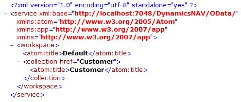
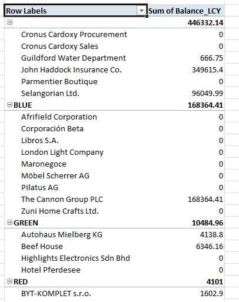
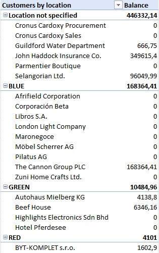

# Walkthrough: Viewing Page Data in Excel Using PowerPivot (OData)
This walkthrough describes how you can use OData to expose a [!INCLUDE[navnowlong](includes/navnowlong_md.md)] page as a web service and then analyze the page data using Microsoft PowerPivot for Excel 2013. Similar steps also apply to PowerPivot for Excel 2010. For information about PowerPivot, see [Microsoft PowerPivot](http://go.microsoft.com/fwlink/?LinkID=199906).  
  
## About This Walkthrough  
 With OData and PowerPivot, you gain access to a powerful set of tools and technologies for data exchange and analysis. This walkthrough illustrates the following tasks:  
  
-   Publishing a [!INCLUDE[navnow](includes/navnow_md.md)] page as a web service.  
  
-   Verifying web service availability from a browser.  
  
-   Using the PowerPivot add-in for Excel to import the table data as a new worksheet.  
  
     This procedure also includes optional instructions about how to use a web service access key.  
  
-   Creating a PivotTable from the worksheet, selecting relevant fields, and then organizing and formatting the data to highlight strategic data.  
  
### Prerequisites  
 To complete this walkthrough, you will need:  
  
-   [!INCLUDE[navnowlong](includes/navnowlong_md.md)] with a developer license.  
  
-   [!INCLUDE[demolong](includes/demolong_md.md)].  
  
-   Excel 2013 with the PowerPivot add-in enabled. For more information, see [Download PowerPivot page](http://go.microsoft.com/fwlink/?LinkId=200002).  
  
-   Optionally, if you want to use a web service access key to authenticate access to the web service, [!INCLUDE[navnow](includes/navnow_md.md)] must meet the following requirements:  
  
    -   The [!INCLUDE[nav_server](includes/nav_server_md.md)] is configured to authenticate users by using the NavUserPassword credential type.  
  
    -   There is a [!INCLUDE[navnow](includes/navnow_md.md)] user account that has a web service access key. In this walkthrough, the user account has the user name NavTest.  
  
     For more information, see [Users and Credential Types](Users-and-Credential-Types.md).  
  
## Publishing a Page as a Web Service  
 You can publish a web service by using the [!INCLUDE[nav_web](includes/nav_web_md.md)] or the [!INCLUDE[nav_windows](includes/nav_windows_md.md)].  
  
#### To register and publish a page as a web service  
  
1.  Open the [!INCLUDE[rtc](includes/rtc_md.md)] and connect to the [!INCLUDE[demoname](includes/demoname_md.md)] company.  
  
2.  In the **Search** box, enter **Web Services**, and then choose the related link.  
  
3.  In the **Web Services** page, choose **New**.  
  
4.  In the **Object Type** column, select **Page**. In the **Object ID** column, enter **21**, and in the **Service Name** column, enter **Customer**.  
  
     This exposes the **Customer Card** page as an OData web service.  
  
5.  Select the check box in the **Published** column.  
  
6.  Choose the **OK** button to close the **New - Web Services** page.  
  
## Verifying the Web Service’s Availability  
  
> [!IMPORTANT]  
>  After publishing a web service, verify that the port that web service applications will use to connect to your web service is open. The default port for OData web services is 7048. You can configure this value by using the [Microsoft Dynamics NAV Server Administration Tool](Microsoft-Dynamics-NAV-Server-Administration-Tool.md).  
  
#### To verify availability of a [!INCLUDE[navnow](includes/navnow_md.md)] web service  
  
1.  Start Windows Internet Explorer.  
  
2.  In the **Address** field, enter a URI using the following format: **http://\<Server>:\<WebServicePort>/\<ServerInstance>/OData/**  
  
    -   **Server** is the name of the computer that is running [!INCLUDE[nav_server](includes/nav_server_md.md)].  
  
    -   **WebServicePort** is the port that OData is running on. The default port is 7048.  
  
    -   **ServiceInstance** is the name of the [!INCLUDE[nav_server](includes/nav_server_md.md)] instance for your solution. The default name is [!INCLUDE[nav_server_instance](includes/nav_server_instance_md.md)].  
  
     For example, if the [!INCLUDE[nav_server](includes/nav_server_md.md)] is running on the computer that you are working on, you can use: **http://localhost:7048/DynamicsNAV90/OData/**  
  
     The browser should now show the web service that you have published, as shown in the following illustration.  
  
       
  
> [!NOTE]  
>  If the browser cannot find the web service, it may indicate that the specified [!INCLUDE[nav_server](includes/nav_server_md.md)] instance is not running. For more information, see [Managing Microsoft Dynamics NAV Server Instances](Managing-Microsoft-Dynamics-NAV-Server-Instances.md).  
  
## Importing [!INCLUDE[navnow](includes/navnow_md.md)] Data into Excel  
 In the following procedures, you use PowerPivot to import [!INCLUDE[navnow](includes/navnow_md.md)] data into Excel. If you will be using a web service access key for authentication, only perform the second procedure; otherwise, only perform the first procedure.  
  
#### To import [!INCLUDE[navnow](includes/navnow_md.md)] data into Excel  
  
1.  Start Microsoft Excel.  
  
2.  In Excel, on the **PowerPivot** tab, choose **Manage**. This opens the **PowerPivot for Excel** window.  
  
3.  In PowerPivot, on the **Home** tab, choose **Get External Data**, choose **From Data Service**, and then choose **From OData Data Feed**.  
  
     The **Table Import Wizard** opens.  
  
4.  If your [!INCLUDE[navnow](includes/navnow_md.md)] implementation requires that you use a web service access key, you must specify the NavUserPassword credentials as described in the following steps:  
  
    1.  In the **Advanced** dialog box, in the **Security** section, set the **Integrated Security** field to **Basic**.  
  
         If your OData is configured to use SSL, then set the field to SSPL.  
  
    2.  In the **Password** field, type the web service access key.  
  
    3.  In the **UserID** field, type the user name for the [!INCLUDE[navnow](includes/navnow_md.md)] user account. For this walkthrough, use **NavTest**.  
  
    4.  In the **Source** section, in the **Service Document URL** field, type the URL for the OData web service that you verified in the previous procedure,  for example, **http://localhost:7048/DynamicsNAV90/OData/**.  
  
    5.  Choose the **OK** button to return to the **Table Import Wizard**.  
  
5.  In the **Connect to a Data Feed** page, in the **Data Feed Url** field, enter the OData URI that you verified in the previous procedure, for example **http://localhost:7048/DynamicsNAV90/OData/**. Choose the **Next** button.  
  
    > [!IMPORTANT]  
    >  The URI must end with a slash \(/\) as shown in the example.  
  
6.  Verify that **Customer** appears in the **Source Table** column.  
  
7.  Select the check box next to the **Customer** web service, and then choose **Finish**.  
  
8.  After you see the **Success** message, choose the **Close** button.  
  
 The data from the **Customer** OData web service displays, and you can use the data to build pivot-based views in the Excel workbook.  
  
## Creating a PivotTable Containing Key [!INCLUDE[navnow](includes/navnow_md.md)] Data  
 In this procedure, you use the Excel workbook with data from the **Customer** web service to create a PivotTable from the worksheet. You select relevant fields and then organize and format the data to highlight strategic data. Building a pivot table is a way to select and arrange data so as to highlight and focus on key elements.  
  
#### To create a PivotTable  
  
1.  In Excel, select the cell where you want the PivotTable located.  
  
2.  In the ribbon, choose the **Insert** tab, and then in the **Tables** group, choose **PivotTable**.  
  
3.  In the **Create PivotTable** dialog box, select **Use an external data source**, and then choose the **Choose Connection** button.  
  
4.  In the **Existing Connections** dialog box, on the **Connections** tab, under **Connections in this Workbook**, choose the data feed for your OData web service, and then choose the **Open** button.  
  
5.  Choose the **OK** button to add the PivotTable to the Excel worksheet.  
  
     The **PowerPivot Field** pane on the right side includes a list of fields from the **Customer** web service that where imported from PowerPivot.  
  
6.  In the **PowerPivot Field List** pane, choose **Location\_Code**.  
  
    > [!TIP]  
    >  To quickly find a field in the field list, type part or all of the field name in the **Search** text box that is above the list of fields, and then press Enter to highlight the first field that contains the text. You can then choose the right arrow to proceed to the next field, and so on.  
  
7.  Select the **Balance\_LCY** field.  
  
8.  Select the **Name** field.  
  
     You can now see the data in the body of the worksheet, as shown in the following illustration.  
  
       
  
     The PivotTable shows customers by location and individual customer balances, and also adds the balances by location. To make the information more readable, you can update the headings on the PivotTable.  
  
9. Select the cell that has the heading **Sum of Balance\_LCY**, and then, in the formula field, type **Balance**.  
  
10. Select the cell that has the heading **Row Labels**, and then in the formula field, type **Customers by location**.  
  
11. Select the empty cell that is below the **Customers by location** cell, and then, in the formula field, type **Location not specified**.  
  
 The following illustration shows how the worksheet looks after you make these changes.  
  
   
  
## Next Steps  
 Now that you have created your PivotTable, you can continue to enhance the data to make it more useful and readable. You can:  
  
-   Add a column to the data that shows average balance by region.  
  
-   Enhance data presentation with a graph.  
  
-   Post the data in a Microsoft SharePoint environment with live data from [!INCLUDE[navnowlong](includes/navnowlong_md.md)].  
  
 For more information about how to use [!INCLUDE[navnow](includes/navnow_md.md)] data with PowerPivot information, see [Walkthrough: Combining Data from Microsoft Dynamics NAV Queries and Pages with Data from Azure DataMarket \(OData\)](Walkthrough:%20Combining%20Data%20from%20Microsoft%20Dynamics%20NAV%20Queries%20and%20Pages%20with%20Data%20from%20Azure%20DataMarket%20\(OData\).md).  
  
## See Also  
 [Web Service Walkthroughs](Web-Service-Walkthroughs.md)   
 [OData Web Services](OData-Web-Services.md)