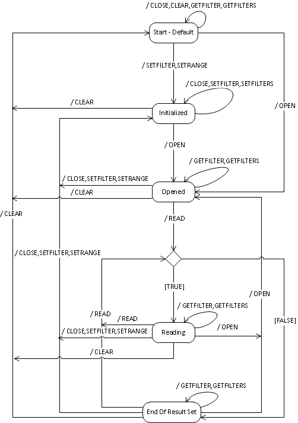

# Working with Queries in C-AL
After you create a query, you can use C/AL code to run the query and retrieve data from the resulting dataset. There are several functions that you can call on the query to filter the dataset, read rows, access columns, and save the dataset to a file in XML or CSV format.  
  
## Query Functions  
 The following table contains the C/AL functions available for running queries and accessing the resulting dataset.  
  
|Function|Description|  
|--------------|-----------------|  
|[SETFILTER Function \(Query\)](SETFILTER-Function--Query-.md)|Sets a filter on a field of a specified data column or filter row in the query.|  
|[SETRANGE Function \(Query\)](SETRANGE-Function--Query-.md)|Sets a simple range filter on a field of a specified data column or filter row in the query.|  
|[TOPNUMBEROFROWS Function](TOPNUMBEROFROWS-Function.md)|Sets the maximum number of rows to include in the resulting dataset.|  
|[OPEN Function \(Query\)](OPEN-Function--Query-.md)|Runs a query object and generates a dataset so that it can be read.|  
|[READ Function \(Query\)](READ-Function--Query-.md)|Retrieves a row from the resulting dataset of a query.|  
|*QueryVariable*.*ColumnName*|Retrieves the value of a column in the dataset row that is currently being read. *QueryVariable* is a variable of the Query data type that specifies the query object. *ColumnName* is the name of the column in the query.   For more information, see [Accessing Columns of a Query Dataset](Accessing-Columns-of-a-Query-Dataset.md).|  
|[GETFILTER Function \(Query\)](GETFILTER-Function--Query-.md)|Returns the filters on a specified column in the query.|  
|[GETFILTERS Function \(Query\)](GETFILTERS-Function--Query-.md)|Returns the filters on all columns in the query.|  
|[CLEAR Function](CLEAR-Function.md)|Clears the instance of the query, including all filters.|  
|[CLOSE Function \(Query\)](CLOSE-Function--Query-.md)|Closes a query dataset and returns it to the initialized state. Any filters that are set by the SETFILTER or SETRANGE functions are still valid.|  
|[SAVEASCSV Function](SAVEASCSV-Function.md)|Saves a query data set as a comma separated values file.|  
|[SAVEASXML Function](SAVEASXML-Function.md)|Saves a query dataset as an .xml file.|  
  
## Query Triggers  
 Queries include an OnBeforeOpen trigger in C/AL that executes before the query is opened and the dataset is generated. For more information, see [OnBeforeOpen Trigger](OnBeforeOpen-Trigger.md).  
  
## Query State Diagram  
 The following figure illustrates the state of a query object for each of the query function calls in C/AL.  
  
   
  
> [!NOTE]  
>  -   The Read function can only be called when the query is in the opened state after a call to the OPEN function.  
> -   *query*. *ColumnName* can only be called when the query is in reading state after a call to the READ function.  
> -   The SAVEASCSV and SAVEASXML functions can be called from any state. If the dataset is currently open, then it will be closed. These functions implicitly call the OPEN, READ, and CLOSE functions, which pass the query through the Opened, Reading, and End Of Result Set states.