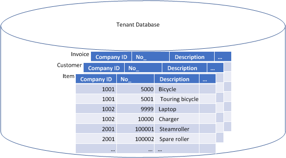

# Converting a Database to Shared Schema
Shared schema is a data model that includes tenants and companies &#8212; optimizing the reuse of resources, such as execution plans, memory, and database connections. 

<!-- alternative
Shared schema is a data model that shares database resources among tenants and companies. Shared schema optimizes the reuse of resources, such as execution plans, memory, and database connections. 
-->

Instead of having company-specific tables for storing business data, companies share the same tables. In a multitenant deployment, shared schema enables you to have multiple tenants in the same database. Tenants in the database can support different application versions, which allows you to individually upgrade tenants to different application versions.

## Overview
To help explain shared schema, let's first look at the conventional [!INCLUDE[navnow_md](includes/navnow_md.md)] data model, which is referred to as *separate schema*.

> [!TIP]
> A tenant is one or more companies, typically part of a business or legal entity, with access to a common application but with dedicated storage of business data in the database. In a single tenant deployment, the application and tenant business data are stored in the same database. In a multitenant deployment, the application is stored in one database, and the tenant business data in another database.

### Separate schema 
By default, [!INCLUDE[navnow_md](includes/navnow_md.md)] uses a *separate schema* data model. A database that uses separate schema has the following characteristics: 

-  It contains business data for one tenant only.

    In practical terms, a tenant is the database. This means that in a multitenant deployment, you have a separate database for each tenant. 
-  Each company has a separate set of tables for storing business entity data, such as the Item, Customer, and Invoice tables (see figure 1). 


**Figure 1: Company business data tables with separate schema**

### Shared schema

A database that uses the shared schema data model has the following characteristics: 

-  It can be shared by more than one tenant. Information about the tenants and their companies is stored in shared tables in the database (see figure 2).

   This is a change to the concept of a tenant/tenant database as compared with the separate schema model, which has one tenant per database (the tenant database). With shared schema, the tenant database is a container for one or more tenants, and each tenant is a unit of data in the tenant database (see figure 2).
   
   You can have multiple tenant databases among which you can mount, delete, and move tenants. 
-  Companies share tables for storing business data.

    There is one set of business entity data tables for all companies and tenants in the database. For example, instead  of an Item table for each company, there is a single table that contains the data for all companies (see figure 3).

-   It an support multiple application versions, which means that tenants in the database can be mounted to different [!INCLUDE[nav_server_md](includes/nav_serever_md.md)] instances that use different application versions.   


**Figure 2: Tenant and company information with shared schema**

 

**Figure 3: Company business data tables with shared schema**

## Convert to shared schema
To convert to shared schema, you use the [Sync-NAVTenant cmdlet](https://go.microsoft.com/fwlink/?linkid=401399) that is included in the [!INCLUDE[navnow_md](includes/nav_shell_md.md)]. 

> [!IMPORTANT]
> Once you convert to shared schema, you cannot revert back to separate schema. We recommend that you make a backup of your database before converting to shared schema.

1. Open the [!INCLUDE[navnow_md](includes/nav_shell_md.md)] as an administrator.

2. Mount the tenant that you want to convert to the [!INCLUDE[nav_server_md](includes/nav_server_md.md)] instance.

    ```
    Mount-NAVTenant –ServerInstance "[server_instance_name]" -Tenant "[tenant_ID]" –DatabaseServer "[server]\[database_instance]" -DatabaseName "[database_name]"
    ```

3. Run the Sync-NAVTenant cmdlet with the `-Mode` parameter set to `ConvertToSharedSchema`.

    ```
    Sync-NAVTenant -ServerInstance  "[server_instance_name]" -Tenant "[tenant_ID]" -Mode ConvertToSharedSchema
    ```
    When the sync process finishes, the database that is used by the tenant has been converted. The tenant is still be mounted on the same NAV Server instance. If you have a multitnenant deployment, the server instance still connects to the same application database. 

## Next steps
You can now begin the manage tenants of the database. If you have single tenant deployment, there is basically no change in the way you manage the tenant compared with before the conversion.

If you have a multitenant deployment, we recommend that you complete the following steps to get started. The distinction between the *tenant database* and *tenant* introduces a new paradigm for managing your tenants, which is supported by several additional [!INCLUDE[navnow_md](includes/navnow_md.md)] Powershell cmdlets. These steps will help you understand the general flow for working with tenant databases and tenants.

1. Dismount the existing tenant from the [!INCLUDE[nav_server_md](includes/nav_server_md.md)] instance:

    ```
    Dismount-NAVTenant -ServerInstance '[nav_server_instance_name]' -Tenant '[tenant ID]'
    ```
3.  Use the Mount-NAVTenantDatabase cmdlet to mount the database of the dismounted tenant to the same [!INCLUDE[nav_server_md](includes/nav_server_md.md)] instance as before. This will designate the database as a  *tenant database*. 

    ```
    Mount-NAVTenantDatabase -ServerInstance '[nav_server_instance_name]' -Id '[tenant_database_id]' -DatabaseName '[existing_database_name]' -DatabaseServer '[server_name]\[database_instance]'
    ```

    Substitute `[tenant_database_id]` with the ID that you want to assign the tenant database. You will use this ID for subsequent operations on the database, like when syncing or dismounting it, mounting a tenant, and more.   
 3. Use the Sync-NAVTenantDatabase cmdlet to synchronize the database schema of the tenant database with the schema in the application database that is mounted on the [!INCLUDE[nav_server_md](includes/nav_server_md.md)] instance.
 
    ```
    Sync-NAVTenantDatabase -ServerInstance '[nav_server_instance_name]' -Id '[tenant_database_id]'
    ```

4. Use the Mount-NAVTenant cmdlet to add the existing tenant to the tenant database and mount it to the [!INCLUDE[nav_server_md](includes/nav_server_md.md)] server instance.

    ```
    Mount-NAVTenant -ServerInstance DynamicsNAV -Tenant 'Tenant1-1' -TenantDatabaseID 'TenantSharedDatabase1'
    ``` 

## See Also  
[Microsoft Dynamics NAV Windows PowerShell Cmdlets](Microsoft-Dynamics-NAV-Windows-PowerShell-Cmdlets.md)   
[Migrating to Multitenancy](Migrating-to-Multitenancy.md)  
[Configuring Microsoft SQL Server](Configuring-Microsoft-SQL-Server.md)   
[Configuring Microsoft Dynamics NAV](Configuring-Microsoft-Dynamics-NAV.md)  
